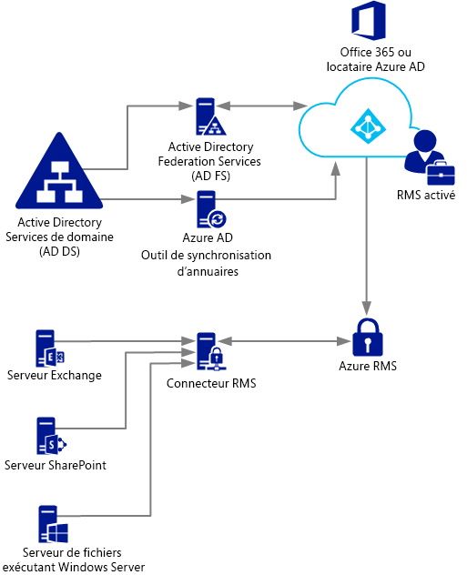
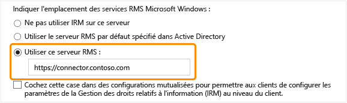

# D&#233;ploiement du connecteur Azure Rights Management
Utilisez ces informations pour en savoir plus sur le connecteur Microsoft Rights Management (RMS) et comprendre comment l'utiliser pour assurer la protection des informations à l'aide de déploiements locaux existants utilisant Microsoft Exchange Server, Microsoft SharePoint Server, ou de serveurs de fichiers exécutant Windows Server et utilisant l'infrastructure de classification des fichiers du gestionnaire de ressources du serveur de fichiers.

> [!TIP]
> Pour consulter un scénario d'exemple global illustré par des captures d'écran, reportez-vous à la section [Protection automatique de fichiers sur des serveurs de fichiers exécutant Windows Server et l'infrastructure de classification des fichiers](../Topic/What_is_Azure_Rights_Management_.md#BKMK_Example_FCI) de la rubrique [Qu'est-ce qu'Azure Rights Management ?](../Topic/What_is_Azure_Rights_Management_.md).

## <a name="OverviewConnector"></a>Vue d'ensemble du connecteur Microsoft Rights Management
Le connecteur Microsoft Rights Management (RMS) permet d'activer rapidement des serveurs locaux existants pour utiliser les services RMS avec le service Microsoft Rights Management (Azure RMS) basé sur le cloud. Cette fonctionnalité permet au service informatique et aux utilisateurs de protéger facilement des documents et des images à l'intérieur comme à l'extérieur de l'organisation, sans avoir à installer des infrastructures supplémentaires ou à établir des relations de confiance avec d'autres organisations. Vous pouvez utiliser ce connecteur même si certains de vos utilisateurs se connectent à des services en ligne dans le cadre d'un scénario hybride. Par exemple, les boîtes aux lettres de certains utilisateurs utilisent Exchange Online et celles d'autres utilisateurs utilisent Exchange Server. Après installation du connecteur RMS, tous les utilisateurs peuvent protéger et consommer des courriers électroniques et pièces jointes à l'aide d'Azure RMS, et la protection des informations fonctionne de façon transparente entre les deux configurations de déploiement.

Le connecteur RMS est un service à faible encombrement qui doit être installé en local sur des serveurs exécutant Windows Server 2012 R2, Windows Server 2012 ou Windows Server 2008 R2. Outre la possibilité d'exécuter le connecteur sur des ordinateurs physiques, vous pouvez l'exécuter sur des machines virtuelles, y compris des machines virtuelles IaaS de Azure. Une fois qu'il est installé et configuré, le connecteur joue le rôle d'une interface de communication (relais) entre les serveurs locaux et le service cloud.

Si vous gérez votre propre clé de client pour Azure RMS (scénario BYOK où vous apportez votre propre clé), le connecteur RMS et les serveurs locaux qui l'utilisent n'accèdent pas au module de sécurité matériel (HSM) qui contient votre clé de client. En effet, toutes les opérations de chiffrement qui utilisent la clé de client sont effectuées dans Azure RMS et non en local.



Le connecteur RMS prend en charge les serveurs locaux suivants : Exchange Server, SharePoint Server et serveurs de fichiers exécutant Windows Server et utilisant l'infrastructure de classification des fichiers pour classer et appliquer des stratégies à des documents Office dans un dossier. Si vous souhaitez protéger tous les types de fichiers à l'aide d'une classification des fichiers, n'utilisez pas le connecteur RMS, mais des [applets de commande de protection RMS](https://msdn.microsoft.com/library/azure/mt433195.aspx).

> [!NOTE]
> Pour connaître les versions prises en charge par les serveurs locaux, consultez le paragraphe relatif aux serveurs locaux prenant en charge Azure RMS de la section [Applications prenant en charge Azure RMS](../Topic/Requirements_for_Azure_Rights_Management.md#BKMK_SupportedApplications) de la rubrique [Conditions requises pour Azure Rights Management](../Topic/Requirements_for_Azure_Rights_Management.md).

Reportez-vous aux sections suivantes pour planifier, installer et configurer le connecteur RMS. Vous devrez ensuite procéder à une configuration post-installation pour que vos serveurs puissent utiliser le connecteur.

-   [Conditions requises pour l'installation du connecteur RMS](../Topic/Deploying_the_Azure_Rights_Management_Connector.md#BKMK_Prereqs)

-   **Étape 1 :**  [Installation du connecteur RMS](../Topic/Deploying_the_Azure_Rights_Management_Connector.md#BKMK_InstallingConnector)

-   **Étape 2 :**  [Saisie des informations d'identification](../Topic/Deploying_the_Azure_Rights_Management_Connector.md#EnteringCredentials)

-   **Étape 3 :**  [Définition des serveurs autorisés à utiliser le connecteur RMS](../Topic/Deploying_the_Azure_Rights_Management_Connector.md#AuthorizingServers)

-   **Étape 4 :**  [Configuration de l'équilibrage de charge et de la haute disponibilité](../Topic/Deploying_the_Azure_Rights_Management_Connector.md#ConfiguringConnector)

-   Facultatif : [Configuration du connecteur RMS pour le protocole HTTPS](../Topic/Deploying_the_Azure_Rights_Management_Connector.md#BKMK_ConfiguringHTTPS)

-   Facultatif : [Configuration du connecteur RMS pour un serveur proxy web](../Topic/Deploying_the_Azure_Rights_Management_Connector.md#BKMK_ConfiguringWebProxy)

-   Facultatif : [Installation de l'outil d'administration du connecteur RMS sur les ordinateurs d'administration](../Topic/Deploying_the_Azure_Rights_Management_Connector.md#BKMK_InstallingStandaloneTool)

-   **Étape 5 :**  [Configuration de serveurs afin d'utiliser le connecteur RMS](../Topic/Deploying_the_Azure_Rights_Management_Connector.md#ConfiguringServers)

    -   [Configuration d'un serveur Exchange afin d'utiliser le connecteur](../Topic/Deploying_the_Azure_Rights_Management_Connector.md#BKMK_ExchangeServer)

    -   [Configuration d'un serveur SharePoint afin d'utiliser le connecteur](../Topic/Deploying_the_Azure_Rights_Management_Connector.md#BKMK_ConfiguringSharePoint)

    -   [Configuration d'un serveur de fichiers pour l'infrastructure de classification des fichiers afin d'utiliser le connecteur](../Topic/Deploying_the_Azure_Rights_Management_Connector.md#BKMK_FileServer)

-   [Étapes suivantes](../Topic/Deploying_the_Azure_Rights_Management_Connector.md#BKMK_NextSteps)

## <a name="BKMK_Prereqs"></a>Conditions requises pour l'installation du connecteur RMS
Avant d'installer le connecteur RMS, assurez-vous que les conditions requises suivantes sont remplies.

|Condition requise|Plus d'informations|
|---------------------|-----------------------|
|Service Rights Management (RMS) activé|[Activation d'Azure Rights Management](../Topic/Activating_Azure_Rights_Management.md)|
|Synchronisation des annuaires entre vos forêts Active Directory et Azure Active Directory|Une fois RMS activé, Azure Active Directory doit être configuré pour travailler avec les utilisateurs et les groupes de votre base de données Active Directory. **Important:** Vous devez effectuer cette étape de synchronisation des annuaires pour que le connecteur RMS fonctionne, même pour un réseau de test. Même si vous pouvez utiliser Office 365 et Azure Active Directory avec des comptes crées manuellement dans Azure Active Directory, ce connecteur nécessite que les comptes Azure Active Directory soient synchronisés avec les services de domaine Active Directory. La synchronisation manuelle des mots de passe n'est pas suffisante.<br />Pour plus d'informations, consultez les ressources suivantes :<br /><br />-   [Instructions relatives à la configuration du client Azure AD](http://technet.microsoft.com/library/hh967611.aspx)<br />-   [Instructions relatives à l'activation de la synchronisation d'annuaires avec AAD à l'aide de DirSync](http://technet.microsoft.com/library/hh967642.aspx)|
|Facultatif mais recommandé :<br /><br />-   Activation de la fédération entre l'annuaire Active Directory local et Azure Active Directory|Vous pouvez activer la fédération des identités entre votre annuaire local et Azure Active Directory. Cette configuration offre une expérience utilisateur plus homogène grâce à une authentification unique au service RMS. Sans l'authentification unique, les utilisateurs sont invités à saisir leurs identifiants pour pouvoir utiliser des contenus protégés par des droits.<br /><br />Pour plus d'informations sur la configuration de la fédération par le biais des services AD FS (Active Directory Federation Services) entre les services de domaine Active Directory et Azure Active Directory, consultez la rubrique [Liste de contrôle : Utiliser AD FS pour mettre en œuvre et gérer l'authentification unique](http://technet.microsoft.com/library/jj205462.aspx) dans la bibliothèque Windows Server.|
|Au moins deux ordinateurs membres sur lesquels installer le connecteur RMS :<br /><br /><ul><li>Un ordinateur 64 bits virtuel ou physique exécutant l'un des systèmes d'exploitation suivants :<br /><br /><ul><li>Windows Server 2012 R2</li><li>Windows Server 2012</li><li>Windows Server 2008 R2</li></ul></li><li>1 Go de RAM minimum</li><li>64 Go d'espace disque minimum</li><li>Au moins une interface réseau</li><li>Un accès à Internet via un pare-feu (ou proxy Web) qui ne requiert pas d'authentification</li><li>Un emplacement au sein d'une forêt ou d'un domaine qui reconnaît les autres forêts de l'organisation contenant les installations des serveurs Exchange ou SharePoint à utiliser avec le connecteur RMS</li></ul>|Pour une tolérance de panne et une haute disponibilité, vous devez installer le connecteur RMS sur un minimum de deux ordinateurs. **Tip:** Si vous utilisez Outlook Web Access ou des appareils mobiles qui utilisent Exchange ActiveSync IRM et qu'il est essentiel de maintenir l'accès aux messages électroniques et pièces jointes protégés par Azure RMS, nous vous recommandons de déployer un groupe de serveurs de connecteur faisant l'objet d'un équilibrage de charge pour garantir une haute disponibilité.<br />Vous n'avez pas besoin de serveurs dédiés pour exécuter le connecteur, mais vous devez l'installer sur un ordinateur différent des serveurs qui utiliseront le connecteur. **Important:** N'installez pas le connecteur sur un ordinateur qui exécute Exchange Server, SharePoint Server ou un serveur de fichiers configuré pour l'infrastructure de classification des fichiers si vous voulez utiliser la fonctionnalité depuis ces services avec Azure RMS. En outre, n'installez pas ce connecteur sur un contrôleur de domaine.|

## <a name="BKMK_InstallingConnector"></a>Installation du connecteur RMS
Une fois ces conditions requises réunies, suivez les instructions ci-après pour installer le connecteur RMS :

1.  Identifiez les ordinateurs (deux au minimum) qui exécuteront le connecteur RMS. Ils doivent présenter les caractéristiques minimales listées dans la section précédente.

    > [!NOTE]
    > Vous ne devez installer qu'un seul connecteur RMS (constitué de plusieurs serveurs pour une haute disponibilité) par client (client Office 365 ou Azure AD). puisque, contrairement à Active Directory RMS, il n'est pas nécessaire d'en installer un par forêt.

2.  Téléchargez les fichiers sources du connecteur RMS sur le [Centre de téléchargement Microsoft](http://go.microsoft.com/fwlink/?LinkId=314106).

    Pour installer le connecteur RMS, téléchargez le fichier RMSConnectorSetup.exe.

    De plus :

    -   Si vous souhaitez configurer ultérieurement le connecteur à partir d'un ordinateur 32 bits, téléchargez également le fichier RMSConnectorAdminToolSetup_x86.exe.

    -   Si vous voulez utiliser l'outil de configuration de serveur pour le connecteur RMS, afin d'automatiser la configuration des paramètres de registre sur vos serveurs locaux, téléchargez également le fichier GenConnectorConfig.ps1.

3.  Sur l'ordinateur sur lequel vous souhaitez installer le connecteur RMS, exécutez le fichier **RMSConnectorSetup.exe** avec des privilèges d'administrateur.

4.  Dans la page d'accueil de la page Microsoft Rights Management Connector Setup, sélectionnez **Installer le connecteur Microsoft Rights Management sur l'ordinateur**, puis cliquez sur **Suivant**.

5.  Lisez et acceptez les termes du contrat de licence du connecteur RMS, puis cliquez sur **Suivant**.

Pour continuer, saisissez un compte et un mot de passe pour configurer le connecteur RMS.

## <a name="EnteringCredentials"></a>Saisie des informations d'identification
Pour pouvoir configurer le connecteur RMS, vous devez saisir les identifiants d'un compte disposant des droits suffisants.

En outre, si vous avez implémenté des [contrôles d'intégration](https://technet.microsoft.com/library/jj658941.aspx), assurez-vous que le compte spécifié est en mesure de protéger le contenu. Par exemple, si vous avez limité la possibilité de protéger du contenu pour le groupe « Département informatique », le compte que vous spécifiez ici doit être un membre de ce groupe. Autrement, le message d'erreur suivant s'affiche : **Échec de la tentative de détection de l'emplacement du service d'administration et de l'organisation. Vérifiez que le service Microsoft Rights Management est activé pour votre organisation.**

Vous pouvez utiliser un compte possédant l'un des privilèges suivants :

-   **Administrateur du client Office 365** : Compte d'administrateur général pour votre locataire Office 365.

-   **Administrateur général Azure Rights Management** : compte disposant des privilèges d’administrateur pour le client Azure RMS.

-   **Administrateur du connecteur Microsoft RMS** : compte dans Azure Active Directory disposant de droits permettant d’installer et d’administrer le connecteur RMS pour votre organisation.

    > [!NOTE]
    > Si vous voulez utiliser le compte d'administrateur du connecteur Microsoft RMS, suivez d'abord les étapes ci-après pour assigner le rôle d'administrateur du connecteur RMS :
    > 
    > 1.  Sur le même ordinateur, téléchargez et installez Windows PowerShell pour Rights Management. Pour plus d'informations, consultez [Installation de Windows PowerShell pour Azure Rights Management](../Topic/Installing_Windows_PowerShell_for_Azure_Rights_Management.md).
    > 
    >     Démarrez Windows PowerShell avec la commande **Exécuter en tant qu’administrateur**, puis connectez-vous au service Azure RMS à l’aide de la commande [Connect-AadrmService](https://msdn.microsoft.com/library/azure/dn629415.aspx) :
    > 
    >     ```
    >     Connect-AadrmService                   //provide Office 365 tenant administrator or Azure RMS global administrator credentials
    >     ```
    > 2.  Puis exécutez la commande [Add-AadrmRoleBasedAdministrator](https://msdn.microsoft.com/library/azure/dn629417.aspx) en utilisant un seul des paramètres suivants :
    > 
    >     ```
    >     Add-AadrmRoleBasedAdministrator -EmailAddress <email address> -Role "ConnectorAdministrator"
    >     ```
    > 
    >     ```
    >     Add-AadrmRoleBasedAdministrator -ObjectId <object id> -Role "ConnectorAdministrator"
    >     ```
    > 
    >     ```
    >     Add-AadrmRoleBasedAdministrator -SecurityGroupDisplayName <group Name> -Role "ConnectorAdministrator"
    >     ```
    >     Par exemple, tapez : **Add-AadrmRoleBasedAdministrator -EmailAddress melisa@contoso.com -Role " ConnectorAdministrator "**
    > 
    >     Bien que ces commandes utilisent le rôle ConnectorAdministrator, vous pouvez également utiliser le rôle GlobalAdministrator ici aussi.

Au cours du processus d'installation du connecteur RMS, tous les logiciels requis sont validés et installés, les services Internet (IIS) sont installés s'ils ne l'étaient pas déjà et le logiciel du connecteur est installé et configuré. De plus, Azure RMS est préparé pour la configuration via la création des éléments suivants :

-   Table vide des pour les serveurs autorisés à utiliser le connecteur pour communiquer avec Azure RMS. Vous ajouterez ultérieurement des serveurs à cette table.

-   Ensemble de jetons de sécurité pour le connecteur, qui autorisent des opérations avec Azure RMS. Ces jetons sont téléchargés à partir d'Azure RMS et installés dans le Registre de l'ordinateur local. Ils sont protégés à l'aide de l'API de protection de données (DPAPI) et des informations d'identification du compte système Local.

Exécutez les actions suivantes sur la dernière page de l'Assistant, puis cliquez sur **Terminer** :

-   S'il s'agit du premier connecteur installé, ne sélectionnez pas l'option **Lancer la console Administrateur du connecteur pour autoriser des serveurs** à ce stade. Vous sélectionnerez cette option une fois que vous aurez installé la deuxième (ou dernière) instance du connecteur RMS. ‎À la place, exécutez à nouveau l'Assistant sur au moins un autre ordinateur. Notez que vous devez procéder à deux installations minimum.

-   S'il s'agit de la deuxième (ou dernière) instance du connecteur, sélectionnez **Lancer la console Administrateur du connecteur pour autoriser des serveurs**.

> [!TIP]
> À ce stade, vous pouvez réaliser un test de vérification pour vous assurer que les services Web du connecteur RMS sont opérationnels :
> 
> -   À l'aide d'un navigateur web, connectez-vous à l'adresse **http://&lt;connectoraddress&gt;/_wmcs/certification/servercertification.asmx**, où *&lt;connectoraddress&gt;* est remplacé par l'adresse ou le nom du serveur sur lequel est installé le connecteur RMS. Si la connexion fonctionne, la page **ServerCertificationWebService** apparaît.

Si vous avez besoin de désinstaller le connecteur RMS, exécutez à nouveau l'Assistant et sélectionnez l'option Désinstaller.

## <a name="AuthorizingServers"></a>Définition des serveurs autorisés à utiliser le connecteur RMS
Dès lors que le connecteur RMS est installé sur au moins deux ordinateurs, vous êtes en mesure d'autoriser les serveurs et les services souhaités à utiliser le connecteur RMS. Par exemple, les serveurs exécutant Exchange Server 2013 ou SharePoint Server 2013.

Pour définir ces serveurs, exécutez l'outil d'administration du connecteur RMS, puis ajoutez des entrées à la liste des serveurs autorisés. Vous pouvez exécuter cet outil lors de la sélection de l'option **Lancer la console Administrateur du connecteur pour autoriser des serveurs** à la fin de l'Assistant de configuration du connecteur Microsoft Rights Management, mais vous pouvez également l'exécuter séparément de l'Assistant.

Prenez en compte les considérations suivantes lors de la définition des serveurs :

-   Les serveurs ajoutés obtiendront des privilèges particuliers. Tous les comptes que vous spécifiez pour le rôle serveur Exchange dans la configuration du connecteur reçoivent le [rôle super utilisateur](https://technet.microsoft.com/library/mt147272.aspx) dans Azure RMS, ce qui leur donne accès à tout le contenu de ce client RMS. La fonctionnalité de super utilisateur est automatiquement activée à ce stade, si nécessaire. Pour éviter le risque de sécurité lié à l'élévation de privilèges, veillez à spécifier uniquement les comptes utilisés par les serveurs Exchange de votre organisation. Tous les serveurs configurés comme serveurs SharePoint ou serveurs de fichiers utilisant l'infrastructure de classification des fichiers obtiendront des privilèges utilisateur standard.

-   Vous pouvez ajouter plusieurs serveurs sous la forme d'une entrée unique en spécifiant un groupe de distribution ou de sécurité Active Directory ou un compte de service utilisé par plus d'un serveur. Dans cette configuration, les serveurs partagent les mêmes certificats RMS, et sont tous considérés comme étant propriétaires de l'ensemble du contenu protégé. Pour minimiser la charge administrative, nous vous conseillons d'adopter cette configuration de groupe unique plutôt que de serveurs multiples pour autoriser les serveurs Exchange ou la batterie de serveurs SharePoint de votre organisation.

Sur la page **Serveurs autorisés à utiliser le connecteur**, cliquez sur **Ajouter**.

### <a name="BKMK_AddServer"></a>Ajout d'un serveur à la liste des serveurs autorisés
Sur la page **Autoriser un serveur à utiliser le connecteur**, saisissez le nom de l'objet ou recherchez l'objet à autoriser.

Il est important d'autoriser l'objet adéquat. Pour qu'un serveur utilise le connecteur, le compte qui exécute le service local (par exemple, Exchange ou SharePoint) doit être sélectionné pour autorisation. Par exemple, si le service est exécuté en tant que compte de service configuré, ajoutez le nom de ce compte de service à la liste. Si le service est exécuté en tant que système local, ajoutez le nom de l'objet d'ordinateur (par exemple, NOMSERVEUR$). Il est préférable de créer un groupe contenant ces comptes afin de spécifier ce groupe plutôt que des noms de serveurs individuels.

Voici quelques informations relatives aux différents rôles de serveur :

-   Pour les serveurs exécutant Exchange : vous devez spécifier un groupe de sécurité. Notez que vous pouvez utiliser le groupe par défaut (**Serveurs Exchange**) créé et mis à jour automatiquement par Exchange, regroupant tous les serveurs Exchange de la forêt.

-   Pour les serveurs exécutant SharePoint :

    -   Si un serveur SharePoint 2010 est configuré pour s'exécuter en tant que système Local (il n'utilise pas de compte de service), créez manuellement un groupe de sécurité dans les services de domaine Active Directory, puis ajoutez l'objet de nom d'ordinateur pour le serveur dans cette configuration à ce groupe.

    -   Si un serveur SharePoint est configuré pour utiliser un compte de service (pratique recommandée pour SharePoint 2010 et seule option pour SharePoint 2013), procédez comme suit :

        1.  Ajoutez le compte de service exécutant le service Administration centrale de SharePoint pour que SharePoint soit configuré à partir de sa console Administrateur.

        2.  Ajoutez le compte configuré pour le pool d'applications SharePoint.

        > [!TIP]
        > S'il s'agit de deux comptes différents, pensez à créer un groupe unique les réunissant, afin de minimiser la charge administrative.

-   Pour les serveurs de fichiers utilisant l'infrastructure de classification des fichiers, les services associés s'exécutent en tant que compte de système local. Vous devez donc autoriser les comptes d'ordinateur des serveurs de fichiers (par exemple, NOMSERVEUR$) ou un groupe réunissant ces comptes d'ordinateur.

Une fois que tous les serveurs sont ajoutés, cliquez sur **Fermer**.

Si vous ne l'avez pas déjà fait, vous devez à présent configurer l'équilibrage de charge pour les serveurs disposant du connecteur RMS installé, et déterminer si vous souhaitez utiliser le protocole HTTPS pour les connexions entre ces serveurs et les serveurs que vous venez d'autoriser.

## <a name="ConfiguringConnector"></a>Configuration de l'équilibrage de charge et de la haute disponibilité
Une fois la deuxième (ou dernière) instance du connecteur RMS installée, vous devez définir un nom de serveur URL pour le connecteur et configurer un système d'équilibrage de charge.

Le nom de serveur URL du connecteur peut être n'importe quel nom défini dans un espace de noms que vous contrôlez. Par exemple, vous pourriez créer dans votre système DNS une entrée pour **rmsconnector.contoso.com**, et configurer celle-ci pour utiliser une adresse IP dans votre système d'équilibrage de charge. Il n'y a pas de conditions requises particulières pour ce nom, et il n'est pas nécessaire de le configurer sur les serveurs de connecteur eux-mêmes. Il n'est pas non plus nécessaire que ce nom apparaisse sur Internet, sauf si vos serveurs Exchange et SharePoint sont amenés à communiquer avec le connecteur via Internet.

> [!IMPORTANT]
> Nous vous conseillons de ne pas modifier ce nom une fois les serveurs Exchange ou SharePoint configurés pour utiliser le connecteur, car vous devriez alors supprimer ces serveurs de l'ensemble des configurations de gestion des droits relatifs à l'information pour ensuite les reconfigurer.

Une fois le nom créé dans le système DNS et associé à une adresse IP, configurez l'équilibrage de charge pour cette adresse, afin de rediriger le trafic vers les serveurs du connecteur. Vous pouvez utiliser n'importe quel programme d'équilibrage de charge basé sur une adresse IP, notamment la fonctionnalité Équilibrage de la charge réseau (NLB) de Windows Server. Pour plus d'informations, consultez le [guide de déploiement de l’équilibrage de charge](http://technet.microsoft.com/library/cc754833%28v=WS.10%29.aspx).

Utilisez les paramètres suivants pour configurer le cluster NLB :

-   Ports : 80 (HTTP) ou 443 (HTTPS)

    Pour plus d'informations sur le choix du protocole HTTP ou du protocole HTTPS, consultez la section suivante.

-   Affinité : Aucune

-   Méthode de distribution : Égal

Ce nom que vous définissez pour le système d'équilibrage de charge (pour les serveurs exécutant le service de connecteur RMS) est le nom de connecteur RMS de votre organisation que vous utiliserez par la suite, au moment où vous configurerez les serveurs locaux pour utiliser Azure RMS.

## <a name="BKMK_ConfiguringHTTPS"></a>Configuration du connecteur RMS pour le protocole HTTPS
> [!NOTE]
> Cette étape de configuration est facultative, mais recommandée pour plus de sécurité.

Bien que l'utilisation de TLS ou de SSL soit facultative pour le connecteur RMS, nous la conseillons pour tout service lié à la sécurité basé sur le protocole HTTP. Cette configuration authentifie les serveurs exécutant le connecteur sur vos serveurs Exchange et SharePoint qui utilisent le connecteur. De plus, toutes les données envoyées depuis ces serveurs au connecteur sont chiffrées.

Pour utiliser TLS, installez un certificat d'authentification de serveur contenant le nom à utiliser pour le connecteur RMS sur chacun des serveurs qui l'exécutent. Par exemple, si le nom de connecteur RMS défini dans votre système DNS est **rmsconnector.contoso.com**, déployez un certificat d'authentification de serveur incluant le nom commun **rmsconnector.contoso.com** dans le sujet du certificat. Vous pouvez également spécifier **rmsconnector.contoso.com** dans le nom alternatif du certificat en tant que valeur DNS. Le certificat n'a pas besoin d'inclure le nom du serveur. Dans IIS, reliez ensuite ce certificat au site Web par défaut.

Si vous utilisez l'option HTTPS, assurez-vous que tous les serveurs exécutant le connecteur disposent d'un certificat d'authentification de serveur valide lié à l'autorité de certification racine reconnue par vos serveurs Exchange et SharePoint. Par ailleurs, si l'autorité de certification qui a établi les certificats pour les serveurs du connecteur publie une liste de révocation de certificats, les serveurs Exchange et SharePoint doivent pouvoir la télécharger.

> [!TIP]
> Vous pouvez utiliser les informations et ressources suivantes pour vous aider à demander et à installer un certificat d'authentification de serveur, puis à relier ce certificat au site Web par défaut dans IIS :
> 
> -   Si vous utilisez les services de certificat Active Directory (AD CS) et une autorité de certification d'entreprise pour déployer ces certificats d'authentification de serveur, vous pouvez dupliquer puis utiliser le modèle de certificat de serveur Web. Ce modèle utilise l'option **Fourni dans la demande** pour le nom du sujet du certificat, ce qui signifie que vous pouvez fournir le nom de domaine complet du nom du connecteur RMS pour le nom du sujet du certificat ou le nom alternatif du sujet pour votre demande de certificat.
> -   Si vous utilisez une autorité de certification autonome ou achetez ce certificat auprès d'une autre société, consultez la rubrique [Configuration des certificats de serveur Internet (IIS 7)](http://technet.microsoft.com/library/cc731977%28v=ws.10%29.aspx) dans la bibliothèque de documentation [Serveur Web (IIS)](http://technet.microsoft.com/library/cc753433%28v=ws.10%29.aspx) sur TechNet.
> -   Pour configurer IIS afin d’utiliser le certificat, consultez la rubrique [Ajouter une liaison à un site (IIS 7)](http://technet.microsoft.com/library/cc731692.aspx) dans la bibliothèque de documentation [Serveur Web (IIS)](http://technet.microsoft.com/library/cc753433%28v=ws.10%29.aspx) sur TechNet.

## <a name="BKMK_ConfiguringWebProxy"></a>Configuration du connecteur RMS pour un serveur proxy web
Si vos serveurs de connecteur sont installés au sein d'un réseau qui ne possède pas de connectivité Internet directe et qui nécessite la configuration manuelle d'un serveur proxy web pour obtenir un accès Internet sortant, vous devez configurer le registre de ces serveurs pour le connecteur RMS.

#### Configuration du connecteur RMS afin d'utiliser un serveur proxy web

1.  Sur chaque serveur exécutant le connecteur RMS, ouvrez un éditeur de registre, tel que Regedit.

2.  Accédez à l'emplacement **HKEY_LOCAL_MACHINE\SOFTWARE\Microsoft\AADRM\Connector**.

3.  Ajoutez la valeur de chaîne **Adresse proxy**, puis configurez les données de cette valeur sur **http://&lt;MonDomainProxyOuAdresseIP&gt;:&lt;MonPortProxy&gt;**.

    Par exemple : **http://proxyserver.contoso.com:8080**

4.  Fermez l'éditeur de registre, puis redémarrez le serveur ou exécutez une commande IISReset pour redémarrer IIS.

## <a name="BKMK_InstallingStandaloneTool"></a>Installation de l'outil d'administration du connecteur RMS sur les ordinateurs d'administration
Vous pouvez exécuter l'outil d'administration du connecteur RMS à partir d'un ordinateur sur lequel le connecteur RMS n'est pas installé, dans la mesure où cet ordinateur est conforme à la configuration suivante :

-   un ordinateur physique ou virtuel exécutant Windows Server 2012 ou Windows Server 2012 R2 (toutes éditions), Windows Server 2008 R2 ou Windows Server 2008 R2 Service Pack 1 (toutes éditions), Windows 8.1, Windows 8 ou Windows 7 ;

-   1 Go de RAM minimum ;

-   64 Go d'espace disque minimum ;

-   au moins une interface réseau ;

-   un accès à Internet via un pare-feu (ou un proxy web).

Exécutez les fichiers suivants pour installer l'outil d'administration du connecteur RMS :

-   Pour un ordinateur 32 bits : RMSConnectorAdminToolSetup_x86.exe

-   Pour un ordinateur 64 bits : RMSConnectorSetup.exe

Si ce n'est déjà fait, vous pouvez télécharger ces fichiers à partir du [Centre de téléchargement Microsoft](http://go.microsoft.com/fwlink/?LinkId=314106).

## <a name="ConfiguringServers"></a>Configuration de serveurs afin d'utiliser le connecteur RMS
Une fois que vous avez installé et configuré le connecteur RMS, vous êtes en mesure de configurer les serveurs locaux destinés à utiliser Rights Management et à se connecter à Azure RMS à l'aide du connecteur. Cela suppose de configurer les serveurs suivants :

-   Pour Exchange 2013 : Serveurs d'accès au client et serveurs de boîte aux lettres

-   Pour Exchange 2010 : serveurs d'accès au client et serveurs de transport Hub

-   Pour SharePoint : serveurs web frontaux SharePoint, y compris ceux hébergeant le serveur d'administration centrale

-   Pour l'infrastructure de classification des fichiers : ordinateurs Windows Server sur lesquels le Gestionnaire de ressources de fichiers est installé

Cette configuration nécessite des paramètres de registre. Pour ce faire, vous avez deux options :

|Option de configuration|Avantages|Inconvénients|
|---------------------------|-------------|-----------------|
|Configuration automatique via l'outil de configuration de serveur pour le connecteur Microsoft RMS|Pas d'édition directe du registre. Cette opération est automatisée à l'aide d'un script.<br /><br />Inutile d'exécuter une applet de commande Windows PowerShell pour obtenir l'URL Microsoft RMS.<br /><br />Les prérequis sont automatiquement vérifiés (mais pas corrigés) en cas d'exécution en local.|L'utilisation de cet outil requiert d'établir une connexion à un serveur exécutant déjà le connecteur RMS.|
|Configuration manuelle via l'édition du registre|Inutile d'établir une connexion à un serveur exécutant le connecteur RMS.|Importante charge administrative susceptible d'engendrer des erreurs.<br /><br />L'obtention de l'URL Microsoft RMS requiert d'exécuter une commande Windows PowerShell.<br /><br />Les prérequis doivent être vérifiés manuellement.|
> [!IMPORTANT]
> Dans les deux cas, vous devez installer manuellement les composants requis et configurer Exchange, SharePoint et l'infrastructure de classification des fichiers pour utiliser Rights Management.

Pour la plupart des organisations, une configuration automatique avec l'outil de configuration de serveur pour le connecteur Microsoft RMS constitue la meilleure option, car elle est plus efficace et fiable que la configuration manuelle.

Après avoir modifié la configuration de ces serveurs, vous devez les redémarrer s'ils exécutent Exchange ou SharePoint et s'ils ont été précédemment configurés pour utiliser les services AD RMS. Il est inutile de redémarrer ces serveurs si vous les configurez pour Rights Management pour la première fois. Vous devez toujours redémarrer le serveur de fichiers qui est configuré pour utiliser l'infrastructure de classification des fichiers après avoir apporté ces modifications à la configuration.

#### Utilisation de l'outil de configuration de serveur pour le connecteur Microsoft RMS

1.  Si vous ne l'avez pas encore fait, téléchargez le script de l'outil de configuration de serveur pour le connecteur Microsoft RMS (GenConnectorConfig.ps1) à partir du [Centre de téléchargement Microsoft](http://go.microsoft.com/fwlink/?LinkId=314106).

2.  Enregistrez le fichier GenConnectorConfig.ps1 sur l'ordinateur que vous utiliserez pour exécuter l'outil. Si vous prévoyez d'exécuter l'outil localement, il doit s'agir du serveur que vous souhaitez configurer afin de communiquer avec le connecteur RMS. Sinon, vous pouvez l'enregistrer sur n'importe quel ordinateur.

3.  Déterminez de quelle façon exécuter l'outil :

    -   **En local** : vous pouvez exécuter l'outil de manière interactive à partir du serveur à configurer pour communiquer avec le connecteur RMS. Cette option est adaptée aux configurations uniques, comme un environnement de test.

    -   **Déploiement logiciel** : vous pouvez exécuter l'outil pour générer des fichiers de registre que vous déployez ensuite sur un ou plusieurs serveurs pertinents à l'aide d'une application de gestion des systèmes prenant en charge le déploiement logiciel, telle que System Center Configuration Manager.

    -   **Stratégie de groupe** : vous pouvez exécuter l'outil pour générer un script, que vous pouvez ensuite transmettre à un administrateur capable de créer des objets de stratégie de groupe pour les serveurs à configurer. Ce script créé un objet de stratégie de groupe pour chaque type de serveur à configurer, auquel l'administrateur peut assigner les serveurs pertinents.

    > [!NOTE]
    > Cet outil configure les serveurs qui sont appelés à communiquer avec le connecteur RMS et qui sont répertoriés au début de cette section. N'exécutez pas cet outil sur les serveurs qui exécutent le connecteur RMS.

4.  Démarrez Windows PowerShell avec l'option **Exécuter en tant qu'administrateur** et utilisez la commande Get-help pour obtenir des instructions d'utilisation de l'outil pour la méthode de configuration choisie :

    ```
    Get-help .\GenConnectorConfig.ps1 -detailed
    ```

Pour exécuter le script, vous devez entrer l’URL du connecteur RMS pour votre organisation. Saisissez le préfixe de protocole (HTTP:// ou HTTPS://) ainsi que le nom du connecteur, tel que défini dans le système DNS pour l'adresse d'équilibrage de charge. Par exemple, https://connector.contoso.com. L'outil utilise ensuite cette URL pour contacter les serveurs qui exécutent le connecteur RMS et obtenir d'autres paramètres servant à créer les configurations requises.

> [!IMPORTANT]
> Quand vous exécutez cet outil, veillez à spécifier le nom du connecteur RMS de votre organisation faisant l'objet d'un équilibrage de charge et non celui d'un serveur unique exécutant le service de connecteur RMS.

Consultez les sections suivantes pour obtenir des informations spécifiques pour chaque type de service :

-   [Configuration d'un serveur Exchange afin d'utiliser le connecteur](../Topic/Deploying_the_Azure_Rights_Management_Connector.md#BKMK_ExchangeServer)

-   [Configuration d'un serveur SharePoint afin d'utiliser le connecteur](../Topic/Deploying_the_Azure_Rights_Management_Connector.md#BKMK_ConfiguringSharePoint)

-   [Configuration d'un serveur de fichiers pour l'infrastructure de classification des fichiers afin d'utiliser le connecteur](../Topic/Deploying_the_Azure_Rights_Management_Connector.md#BKMK_FileServer)

> [!NOTE]
> Il est possible que les applications clientes installées en local sur les serveurs configurés pour utiliser le connecteur ne fonctionnent pas avec RMS, car elles tentent d'utiliser le connecteur plutôt que RMS directement, ce qui n'est pas pris en charge.
> 
> En outre, si Office 2010 est installé en local sur un serveur Exchange, les fonctionnalités de gestion des droits relatifs à l'information d'une application cliente peuvent fonctionner sur cet ordinateur une fois le serveur configuré pour utiliser le connecteur, ce qui n'est pas non plus pris en charge.
> 
> Dans les deux cas, vous devez installer les applications clientes sur des ordinateurs distincts non configurés pour utiliser le connecteur. Elles utiliseront alors RMS correctement.

### <a name="BKMK_ExchangeServer"></a>Configuration d'un serveur Exchange afin d'utiliser le connecteur
Les rôles Exchange qui communiquent avec le connecteur RMS sont les suivants :

-   Pour Exchange 2013 : Serveur d'accès au client et serveur de boîte aux lettres

-   Pour Exchange 2010 : serveur d'accès au client et serveur de transport Hub

Pour utiliser le connecteur RMS, ces serveurs Exchange doivent exécuter l'une des versions logicielles suivantes :

-   Exchange Server 2013, mise à jour cumulative 3

-   Exchange Server 2010 avec mise à jour cumulative 6 Exchange 2010 Service Pack 3

Vous devez également installer sur ces serveurs une version du client RMS qui prend en charge le mode de chiffrement RMS 2. La version minimale prise en charge par Windows Server 2008 est incluse dans le correctif décrit dans [Longueur de clé RSA augmentée à 2 048 bits pour AD RMS dans Windows Server 2008 R2 et Windows Server 2008](http://support.microsoft.com/kb/2627272). La version minimum pour Windows Server 2008 R2 peut quant à elle être téléchargée via la rubrique [La longueur de clé RSA est augmentée à 2 048 bits pour AD RMS dans Windows 7 ou Windows Server 2008 R2](http://support.microsoft.com/kb/2627273). Notez que Windows Server 2012 et Windows Server 2012 R2 prennent nativement en charge le mode de chiffrement 2.

> [!IMPORTANT]
> Si ces versions ou des versions ultérieures d'Exchange et du client RMS ne sont pas installées, vous ne pourrez pas configurer Exchange pour utiliser le connecteur. Vérifiez que ces versions sont installées avant de continuer.

##### Configuration de serveurs Exchange afin d'utiliser le connecteur

1.  Sur les rôles serveur Exchange qui communiquent avec le connecteur RMS, effectuez l'une des opérations suivantes :

    -   Exécutez l'outil de configuration de serveur pour le connecteur Microsoft RMS. Pour plus d'informations, consultez [Utilisation de l'outil de configuration de serveur pour le connecteur Microsoft RMS](../Topic/Deploying_the_Azure_Rights_Management_Connector.md#BKMK_HowToRunTheTool) dans cette rubrique.

        Par exemple, pour exécuter l’outil localement afin de configurer un serveur exécutant Exchange 2013 :

        ```
        .\GenConnectorConfig.ps1 -ConnectorUri https://rmsconnector.contoso.com -SetExchange2013
        ```

    -   Modifiez le registre à l'aide des tables fournies dans les sections suivantes pour ajouter manuellement des paramètres de registre sur les serveurs.

2.  Activez les fonctionnalités Information Rights Management dans Exchange. Pour plus d'informations, voir [Procédures de gestion des droits relatifs à l’information](https://technet.microsoft.com/library/dd351212%28v=exchg.150%29.aspx) dans la bibliothèque Exchange.

Utilisez les tables fournies dans les sections suivantes uniquement si vous voulez ajouter ou vérifier manuellement les paramètres de registre sur ces serveurs, afin de les configurer pour utiliser le connecteur RMS. Voici quelques instructions relatives à l'utilisation de ces tables :

-   *MicrosoftRMSURL* est l'URL de service Microsoft RMS de votre organisation. Pour obtenir cette valeur :

    1.  Exécutez l’applet de commande [Get-AadrmConfiguration](http://msdn.microsoft.com/library/windowsazure/dn629410.aspx) pour Azure RMS. Si vous n'avez pas encore installé le module Windows PowerShell pour Azure RMS, consultez la rubrique [Installation de Windows PowerShell pour Azure Rights Management](../Topic/Installing_Windows_PowerShell_for_Azure_Rights_Management.md).

    2.  Dans le résultat de l'applet de commande, identifiez la valeur **LicensingIntranetDistributionPointUrl**.

        Par exemple : **LicensingIntranetDistributionPointUrl   : https://5c6bb73b-1038-4eec-863d-49bded473437.rms.na.aadrm.com/_wmcs/licensing**

    3.  Supprimez la section **_wmcs/licensing** de cette chaîne. La chaîne restante correspond à votre URL Microsoft RMS. Dans notre exemple, l'URL Microsoft RMS correspond à la valeur suivante :

        **https://5c6bb73b-1038-4eec-863d-49bded473437.rms.na.aadrm.com**

-   *ConnectorFQDN*} est le nom d'équilibrage de charge que vous avez défini dans le système DNS pour le connecteur. Par exemple, **rmsconnector.contoso.com**.

-   Utilisez le préfixe HTTPS pour l'URL du connecteur si vous avez configuré le connecteur pour utiliser le protocole HTTPS pour communiquer avec vos serveurs locaux. Pour plus d'informations, consultez la section [Configuration du connecteur RMS pour le protocole HTTPS](../Topic/Deploying_the_Azure_Rights_Management_Connector.md#BKMK_ConfiguringHTTPS) dans cette rubrique. Notez que les URL Microsoft RMS utilisent toujours le protocole HTTPS.

#### Table pour les paramètres de registre Exchange 2013

|Chemin d'accès au registre|Type|Valeur|Niveau|
|------------------------------|--------|----------|----------|
|HKEY_LOCAL_MACHINE\Software\Microsoft\MSDRM\ServiceLocation\Activation|Reg_SZ|Par défaut|https://*MicrosoftRMSURL/_wmcs/certification*|
|HKEY_LOCAL_MACHINE\Software\Microsoft\MSDRM\ServiceLocation\EnterprisePublishing|Reg_SZ|Par défaut|https://MicrosoftRMSURL/_wmcs/Licensing|
|HKEY_LOCAL_MACHINE\SOFTWARE\Microsoft\ExchangeServer\v15\IRM\CertificationServerRedirection|Reg_SZ|https://*MicrosoftRMSURL*|L'une des options suivantes, selon que vous utilisez le protocole HTTP ou HTTPS entre votre serveur Exchange et votre connecteur RMS :<br /><br />-   http://*ConnectorFQDN*<br />-   https://*ConnectorFQDN*|
|HKEY_LOCAL_MACHINE\SOFTWARE\Microsoft\ExchangeServer\v15\IRM\LicenseServerRedirection|Reg_SZ|https://*MicrosoftRMSURL*|L'une des options suivantes, selon que vous utilisez le protocole HTTP ou HTTPS entre votre serveur Exchange et votre connecteur RMS :<br /><br />-   http://*ConnectorFQDN*<br />-   https://*ConnectorFQDN*|

#### Tableau pour les paramètres de Registre Exchange 2010

|Chemin d'accès au registre|Type|Valeur|Niveau|
|------------------------------|--------|----------|----------|
|HKEY_LOCAL_MACHINE\Software\Microsoft\MSDRM\ServiceLocation\Activation|Reg_SZ|Par défaut|https://*MicrosoftRMSURL*/_wmcs/certification|
|HKEY_LOCAL_MACHINE\Software\Microsoft\MSDRM\ServiceLocation\EnterprisePublishing|Reg_SZ|Par défaut|https://*MicrosoftRMSURL*/_wmcs/Licensing|
|HKEY_LOCAL_MACHINE\SOFTWARE\Microsoft\ExchangeServer\v14\IRM\CertificationServerRedirection|Reg_SZ|https://*MicrosoftRMSURL*|L'une des options suivantes, selon que vous utilisez le protocole HTTP ou HTTPS entre votre serveur Exchange et votre connecteur RMS :<br /><br />-   http://*ConnectorFQDN*<br />-   https://*ConnectorFQDN*|
|HKEY_LOCAL_MACHINE\SOFTWARE\Microsoft\ExchangeServer\v14\IRM\LicenseServerRedirection|Reg_SZ|https://*MicrosoftRMSURL*|L'une des options suivantes, selon que vous utilisez le protocole HTTP ou HTTPS entre votre serveur Exchange et votre connecteur RMS :<br /><br />-   http://*ConnectorFQDN*<br />-   https://*ConnectorFQDN*|

### <a name="BKMK_ConfiguringSharePoint"></a>Configuration d'un serveur SharePoint afin d'utiliser le connecteur
Les rôles SharePoint qui communiquent avec le connecteur RMS sont les suivants :

-   serveurs web frontaux SharePoint, y compris ceux hébergeant le serveur d'administration centrale

Pour utiliser le connecteur RMS, ces serveurs SharePoint doivent exécuter l'une des versions logicielles suivantes :

-   SharePoint Server 2013

-   SharePoint Server 2010

Un serveur SharePoint 2013 doit également exécuter une version du client MSIPC 2.1 dont le numéro est compris entre 1.0.622.34 et 1.0.10907.0.

> [!WARNING]
> Étant donné qu'il existe plusieurs versions du client MSIPC 2.1, veillez à installer la version référencée dans cet article.
> 
> Vous pouvez vérifier la version du client en consultant le numéro de version du fichier MSIPC.dll qui se trouve dans **\Program Files\Active Directory Rights Management Services Client 2.1**. La boîte de dialogue Propriétés affiche le numéro de version du client MSIPC 2.1.

Ces serveurs exécutant SharePoint 2010 doivent disposer d'une version du client MSDRM qui inclut la prise en charge du mode de chiffrement RMS 2. La version minimale prise en charge dans Windows Server 2008 est incluse dans le correctif logiciel que vous pouvez télécharger depuis la page [Longueur de clé RSA augmentée à 2 048 bits pour AD RMS dans Windows Server 2008 R2 et Windows Server 2008](http://support.microsoft.com/kb/2627272), et la version minimale pour Windows Server 2008 R2 est téléchargeable à partir de la page [Longueur de clé RSA augmentée à 2 048 bits pour AD RMS dans Windows 7 ou Windows Server 2008 R2](http://support.microsoft.com/kb/2627273). Notez que Windows Server 2012 et Windows Server 2012 R2 prennent nativement en charge le mode de chiffrement 2.

##### Configuration de serveurs SharePoint afin d'utiliser le connecteur

1.  Sur les serveurs SharePoint qui communiquent avec le connecteur RMS, effectuez l'une des opérations suivantes :

    -   Exécutez l'outil de configuration de serveur pour le connecteur Microsoft RMS. Pour plus d'informations, consultez [Utilisation de l'outil de configuration de serveur pour le connecteur Microsoft RMS](../Topic/Deploying_the_Azure_Rights_Management_Connector.md#BKMK_HowToRunTheTool) dans cette rubrique.

        Par exemple, pour exécuter l’outil localement afin de configurer un serveur exécutant SharePoint 2013 :

        ```
        .\GenConnectorConfig.ps1 -ConnectorUri https://rmsconnector.contoso.com -SetSharePoint2013
        ```

    -   Si vous utilisez SharePoint 2013, modifiez le registre à l'aide de la table fournie à la section suivante pour ajouter manuellement des paramètres de registre sur les serveurs.

2.  Activez IRM dans SharePoint. Pour plus d'informations, voir [Configurer la gestion des droits relatifs à l’information (SharePoint Server 2010)](https://technet.microsoft.com/library/hh545607%28v=office.14%29.aspx) dans la bibliothèque SharePoint.

    Dans le cadre de ces instructions, vous devez configurer SharePoint pour utiliser le connecteur en spécifiant l'option **Utiliser ce serveur RMS**, puis entrer l'URL de connecteur d'équilibrage de charge configurée. Saisissez le préfixe de protocole (HTTP:// ou HTTPS://) ainsi que le nom du connecteur, tel que défini dans le système DNS pour l'adresse d'équilibrage de charge. Par exemple, si le nom de votre connecteur est https://connector.contoso.com, votre configuration ressemble à l'image suivante :

    

    Une fois les services RMS activés pour une ferme SharePoint, vous pouvez les activer pour des bibliothèques grâce à l'option **Services RMS** de la page **Paramètres de la bibliothèque** pour chacune des bibliothèques.

    > [!IMPORTANT]
    > Pour que SharePoint accède à RMS via le connecteur, vous devez autoriser les comptes correspondants dans l'outil d'administration du connecteur RMS. Si vous ne l'avez pas encore fait, consultez la section [Définition des serveurs autorisés à utiliser le connecteur RMS](../Topic/Deploying_the_Azure_Rights_Management_Connector.md#AuthorizingServers) dans cette rubrique.

Utilisez la table fournie à la section suivante uniquement si vous voulez ajouter ou vérifier manuellement les paramètres de registre d'un serveur exécutant SharePoint 2013.

#### Table pour les paramètres de registre SharePoint 2013
Voici quelques instructions relatives à l'utilisation de cette table :

-   *MicrosoftRMSURL* est l'URL de service Microsoft RMS de votre organisation. Pour obtenir cette valeur :

    1.  Exécutez l’applet de commande [Get-AadrmConfiguration](http://msdn.microsoft.com/library/windowsazure/dn629410.aspx) pour Azure RMS. Si vous n'avez pas encore installé le module Windows PowerShell pour Azure RMS, consultez la rubrique [Installation de Windows PowerShell pour Azure Rights Management](../Topic/Installing_Windows_PowerShell_for_Azure_Rights_Management.md).

    2.  Dans le résultat de l'applet de commande, identifiez la valeur **LicensingIntranetDistributionPointUrl**.

        Par exemple : **LicensingIntranetDistributionPointUrl   : https://5c6bb73b-1038-4eec-863d-49bded473437.rms.na.aadrm.com/_wmcs/licensing**

    3.  Supprimez la section **_wmcs/licensing** de cette chaîne. La chaîne restante correspond à votre URL Microsoft RMS. Dans notre exemple, l'URL Microsoft RMS correspond à la valeur suivante :

        **https://5c6bb73b-1038-4eec-863d-49bded473437.rms.na.aadrm.com**

-   *ConnectorFQDN*} est le nom d'équilibrage de charge que vous avez défini dans le système DNS pour le connecteur. Par exemple, **rmsconnector.contoso.com**.

-   Utilisez le préfixe HTTPS pour l'URL du connecteur si vous avez configuré le connecteur pour utiliser le protocole HTTPS pour communiquer avec vos serveurs locaux. Pour plus d'informations, consultez la section [Configuration du connecteur RMS pour le protocole HTTPS](../Topic/Deploying_the_Azure_Rights_Management_Connector.md#BKMK_ConfiguringHTTPS) dans cette rubrique. Notez que les URL Microsoft RMS utilisent toujours le protocole HTTPS.

|Chemin d'accès au registre|Type|Valeur|Niveau|
|------------------------------|--------|----------|----------|
|HKEY_LOCAL_MACHINE\SOFTWARE\Microsoft\MSIPC\ServiceLocation\LicensingRedirection|Reg_SZ|https://*MicrosoftRMSURL*/_wmcs/licensing|L'une des options suivantes, selon que vous utilisez le protocole HTTP ou HTTPS entre votre serveur Exchange et le connecteur RMS :<br /><br />-   http://*ConnectorFQDN*/_wmcs/licensing<br />-   https://*ConnectorFQDN*/_wmcs/licensing|
|HKEY_LOCAL_MACHINE\SOFTWARE\Microsoft\MSIPC\ServiceLocation\EnterpriseCertification|Reg_SZ|Par défaut|L'une des options suivantes, selon que vous utilisez le protocole HTTP ou HTTPS entre votre serveur Exchange et le connecteur RMS :<br /><br />-   http://*ConnectorFQDN*/_wmcs/certification<br />-   https://*ConnectorFQDN*/_wmcs/certification|
|HKEY_LOCAL_MACHINE\SOFTWARE\Microsoft\MSIPC\ServiceLocation\EnterprisePublishing|Reg_SZ|Par défaut|L'une des options suivantes, selon que vous utilisez le protocole HTTP ou HTTPS entre votre serveur Exchange et le connecteur RMS :<br /><br />-   http://*ConnectorFQDN*/_wmcs/licensing<br />-   https://*ConnectorFQDN*/_wmcs/licensing|

### <a name="BKMK_FileServer"></a>Configuration d'un serveur de fichiers pour l'infrastructure de classification des fichiers afin d'utiliser le connecteur
Pour utiliser le connecteur RMS et l'infrastructure de classification des fichiers dans l'objectif de protéger des documents Office, le serveur de fichiers doit exécuter l'un des systèmes d'exploitation suivants :

-   Windows Server 2012 R2

-   Windows Server 2012

##### Configuration de serveurs de fichiers afin d'utiliser le connecteur

1.  Sur les serveurs de fichiers qui sont configurés pour l'infrastructure de classification des fichiers et appelés à communiquer avec le connecteur RMS, effectuez l'une des opérations suivantes :

    -   Exécutez l'outil de configuration de serveur pour le connecteur Microsoft RMS. Pour plus d'informations, consultez [Utilisation de l'outil de configuration de serveur pour le connecteur Microsoft RMS](../Topic/Deploying_the_Azure_Rights_Management_Connector.md#BKMK_HowToRunTheTool) dans cette rubrique.

        Par exemple, pour exécuter l’outil localement afin de configurer un serveur de fichiers exécutant ICF :

        ```
        .\GenConnectorConfig.ps1 -ConnectorUri https://rmsconnector.contoso.com -SetFCI2012
        ```

    -   Modifiez le registre à l'aide de la table fournie à la section suivante pour ajouter manuellement des paramètres de registre sur les serveurs.

2.  Créez des règles de classification et des tâches de gestion de fichiers pour protéger les documents avec le chiffrement RMS, puis spécifiez un modèle RMS pour appliquer automatiquement des stratégies RMS. Pour plus d'informations, voir [Vue d'ensemble du Gestionnaire de ressources du serveur de fichiers](http://technet.microsoft.com/library/hh831701.aspx) dans la bibliothèque de documentation Windows Server.

Utilisez la table fournie à la section suivante uniquement si vous voulez ajouter ou vérifier manuellement les paramètres de registre d'un serveur de fichiers utilisant l'infrastructure de classification des fichiers pour protéger des documents.

#### Table pour les paramètres de registre de serveurs de fichiers utilisant l'infrastructure de classification des fichiers
Voici quelques instructions relatives à l'utilisation de cette table :

-   *ConnectorFQDN*} est le nom d'équilibrage de charge que vous avez défini dans le système DNS pour le connecteur. Par exemple, **rmsconnector.contoso.com**.

-   Utilisez le préfixe HTTPS pour l'URL du connecteur si vous avez configuré le connecteur pour utiliser le protocole HTTPS pour communiquer avec vos serveurs locaux. Pour plus d'informations, consultez la section [Configuration du connecteur RMS pour le protocole HTTPS](../Topic/Deploying_the_Azure_Rights_Management_Connector.md#BKMK_ConfiguringHTTPS) dans cette rubrique. Notez que les URL Microsoft RMS utilisent toujours le protocole HTTPS.

|Chemin d'accès au registre|Type|Valeur|Niveau|
|------------------------------|--------|----------|----------|
|HKEY_LOCAL_MACHINE\SOFTWARE\Microsoft\MSDRM\ServiceLocation\EnterprisePublishing|Reg_SZ|Par défaut|http://*ConnectorFQDN*/_wmcs/licensing|
|HKEY_LOCAL_MACHINE\SOFTWARE\Microsoft\MSDRM\ServiceLocation\Activation|Reg_SZ|Par défaut|http://*ConnectorFQDN*/_wmcs/certification|

## <a name="BKMK_NextSteps"></a>Étapes suivantes
Maintenant que le connecteur RMS est installé et configuré et que vos serveurs sont configurés pour l'utiliser, les administrateurs informatiques et les utilisateurs peuvent protéger et utiliser la messagerie électronique et les documents à l'aide d'Azure RMS. Pour faciliter la tâche des utilisateurs, déployez l'application de partage RMS, qui installe un module complémentaire pour Office et ajoute de nouvelles options contextuelles à l'Explorateur de fichiers. Pour plus d'informations, consultez le [guide d'administration de l'application de partage Rights Management](http://technet.microsoft.com/library/%20dn339003%28v=ws.10%29.aspx).

Vous pouvez également consulter les rubriques suivantes qui vous aideront à gérer le connecteur RMS et l’utilisation d’Azure RMS par votre organisation :

-   Compteurs de performances **Connecteur Microsoft Rights Management** intégrés.

-   [Outil Analyseur RMS](https://www.microsoft.com/en-us/download/details.aspx?id=46437) à l’aide de l’option de connecteur RMS pour vous aider à surveiller l’intégrité du connecteur et à identifier les problèmes de configuration.

-   [Journalisation et analyse de l'utilisation d'Azure Rights Management](../Topic/Logging_and_Analyzing_Azure_Rights_Management_Usage.md)

Reportez-vous à la [feuille de route pour le déploiement d'Azure Rights Management](../Topic/Azure_Rights_Management_Deployment_Roadmap.md) pour déterminer si d'autres étapes de configuration peuvent s'avérer nécessaires avant de mettre [!INCLUDE[aad_rightsmanagement_1](../Token/aad_rightsmanagement_1_md.md)] à disposition des utilisateurs et des administrateurs. Si aucune étape de configuration supplémentaire n'est requise, consultez la rubrique [Utilisation d'Azure Rights Management](../Topic/Using_Azure_Rights_Management.md) pour savoir comment réussir le déploiement pour votre organisation.

## Voir aussi
[Configuration d'Azure Rights Management](../Topic/Configuring_Azure_Rights_Management.md)

