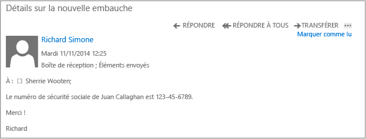

# Image plein &#233;cran&#160;: Message &#233;lectronique non prot&#233;g&#233; (interne)

Retour à [Azure RMS en action : Protection automatique des messages électroniques avec Exchange Online et les stratégies de prévention des pertes de données](http://technet.microsoft.com/library/jj585026.aspx)

