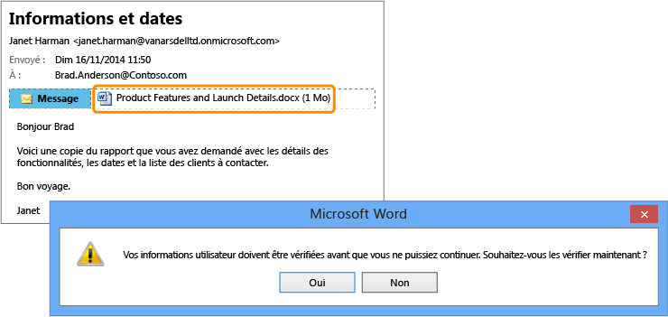

# Image plein &#233;cran&#160;: Rapport confidentiel envoy&#233; par erreur &#224; une autre personne

Retour à [Azure RMS en action : Protection automatique de fichiers sur des serveurs de fichiers exécutant Windows Server et l'infrastructure de classification des fichiers](http://technet.microsoft.com/library/jj585026.aspx)

