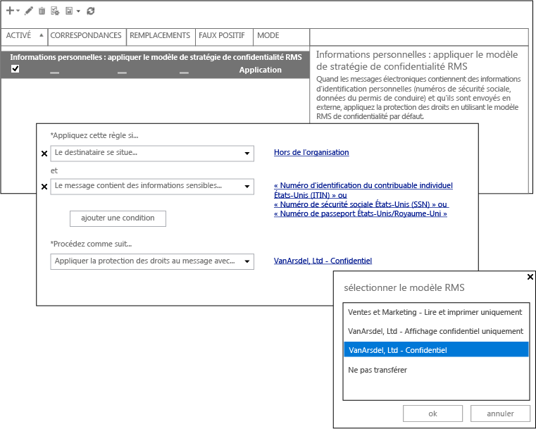

# Image plein &#233;cran&#160;: Configuration de DLP pour Azure RMS

Retour à [Azure RMS en action : Protection automatique des messages électroniques avec Exchange Online et les stratégies de prévention des pertes de données](http://technet.microsoft.com/library/jj585026.aspx)

