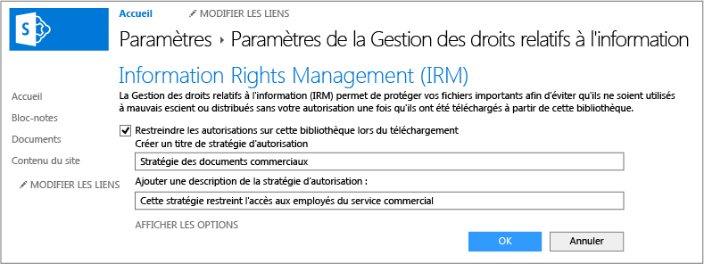

# Image plein &#233;cran&#160;: Activation du service IRM pour une biblioth&#232;que

Retour à [Azure RMS en action : Bibliothèques protégées avec SharePoint Online](http://technet.microsoft.com/library/jj585026.aspx).

