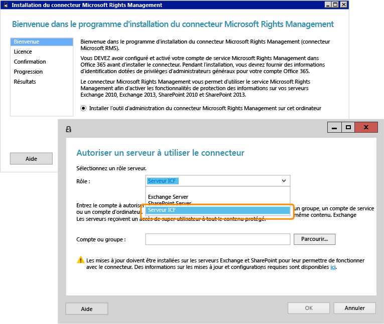

# Image plein &#233;cran&#160;: Installation et configuration du connecteur RMS pour l&#39;ICF

Retour à [Azure RMS en action : Protection automatique de fichiers sur des serveurs de fichiers exécutant Windows Server et l'infrastructure de classification des fichiers](http://technet.microsoft.com/library/jj585026.aspx)

