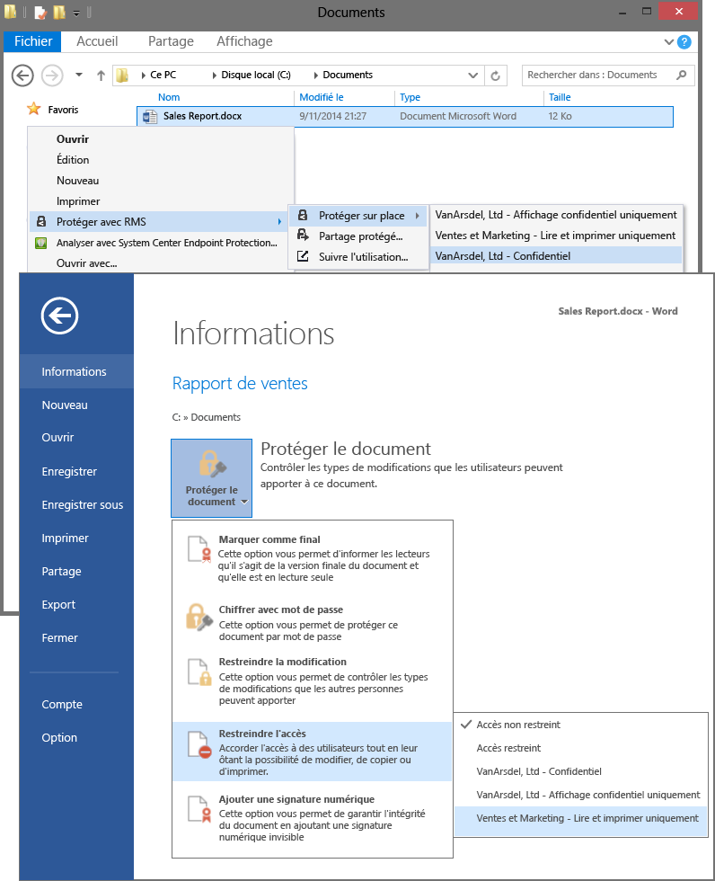

# Image plein &#233;cran&#160;: S&#233;lectionner des mod&#232;les RMS dans les applications, telles que l&#39;Explorateur de fichiers et Word

Retour à [Azure RMS en action : Activation et configuration de Rights Management](http://technet.microsoft.com/library/jj585026.aspx)

