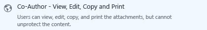

# Comment partager un document par courrier &#233;lectronique en toute s&#233;curit&#233;

## &lt;Instructions pour l'administrateur – supprimer cette section avant transmettre aux utilisateurs&gt;
Utilisez ce document comme point de départ de vos propres instructions pour l'utilisateur final afin d'aider les utilisateurs à partager leurs documents par courrier électronique en toute sécurité.Apportez les modifications de votre choix aux instructions figurant dans la section suivante, supprimez cette première section, donnez transmettez ce document aux utilisateurs.

Les instructions présentées ici ont trait à une entreprise fictive, **VanArsdel, Ltd**.Avant de donner ces instructions aux utilisateurs, remplacez les captures d'écran et les instructions afin qu'elles indiquent le nom de votre propre organisation, ou modifiez les instructions pour informer les utilisateurs que, lorsque les instructions font référence à VanArsdel Ltd, ils doivent imaginer le nom de leur entreprise à la place.Autres personnalisations que vous pouvez apporter :

-   À l'étape 2, nous vous suggérons deux des options disponibles en cas d'envoi à des personnes extérieures à l'organisation.Vous pouvez modifier ces suggestions.

-   À l'étape 2, nous suggérons des descriptions pour aider les utilisateurs à identifier le modèle à sélectionner.Vous pouvez modifier ces descriptions afin d'être plus spécifique ou significative en relation avec votre activité et vos utilisateurs.

-   À l'étape 3, nous suggérons de sélectionner **M'autoriser à révoquer de suite l'accès à ces documents** pour l'option **Visionneuse – Affichage uniquement**, au cas où vous voudriez inclure cette option de configuration pour les utilisateurs.Toutefois, vous pouvez décider que les utilisateurs doivent toujours sélectionner cette option quand ils envoient le document à quelqu'un d'extérieur à l'organisation, ou qu'ils ne doivent jamais la sélectionner.

-   À l'étape 4, nous suggérons de sélectionner l'option **M'envoyer un message électronique quand quelqu'un tente d'ouvrir ce document**.Si les utilisateurs suivent leurs documents via le portail de suivi de document, vous pouvez décider que la notification par courrier électronique n'est pas nécessaire et supprimer cette étape.

> [!NOTE]
> Pour plus d'informations sur chacune des options que les utilisateurs peuvent sélectionner, consultez [Options de boîte de dialogue pour l'application de partage Rights Management](https://technet.microsoft.com/library/dn574738.aspx)

Pour que les instructions pour l'utilisateur fonctionnent, les éléments suivants doivent être en place :

|Check|Condition requise|Si vous avez besoin d'informations supplémentaires|
|---------|---------------------|------------------------------------------------------|
||Vous avez préparé des comptes et des groupes pour Azure Active Directory|[Préparation pour Azure Rights Management](https://technet.microsoft.com/library/jj585029.aspx)|
||Azure Rights Management est activé|[Activation d'Azure Rights Management](https://technet.microsoft.com/library/jj658941.aspx)|
||L'application de partage Rights Management est déployée sur les ordinateurs des utilisateurs qui exécutent Windows|[Déploiement automatique de l'application de partage Microsoft Rights Management](https://technet.microsoft.com/library/dn339003%28v=ws.10%29.aspx)|
||Si vous utilisez Exchange Server plutôt qu'Exchange Online :  -   Le connecteur RMS est déployé et les rôles Exchange Server sont configurés pour l'utiliser|[Déploiement du connecteur Azure Rights Management](https://technet.microsoft.com/library/dn375964.aspx)|
||Les utilisateurs utilisent Outlook version Office 2010.|Si les utilisateurs disposent d'Office 2013, remplacez les captures d'écran par des versions équivalentes afin qu'elles correspondent à ce que les utilisateurs voient.|
||Vous avez configuré des modèles personnalisés comme décrit ci-dessous|[Configuration de modèles personnalisés pour Azure Rights Management](https://technet.microsoft.com/library/dn642472.aspx)|

#### Pour configurer les modèles personnalisés :

1.  Archivez les 2 modèles par défaut.

2.  Créez 3 nouveaux modèles en copiant les modèles par défaut et en y apportant les modifications suivantes :

    |Modèle à copier|Nouveau nom|Nouvelle description|Accorder ces droits personnalisés|Autres paramètres|
    |-------------------|---------------|------------------------|-------------------------------------|---------------------|
    |**&lt;nom de l'organisation&gt; - Affichage confidentiel uniquement**|**Confidentialité élevée - &lt;nom de l'organisation&gt;**|Tous les utilisateurs de &lt;nom de l'organisation&gt; disposent de droits d'affichage et de modification.Pas d'accès hors connexion.|**Afficher le contenu**  **Enregistrer le fichier**  **Modifier le contenu**|Mettez à jour le nom et la description pour les langues des utilisateurs.  Pour **Expiration du contenu** : Conservez l'option par défaut **Le contenu n'expire jamais**  Pour **Accès hors connexion** : Sélectionnez **Le contenu n'est disponible qu'avec une connexion Internet**|
    |**&lt;nom de l'organisation&gt; - Affichage confidentiel uniquement**|**Confidentiel - &lt;nom de l'organisation&gt;**|Tous les utilisateurs de &lt;nom de l'organisation&gt; disposent de droits d'affichage et de modification.|**Afficher le contenu**  **Enregistrer le fichier**  **Modifier le contenu**|Mettez à jour le nom et la description pour les langues des utilisateurs.  Pour **Expiration du contenu** : Conservez l'option par défaut **Le contenu n'expire jamais**  Pour **Accès hors connexion** : Sélectionnez **Nombre de jours pendant lesquels le contenu est disponible sans connexion Internet**, puis tapez **1**|
    |**&lt;nom de l'organisation&gt; - Confidentiel**|**Interne - &lt;nom de l'organisation&gt;**|Tous les utilisateurs de &lt;nom de l'organisation&gt; possèdent les droits complets, mais ils ne peuvent pas ôter la protection du contenu.|**Afficher le contenu**  **Enregistrer le fichier**  **Modifier le contenu**  **Copier et extraire le contenu**  **Imprimer**|Mettez à jour le nom et la description pour les langues des utilisateurs.  Pour **Expiration du contenu** : Conservez l'option par défaut **Le contenu n'expire jamais**  Pour **Accès hors connexion** : Conservez l'option par défaut **Nombre de jours pendant lesquels le contenu est disponible sans connexion Internet** et la valeur par défaut **7**|

3.  Publiez les 3 nouveaux modèles.

## &lt;Les instructions pour l'utilisateur commencent ici. Supprimez ce titre&gt;
Désormais, chaque fois que vous envoyez un document important à quelqu'un par courrier électronique, vous devez suivre ces instructions pour éviter que le document soit lu par des personnes non autorisés.

1.  Créez votre message électronique en spécifiant les adresses de messagerie, tapez votre message, puis joignez le fichier que vous souhaitez partager en toute sécurité.Ensuite, sous l'onglet **Message**, dans le groupe **RMS**, cliquez sur **Partager le fichier protégé**, puis de nouveau sur **Partager le fichier protégé** :

    

2.  Dans la boîte de dialogue **Partager le fichier protégé**, spécifiez les éléments suivants :

    Lorsque vous envoyez un document à au moins une personne travaillant pour une autre organisation :

    |Si cela s'applique...|Procédez comme suit :|
    |-------------------------|-------------------------|
    |**Protection générique** est automatiquement sélectionné pour vous    →|Conservez cette sélection :  |
    |Les informations contenues dans le document ne doivent pas être modifiées    →|Sélectionnez **Visionneuse – Affichage uniquement** :  |
    |Vous pouvez modifier les informations figurant dans le document    →|Sélectionnez **Co-auteur – Affichage, modification, copie et impression** :  |
    Lorsque vous envoyez un document à des personnes au sein de votre organisation :

    |Si cela s'applique...|Procédez comme suit :|
    |-------------------------|-------------------------|
    |**Protection générique** est automatiquement sélectionné pour vous    →|Conservez cette sélection :  |
    |Les informations contenues dans le document sont très sensibles et pourraient causer un préjudice exceptionnellement grave à l'organisation ou à ses employés si elles venaient à être rendues publiques    →|Sélectionnez **Confidentialité élevée - VanArsdel, Ltd** :  |
    |Les informations contenues dans le document sont sensibles et pourraient causer un préjudice à l'organisation ou à ses employés si elles venaient à être rendues publiques    →|Sélectionnez **Confidentiel - VanArsdel, Ltd** :  |
    |Les informations contenues dans le document ne doivent pas être partagées avec des personnes extérieures à votre organisation, mais ne contiennent pas de données sensibles sur l'organisation ou ses employés    →|Sélectionnez **Interne – VanArsdel, Ltd** :  |

3.  Si vous avez sélectionné **Visionneuse – Affichage uniquement** : Sélectionnez **M'autoriser à révoquer de suite l'accès à ces documents** :

    

4.  Sélectionnez **M'envoyer un message électronique quand quelqu'un tente d'ouvrir ces documents** :

    

5.  Cliquez sur **Envoyer maintenant** :

    

Quand une personne à qui vous avez envoyé un document protégé reçoit le courrier électronique, elle voit un message contenant des instructions sur la manière de le lire.Elle peut le lire sur de nombreux appareils tels que iPad, iPhone, tablettes et téléphones Android, ordinateurs Mac et ordinateurs Windows.

Pour savoir si les personnes auxquelles vous avez envoyé des documents protégés ont accédé à ceux-ci, utilisez le [site de suivi de document](https://track.azurerms.com/).

**Vous avez besoin d'aide ?**

-   Pour plus d'informations :

    -   [Protéger un fichier que vous partagez par courrier électronique](https://technet.microsoft.com/library/dn574735%28v=ws.10%29.aspx)

    -   [Suivre et révoquer vos documents](https://technet.microsoft.com/library/dn986611.aspx)

-   Contactez le support technique :

    -   &lt;coordonnées&gt;

