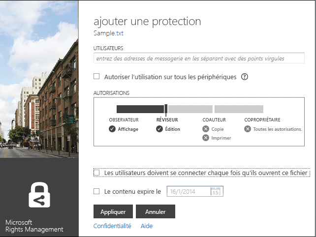
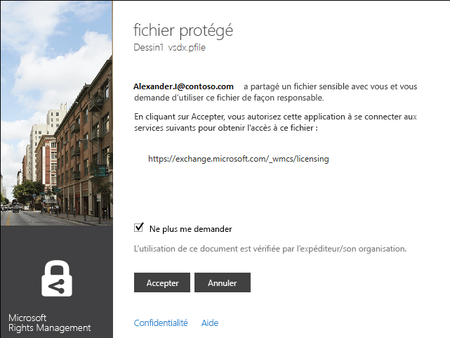

# Guide de l&#39;utilisateur de l&#39;application de partage Microsoft Rights Management&#160;–&#160;publication d&#39;origine
Ce guide de l’utilisateur pour l’application de partage Microsoft Rights Management pour Windows comprend les sections suivantes :

-   [Évaluation et installation de l'application de partage Microsoft Rights Management](../Topic/Microsoft_Rights_Management_sharing_application_user_guide_-_original_publication.md#BKMK_Eval)

-   [Utilisation de l'application de partage Microsoft Rights Management](../Topic/Microsoft_Rights_Management_sharing_application_user_guide_-_original_publication.md#BKMK_UsingMSRMSApp)

-   [Utilisation d'autorisations créées par l'utilisateur et partage de contenu protégé](../Topic/Microsoft_Rights_Management_sharing_application_user_guide_-_original_publication.md#BKMK_Custom)

-   [Utilisation du complément de la barre d'outils Office](../Topic/Microsoft_Rights_Management_sharing_application_user_guide_-_original_publication.md#BKMK_OfficeToolbar)

-   [Aide pour l'administrateur de l'application de partage Microsoft Rights Management](../Topic/Microsoft_Rights_Management_sharing_application_user_guide_-_original_publication.md#BKMK_AdminGuide)

Pour consulter le forum aux questions et obtenir des informations de dépannage, consultez le [Forum aux questions sur l’application de partage Microsoft Rights Managements pour Windows](http://go.microsoft.com/fwlink/?LinkId=303971).

## <a name="BKMK_Eval"></a>Évaluation et installation de l’application de partage Microsoft Rights Management
Cette section décrit l’application de partage Microsoft Rights Management et explique comment l’installer :

-   [Qu'est-ce que l'application de partage Microsoft Rights Management ?](../Topic/Microsoft_Rights_Management_sharing_application_user_guide_-_original_publication.md#BKMK_WhatIs)

-   [Configuration requise pour l'application de partage Microsoft Rights Management](../Topic/Microsoft_Rights_Management_sharing_application_user_guide_-_original_publication.md#BKMK_Reqs)

-   [Installation de l'application de partage Microsoft Rights Management](../Topic/Microsoft_Rights_Management_sharing_application_user_guide_-_original_publication.md#BKMK_Install)

### <a name="BKMK_WhatIs"></a>Qu’est-ce que l’application de partage Microsoft Rights Management ?
L’application de partage Microsoft Rights Management est une application téléchargeable facultative pour Microsoft Windows qui offre les avantages suivants :

-   Elle améliore l’Explorateur de fichiers (également appelé Explorateur Windows dans Windows 7 et les versions antérieures) en vous permettant de protéger un seul fichier, ou de protéger plusieurs fichiers en bloc, ainsi que l’ensemble des fichiers dans un dossier sélectionné.

-   Elle prend en charge la protection de tout type de fichier et intègre une visionneuse pour les types de fichiers texte et image couramment utilisés.

-   Elle ajoute de nouveaux boutons à la barre d’outils Microsoft Office pour Word, PowerPoint et Excel.

### <a name="BKMK_Reqs"></a>Exigences pour l’application de partage Microsoft Rights Management
Pour utiliser l’application de partage Microsoft Rights Management, votre ordinateur doit exécuter Windows 8.1, Windows 8 ou Windows 7.

L’application de partage Microsoft Rights Management nécessite le client AD RMS 2.1, qui est installé avec le package d’installation.L’application de partage Microsoft Rights Management ne fonctionnera qu’avec cette version du client AD RMS.

### <a name="BKMK_Install"></a>Installation de l’application de partage Microsoft Rights Management
Pour installer l’application de partage Microsoft Rights Management, procédez comme suit :

1.  Accédez à la page [Microsoft Rights Management](http://go.microsoft.com/fwlink/?LinkId=303970) sur le site web de Microsoft.

2.  Dans la section **Ordinateurs**, cliquez sur l’icône de l’**application RMS pour Windows** et enregistrez le package d’installation de l’application de partage Microsoft Rights Management sur votre ordinateur.

3.  Double-cliquez sur le fichier compressé qui a été téléchargé, puis double-cliquez sur **setup.exe**.Si vous êtes invité à continuer, cliquez sur **Oui**.

4.  Sur la page **Installer Microsoft RMS**, cliquez sur **Suivant**, et attendez que l’installation se termine.

5.  Une fois l’installation terminée, cliquez sur **Redémarrer** pour redémarrer votre ordinateur et terminer l’installation.Sinon, cliquez sur **Fermer** et vous pourrez redémarrer votre ordinateur plus tard pour terminer l’installation.

## <a name="BKMK_UsingMSRMSApp"></a>Utilisation de l’application de partage Microsoft Rights Management
Cette section décrit les différentes façons d’utiliser l’application de partage Microsoft Rights Management :

-   [Création d'un fichier texte protégé (.ptxt)](../Topic/Microsoft_Rights_Management_sharing_application_user_guide_-_original_publication.md#BKMK_CreatePTXT)

-   [Affichage d'un fichier texte protégé (.ptxt) ou d'un fichier image protégé](../Topic/Microsoft_Rights_Management_sharing_application_user_guide_-_original_publication.md#BKMK_ViewPTXT)

-   [Création d'un fichier protégé générique (.pfile)](../Topic/Microsoft_Rights_Management_sharing_application_user_guide_-_original_publication.md#BKMK_CreatePFILE)

-   [Affichage d'un fichier protégé générique (.pfile)](../Topic/Microsoft_Rights_Management_sharing_application_user_guide_-_original_publication.md#BKMK_ViewPFILE)

-   [Suppression de la protection d'un fichier](../Topic/Microsoft_Rights_Management_sharing_application_user_guide_-_original_publication.md#BKMK_Unprotect)

### <a name="BKMK_CreatePTXT"></a>Création d’un fichier texte protégé (.ptxt)
L’application de partage Microsoft Rights Management peut être utilisée pour convertir un fichier texte standard (.txt) en un fichier protégé (.ptxt).

##### Pour créer un fichier texte protégé (.ptxt)

1.  Dans l’Explorateur de fichiers, cliquez avec le bouton droit dans un dossier, pointez sur **Nouveau**, puis cliquez sur **Document texte**.

2.  Renommez le fichier (par exemple, Sample.txt).

3.  Double-cliquez sur le fichier pour l’ouvrir dans le Bloc-notes.

4.  Dans le Bloc-notes, ajoutez quelques lignes de texte au fichier, par exemple ce qui suit, puis enregistrez-le :

    ```
    This is a sample text file.
    This is a sample text file.
    This is a sample text file.
    This is a sample text file. 
    This is a sample text file.
    This is a sample text file.
    ```

5.  Cliquez avec le bouton droit sur le fichier, pointez sur **Protéger au même emplacement** et sélectionnez un modèle dans la liste.(Si vous utilisez l’outil pour la première fois, vous devez sélectionner **Stratégie de protection de l’entreprise** pour lancer le téléchargement des modèles pour votre organisation.)

6.  Sur l’écran **Application de partage Microsoft Rights Management**, confirmez la stratégie que vous souhaitez appliquer, cliquez sur **Appliquer**, puis, une fois que le fichier est protégé, cliquez sur **Fermer**.

### <a name="BKMK_ViewPTXT"></a>Affichage d’un fichier texte protégé (.ptxt) ou d’un fichier image protégé
Pour afficher un fichier texte protégé (.ptxt), dans l’Explorateur de fichiers, double-cliquez sur le fichier (par exemple, Sample.ptxt).Il se peut que l’application vous invite à lui accorder des droits.La stratégie de protection apparaît en haut du fichier.

Les images protégées peuvent être ouvertes et affichées de la même façon.

### <a name="BKMK_CreatePFILE"></a>Création d’un fichier protégé générique (.pfile)
Le format des fichiers de protection générique (.pfile) peut être utilisé pour offrir un niveau de protection générique pour les types de fichiers qui ne sont pas directement pris en charge par l’application de partage Microsoft Rights Management ou d’autres applications qui fournissent une protection intégrée de type RMS.

Par exemple, le format de fichier de protection générique peut protéger des fichiers .vsd créés avec Microsoft Visio (qui ne prend actuellement pas en charge une protection intégrée).

> [!NOTE]
> Les fichiers qui utilisent la protection générale sont sécurisés uniquement pour l’authentification.Un utilisateur qui est autorisé à utiliser le fichier protégé (.pfile) sera authentifié et les droits et autorisations de l’utilisateur sont affichés, mais ce dernier ne peut pas les faire valoir une fois que le fichier est ouvert dans son format d’origine (par exemple, une fois le fichier .vsd ouvert dans Visio).Un utilisateur qui n’est pas autorisé ou ne parvient pas à s’authentifier ne pourra pas ouvrir le fichier protégé.

##### Pour créer un fichier protégé générique (.pfile) à partir d’un dessin Visio (.vsd)

1.  Dans l’Explorateur de fichiers, cliquez avec le bouton droit dans un dossier, pointez sur **Nouveau**, puis cliquez sur **Nouveau document Visio**.

2.  Renommez le fichier (par exemple, Sample.vsd).

3.  Double-cliquez sur le fichier pour l’ouvrir dans Visio.

4.  Dans Visio, ajoutez des éléments au dessin, puis enregistrez et fermez le fichier.

5.  Cliquez avec le bouton droit sur le fichier, pointez sur **Protéger au même emplacement** et sélectionnez un modèle de stratégie dans la liste.(Si vous utilisez l’outil pour la première fois, vous devez sélectionner **Stratégie de protection de l’entreprise** pour lancer le téléchargement des modèles pour votre organisation.)

6.  Sur l’écran **Application de partage Microsoft Rights Management**, sélectionnez la stratégie que vous voulez appliquer, puis cliquez sur **Appliquer**.

7.  Un message indique que votre fichier protégé a été enregistré sous le nom Sample.vsd.pfile (le fichier d’origine est supprimé).

### <a name="BKMK_ViewPFILE"></a>Affichage d’un fichier protégé générique (.pfile)
Pour afficher un fichier protégé générique (.pfile), dans l’Explorateur de fichiers, double-cliquez sur le fichier protégé générique (.pfile) (par exemple, Sample.vsd.pfile), puis cliquez sur **Ouvrir**.

### <a name="BKMK_Unprotect"></a>Suppression de la protection d’un fichier
L’application de partage Microsoft Rights Management vous permet de supprimer la protection des fichiers que vous avez précédemment protégés.

Pour supprimer la protection (c’est-à-dire, l’ôter) d’un fichier précédemment protégé, appliquez l’option **Supprimer la protection** comme suit :

1.  Cliquez avec le bouton droit sur **Sample.ptxt**, pointez sur **Protéger au même emplacement**, puis cliquez sur **Supprimer la protection**.Il se peut que l’application vous invite à lui accorder des droits.

2.  Le fichier Sample.ptxt sera supprimé et remplacé par Sample.txt.

## <a name="BKMK_Custom"></a>Utilisation d’autorisations créées par l’utilisateur et partage de contenu protégé
Cette section explique comment protéger et utiliser un fichier à l’aide d’autorisations créées par l’utilisateur, comment partager du contenu protégé et comment protéger plusieurs fichiers :

-   [Protection d'un fichier avec des autorisations créées par l'utilisateur](../Topic/Microsoft_Rights_Management_sharing_application_user_guide_-_original_publication.md#BKMK_ProtectCustom)

-   [Utilisation de fichiers avec une protection créée par l'utilisateur](../Topic/Microsoft_Rights_Management_sharing_application_user_guide_-_original_publication.md#BKMK_UserDefined)

-   [Partage de contenu protégé](../Topic/Microsoft_Rights_Management_sharing_application_user_guide_-_original_publication.md#BKMK_ShareProtected)

-   [Utilisation des raccourcis clavier](../Topic/Microsoft_Rights_Management_sharing_application_user_guide_-_original_publication.md#BKMK_AccessKeys)

-   [Application de la protection à plusieurs fichiers et dossiers](../Topic/Microsoft_Rights_Management_sharing_application_user_guide_-_original_publication.md#BKMK_Multiple)

### <a name="BKMK_ProtectCustom"></a>Protection d’un fichier avec des autorisations créées par l’utilisateur
Vous pouvez utiliser la protection créée par l’utilisateur aux fins suivantes :

-   Pour limiter l’accès au fichier à une liste spécifique d’utilisateurs individuels identifiés par leurs adresses de messagerie.

-   Pour limiter l’utilisation du fichier à des droits spécifiques, comme le droit de visualiser un document en lecture seule uniquement.

Pour protéger un fichier avec des autorisations créées par l’utilisateur, cliquez avec le bouton droit sur le fichier, cliquez sur **Protéger au même emplacement** et cliquez sur **Autorisations personnalisées**.L’écran suivant s’ouvre :



Entrez les adresses de messagerie de la liste des utilisateurs, utilisez le curseur pour sélectionner les autorisations pour le fichier, puis cliquez sur **Appliquer**.

### <a name="BKMK_UserDefined"></a>Utilisation de fichiers dont la protection a été créée par l’utilisateur
La plupart des fichiers protégés gérés par l’application de partage Microsoft Rights Management auront été protégés par l’application de niveaux de protection reposant sur des modèles.Cependant, l’application de partage Microsoft Rights Management prend également en charge les fichiers qui ont reçu un niveau de protection créé par l’utilisateur.

La protection créée par l’utilisateur peut être utilisée pour obtenir les types suivants de protection pour un fichier :

-   Pour limiter l’accès au fichier à une liste très spécifique d’utilisateurs individuels identifiés par leurs adresses de messagerie.

-   Pour limiter l’utilisation du fichier à un seul droit spécifique, comme le droit d’imprimer le document uniquement.

Pour les formats de fichier texte et image, ce niveau de protection nécessite que toutes les applications qui sont utilisées pour modifier, enregistrer ou limiter les fichiers texte ou image aient été conçues pour prendre en charge la protection RMS et mettre en œuvre les API de protection fournies dans le kit de développement logiciel AD RMS.

Lorsque vous affichez un fichier texte protégé auquel a été appliquée une protection créée par l’utilisateur, vous remarquerez une légère différence au niveau des autorisations, car elles sont affichées pour le fichier comme illustré dans l’exemple suivant.

Pour les fichiers qui sont protégés à l’aide du format de fichier de protection générique (.pfile), les droits ou les autorisations spécifiques qui ont été définies par l’utilisateur s’affichent dans l’écran de confirmation à la place du nom du modèle qui a été utilisé pour protéger le fichier, comme illustré dans la figure suivante.



### <a name="BKMK_ShareProtected"></a>Partage de contenu protégé
Pour protéger et partager du contenu, cliquez avec le bouton droit sur le fichier, puis cliquez sur **Partage protégé**.L’écran suivant s’ouvre :


Entrez les adresses de messagerie de la liste des utilisateurs, utilisez le curseur pour sélectionner les autorisations pour le fichier, puis cliquez sur **Envoyer**.L’application lance Outlook et ouvre un e-mail prérédigé, avec le fichier protégé en pièce jointe.Le fichier d’origine ne sera pas protégé.

Pour permettre aux utilisateurs d’afficher les fichiers protégés sur des périphériques n’exécutant pas Windows, cliquez sur **Autoriser l’utilisation sur tous les périphériques**.Les utilisateurs devront [télécharger l’application de partage Microsoft Rights Management](http://go.microsoft.com/fwlink/?LinkId=303970) pour leur périphérique.

### <a name="BKMK_AccessKeys"></a>Utilisation des raccourcis clavier
Appuyez sur la touche **Alt** pour voir les touches d’accès rapide disponibles.Appuyez sur **Alt** + la touche d’accès rapide pour sélectionner une option.Par exemple, dans la boîte de dialogue **Partage protégé**, appuyez sur **Alt** pour afficher les touches d’accès rapide et appuyez sur **Alt + u** pour sélectionner **Les utilisateurs doivent se connecter chaque fois qu’ils ouvrent ce fichier**.


### <a name="BKMK_Multiple"></a>Application de la protection à plusieurs fichiers et dossiers
L’application de partage Microsoft Rights Management permet également d’appliquer une protection à plusieurs fichiers, en sélectionnant plusieurs fichiers ou un dossier qui contient des fichiers non protégés dans l’Explorateur de fichiers.

##### Pour protéger plusieurs fichiers ou tous les fichiers d’un dossier sélectionné

1.  Dans l’Explorateur de fichiers, sélectionnez plusieurs fichiers ou sélectionnez un dossier contenant plusieurs fichiers à protéger.

2.  Cliquez avec le bouton droit sur le dossier ou les fichiers pour les sélectionner, pointez sur **Protéger au même emplacement**, puis sélectionnez un modèle dans la liste.(Si vous utilisez l’outil pour la première fois, vous devez sélectionner **Stratégie de protection de l’entreprise** pour lancer le téléchargement des modèles pour votre organisation.)

3.  Sur l’écran **Application de partage Microsoft Rights Management**, vérifiez que les fichiers ont été protégés.

Si vous observez des erreurs, reportez-vous au [forum aux questions pour l’application de partage Microsoft Rights Management pour Windows](http://go.microsoft.com/fwlink/?LinkId=303971).

## <a name="BKMK_OfficeToolbar"></a>Utilisation du complément de barre d’outils Office
Vous pouvez protéger et partager des fichiers Word, PowerPoint et Excel directement dans Microsoft Office à l’aide du complément de ruban Office pour l’application de partage Microsoft Rights Management.Cliquez sur **Partage protégé** sur le ruban pour lancer l’application de partage Microsoft Rights Management.


## <a name="BKMK_AdminGuide"></a>Guide de l’administrateur pour l’application de partage Microsoft Rights Management
Le guide de l’administrateur pour l’application de partage Microsoft Rights Management comprend les sections suivantes :

-   [Présentation technique de l'application de partage Microsoft Rights Management](../Topic/Microsoft_Rights_Management_sharing_application_user_guide_-_original_publication.md#BKMK_AdminOverview)

-   [Types de fichiers pris en charge](../Topic/Microsoft_Rights_Management_sharing_application_user_guide_-_original_publication.md#BKMK_SupportFileTypes)

-   [Déploiement automatique de l'application de partage Microsoft Rights Management](../Topic/Microsoft_Rights_Management_sharing_application_user_guide_-_original_publication.md#BKMK_ScriptedInstall)

### <a name="BKMK_AdminOverview"></a>Présentation technique de l’application de partage Microsoft Rights Management
L’application de partage Microsoft Rights Management est une application téléchargeable facultative pour les plateformes Microsoft Windows et autres qui offre les avantages suivants :

-   Protection d’un seul fichier ou protection en bloc de plusieurs fichiers, ainsi que de tous les fichiers d’un dossier sélectionné

-   Prise en charge intégrale de la protection de tous les types de fichier et intégration d’une visionneuse pour les types de fichier texte et image couramment utilisés

-   Protection générique pour les fichiers qui ne prennent pas en charge la protection RMS

-   Interopérabilité intégrale avec les fichiers protégés à l’aide de la gestion des droits relatifs à l’information (Office Information Rights Management, IRM)

-   Interopérabilité intégrale avec les fichiers PDF protégés à l’aide de SharePoint, l’Infrastructure de classification des fichiers (ICF) et les outils de création de fichiers PDF pris en charge

L’application de partage Microsoft Rights Management utilise le nouveau [runtime RMS Client 2.1](http://www.microsoft.com/download/details.aspx?id=38396).Elle fournit aux utilisateurs la possibilité de protéger du contenu à l’aide de modèles prédéfinis ou définis par l’utilisateur que vous pouvez personnaliser et déployer pour votre organisation.À l’aide de la fonctionnalité AD RMS 2.1, l’application de partage Microsoft Rights Management fournit aux utilisateurs finals une expérience simple de protection et d’utilisation.

Grâce à la version d’octobre 2013 de Windows Azure AD RMS, vous pouvez protéger des documents au niveau natif à l’aide d’Office 2010 et les envoyer à des personnes travaillant dans une autre société, qui pourront alors les utiliser à l’aide de Windows Azure AD RMS.En outre, avec cette version, si vous utilisez AD RMS avec le mode de chiffrement 2, vous pouvez utiliser RMS pour les particuliers et exploiter du contenu provenant de personnes travaillant dans une autre société qui utilise Windows Azure AD RMS.Pour plus d’informations sur le mode de chiffrement 2, voir [Modes de chiffrement AD RMS](http://technet.microsoft.com/library/hh867439%28v=ws.10%29.aspx).

Pour télécharger l’application de partage Microsoft Rights Management, procédez comme suit :

1.  Connectez-vous à [Microsoft Connect](http://connect.microsoft.com/) avec votre compte Microsoft (anciennement appelé Live ID).

2.  Sur la page d’**accueil**, recherchez **Rights Management Services** et rejoignez le groupe.

3.  Cliquez sur **Téléchargements**, puis sur **Application de partage Microsoft Rights Management**.

4.  Sur la page **Détails du téléchargement**, sélectionnez le **fichier .zip de l’application de partage Microsoft Rights Management**, puis cliquez sur **Télécharger**.

5.  Si nécessaire, installez Microsoft File Transfer Manager et suivez la procédure pour télécharger l’application de partage Microsoft Rights Management.

#### Niveaux de protection pris en charge par l’application de partage Microsoft Rights Management
L’application de partage Microsoft Rights Management prend en charge la protection à deux niveaux différents, comme décrit dans le tableau suivant.

||||
|-|-|-|
|Type de protection|Natif|Générique|
|Description|Dans le cas de fichiers texte, image, Microsoft Office (Word, Excel, PowerPoint), .pdf et d’autres types de fichier d’application pris en charge par AD RMS, la protection native fournit un niveau de protection élevé qui comprend le chiffrement et la mise en application de droits (autorisations).|Pour toutes les autres applications et tous les autres types de fichier, la protection générique fournit un niveau de protection qui inclut à la fois l’encapsulation de fichier avec le type de fichier .pfile et l’authentification pour déterminer si un utilisateur est autorisé à ouvrir le fichier.|
|Protection|Les fichiers sont entièrement cryptés et la protection est appliquée comme suit :<br /><br />-   Pour que le contenu protégé soit affiché, les personnes qui reçoivent le fichier par courrier électronique ou obtiennent un accès à celui-ci grâce aux autorisations de fichier ou de partage doivent être authentifiées.<br />-   De plus, la stratégie et les droits d’utilisation définis par le propriétaire du contenu lorsque les fichiers sont protégés sont entièrement appliqués lorsque le contenu est affiché dans IP Viewer (pour les fichiers texte et image protégés) ou dans l’application associée (pour tous les autres types de fichiers pris en charge).|La protection des fichiers est appliquée comme suit :<br /><br />-   Avant l’affichage du contenu protégé, les personnes autorisées à ouvrir le fichier et qui ont la possibilité d’y accéder doivent s’authentifier.Si l’autorisation échoue, le fichier ne s’ouvre pas.<br />-   Les droits d’utilisation et la stratégie définis par le propriétaire du contenu sont affichés pour informer les utilisateurs autorisés de la stratégie d’utilisation en vigueur.<br />-   L’enregistrement d’audit des utilisateurs autorisés qui ouvrent les fichiers et y accèdent se produit, mais aucun droit d’utilisation n’est appliqué par les applications non prises en charge.|
|Valeur par défaut pour les types de fichier|Il s’agit du niveau de protection par défaut pour les types de fichiers suivants :<br /><br />-   Fichiers texte et image<br />-   Fichiers Microsoft Office (Word, Excel, PowerPoint)<br />-   Format PDF<br /><br />Pour plus d’informations, voir les types de fichiers pris en charge.|Il s’agit de la protection par défaut pour tous les autres types de fichiers (comme .vsdx, .rtf, etc.) non pris en charge pour la protection intégrale.|

### <a name="BKMK_SupportFileTypes"></a>Types de fichiers pris en charge
Le tableau suivant répertorie les types de fichier pris en charge par l’application de partage Microsoft Rights Management.

|Extension de fichier|Description|Extension de fichier d’origine|
|------------------------|---------------|----------------------------------|
|.ptxt|Fichier texte protégé|.txt|
|.pxml|Fichier XML protégé|.xml|
|.pjpg|Fichier image JPG protégé|.jpg|
|.pjpeg|Fichier image JPEG protégé|.jpeg|
|.ppng|Fichier image PNG protégé|.png|
|.ptiff|Fichier image TIFF protégé|.tiff|
|.pbmp|Fichier Bitmap Windows protégé|.bmp|
|.pgif|Fichier image GIF protégé|.gif|
|.pgiff|Fichier image GIFF protégé|.giff|
|.pjpe|Fichier image JPE protégé|.jpe|
|.pjfif|Fichier image JFIF protégé|.jfif|
|.pjif|Fichier image JIF protégé|.jif|
Le tableau suivant répertorie les types de fichier pris en charge par Microsoft Office 2013, Office 2010 et Office 2007.Il existe deux types de protecteur : MsoIrmProtector et OpcIrmProtector.Pour plus d’informations sur ces types de protecteur, voir [Protecteurs de formats de fichier Microsoft Office](http://archive.msdn.microsoft.com/OfficeProtectors).

|||
|-|-|
|MsoIrmProtector prend en charge les types de fichiers suivants :<br /><br />-   doc<br />-   dot<br />-   xla<br />-   xls<br />-   xlt<br />-   pps<br />-   ppt|OpcIrmProtector prend en charge les types de fichier suivants :<br /><br />-   docm<br />-   docx<br />-   dotm<br />-   dotx<br />-   xlam<br />-   xlsb<br />-   xlsm<br />-   xlsx<br />-   xltm<br />-   xltx<br />-   xps<br />-   potm<br />-   potx<br />-   ppsx<br />-   ppsm<br />-   pptm<br />-   pptx<br />-   thmx|

### <a name="BKMK_ScriptedInstall"></a>Déploiement automatique de l’application de partage Microsoft Rights Management
La version Windows de l’application de partage RMS prend en charge une installation par script, ce qui permet un déploiement en entreprise.

##### Pour télécharger l’application de partage RMS pour un déploiement automatique

1.  Accédez à la page [Application de partage Microsoft Rights Management pour Windows](http://www.microsoft.com/download/details.aspx?id=40857) du centre de téléchargement Microsoft, puis cliquez sur **Télécharger**.

2.  Sélectionnez et téléchargez les fichiers dont vous avez besoin.Il existe deux packages d’installation client : un pour Windows 64 bits (Microsoft Rights Management sharing application x64.zip) et un autre pour Windows 32 bits (Microsoft Rights Management sharing application x86.zip).

3.  Extrayez les fichiers des packages d’installation compressés, par exemple, en double-cliquant dessus.Ensuite, copiez les fichiers extraits dans un emplacement réseau auquel les ordinateurs clients peuvent accéder.

Les packages d’installation pour l’application de partage RMS prennent en charge différents scénarios de déploiement et incluent les éléments suivants :

|Description|Scénario de déploiement|
|---------------|---------------------------|
|Assistant de connexion Microsoft Online|Requis pour :<br /><br />-   Office 2010 et Windows Azure RMS|
|Correctif logiciel pour Office (article 2596501 de la base de connaissances)|Requis pour :<br /><br />-   Office 2010 et Windows Azure RMS|
|Correctif logiciel pour le mode de chiffrement 2 (article 2627273 de la base de connaissances)|Requis pour :<br /><br />-   Office 2010 et Windows Azure RMS|
|Client AD RMS et application de partage RMS|Requis pour :<br /><br />-   Office 2013 et Windows Azure RMS<br />-   Office 2010 et Windows Azure RMS<br />-   Office 2013 et Active Directory RMS<br />-   Office 2010 et Active Directory RMS<br />-   Mise à niveau de l’application de partage RMS|
|Complément Office pour le ruban|Requis pour :<br /><br />-   Office 2013 et Windows Azure RMS<br />-   Office 2013 et Active Directory RMS<br />-   Office 2010 et Active Directory RMS<br />-   Mise à niveau de l’application de partage RMS|
|Outil de préparation de Windows Azure Active Directory Rights Management|Requis pour :<br /><br />-   Office 2010 et Windows Azure RMS|
> [!NOTE]
> Pour le scénario **Office 2010 et Windows Azure RMS**, vous utilisez Windows Azure RMS ou Active Directory RMS mais vous souhaitez envoyer en toute sécurité des documents à des personnes d’une autre société qui utilisent Windows Azure RMS.
> 
> Lorsque vous installez et exécutez l’outil de préparation Windows Azure Active Directory Rights Management pour prendre en charge Office 2010, il effectue deux opérations :
> 
> -   Il modifie le registre pour que celui-ci prenne en charge l’application de partage RMS.
> -   Il « amorce » l’utilisateur, ce qui signifie que l’ordinateur contacte le serveur AD RMS ou Windows Azure RMS et obtient les certificats dont l’ordinateur et l’utilisateur ont besoin pour utiliser RMS.

Utilisez les procédures suivantes pour identifier les commandes nécessaires pour déployer l’application de partage RMS pour ces scénarios de déploiement :

-   Office 2013 et Windows Azure RMS

-   Office 2010 et Windows Azure RMS

-   Office 2013 ou Office 2010 et Active Directory RMS

-   Mise à niveau de l’application de partage RMS

Les exemples de commandes supposent que vous avez copié les fichiers téléchargés et extraits sur un partage réseau auquel les ordinateurs clients accèdent à l’aide de **\\server5\apps\rms** et que les ordinateurs clients contiennent déjà un dossier nommé **C:\Log files** où vous stockez les fichiers journaux d’installation de l’application.Pour chaque installation, vous choisissez le nom du fichier journal de l’installation, mais il doit avoir une extension de fichier .log.

> [!IMPORTANT]
> Avant de déployer l’application de partage RMS, vous devez créer un package avec les commandes requises dans ces procédures afin que l’installation puisse se faire dans le contexte de l’ordinateur pour tous les utilisateurs et avec des privilèges d’administrateur local.Vous pouvez ensuite déployer le package sur les ordinateurs à l’aide de votre mécanisme de déploiement d’application standard, par exemple, la stratégie de groupe ou System Center Configuration Manager.
> 
> L’outil de préparation Windows Azure Active Directory Rights Management présente toutefois une exception : Il doit être exécuté une fois pour chaque utilisateur sur l’ordinateur et l’outil doit être exécuté avec des privilèges élevés pour pouvoir modifier correctement le registre.Il existe différentes manières d’effectuer cette opération. Vous pouvez par exemple demander aux utilisateurs d’exécuter la commande (en incluant un lien dans un message électronique ou en affichant un lien sur le portail du support technique), ou vous pouvez l’ajouter à leur script d’ouverture de session.Si vous ne pouvez pas utiliser la commande runas, car les utilisateurs ne disposent pas d’un compte administrateur local, il existe des outils de déploiement qui peuvent élever automatiquement une commande, en fonction de règles que vous spécifiez.

##### Pour déployer l’application de partage RMS pour Office 2013 et Windows Azure RMS

1.  Installez le client AD RMS et l’application de partage RMS à l’aide des commandes suivantes :

    -   Pour Windows 64 bits : x64\setup_ipviewer.exe /norestart /quiet /msicl "MSIRESTARTMANAGERCONTROL=Disable" /log "&lt;chemin et nom du fichier journal&gt;"

        ```
        x64\setup_ipviewer.exe /norestart /quiet /msicl "MSIRESTARTMANAGERCONTROL=Disable" /log "<log file path and name>"
        ```

    -   Pour Windows 32 bits :

        ```
        X86\setup_ipviewer.exe /norestart /quiet /msicl "MSIRESTARTMANAGERCONTROL=Disable" /log "<log file path and name>"
        ```

    Par exemple : `\\server5\apps\rms\x64\setup_ipviewer.exe /norestart /quiet /msicl "MSIRESTARTMANAGERCONTROL=Disable" /log "C:\Log files\ipviewerinstall.log"`

2.  Installez le complément Office à l’aide des commandes suivantes :

    -   Pour la version 64 bits d’Office :

        ```
        msiexec.exe /norestart /quiet MSIRESTARTMANAGERCONTROL=Disable /i "x64\Setup64.msi" /L*v "<log file path and name>"
        ```

    -   Pour la version 32 bits d’Office :

        ```
        msiexec.exe /norestart /quiet MSIRESTARTMANAGERCONTROL=Disable /i "x86\Setup.msi" /L*v "<log file path and name>"
        ```

    > [!NOTE]
    > L’ordinateur doit être redémarré pour terminer l’installation.Vous pouvez lancer un redémarrage automatique à l’aide d’une commande, comme shutdown /i.

    Par exemple : `\\server5\apps\rms\msiexec.exe /norestart /quiet MSIRESTARTMANAGERCONTROL=Disable /i "x64\Setup64.msi" /L*v "C:\Log files\rmsoffice.log"`

##### Pour déployer l’application de partage RMS pour Office 2010 et Windows Azure RMS

1.  Installez l’Assistant de connexion Microsoft Online à l’aide des commandes suivantes :

    -   Pour Windows 64 bits :

        ```
        msiexec.exe /norestart /quiet MSIRESTARTMANAGERCONTROL=Disable /i "x64\msoidcli_64bit.msi" /L*v "<log file path and name >"
        ```

    -   Pour Windows 32 bits :

        ```
        msiexec.exe /norestart /quiet MSIRESTARTMANAGERCONTROL=Disable /i "x64\msoidcli_64bit.msi" /L*v "<log file path and name>"
        ```

    Par exemple : `\\server5\apps\rms\msiexec.exe /norestart /quiet MSIRESTARTMANAGERCONTROL=Disable /i "x64\msoidcli_64bit.msi" /L*v "C:\Log files\assistant.log"`

2.  Installez le correctif logiciel Office à l’aide des commandes suivantes :

    -   Pour la version 64 bits d’Office :

        ```
        x64\office2010-kb2596501-fullfile-x64-glb.exe /norestart /quiet /log:"<log file path and name >"
        ```

    -   Pour la version 32 bits d’Office :

        ```
        x86\office2010-kb2596501-fullfile-x86-glb.exe /norestart /quiet /log:"<log file path and name>"
        ```

    Par exemple : `\\server5\apps\rms\x64\office2010-kb2596501-fullfile-x64-glb.exe /norestart /quiet /log:"C:\Log files\kb2596501install.log"`

3.  Installez le correctif logiciel du mode de chiffrement 2 à l’aide des commandes suivantes :

    -   Pour Windows 64 bits :

        ```
        wusa.exe /norestart /quiet "x64\Windows6.1-KB2627273-v4-x64.msu" /log:"<log file path and name >"
        ```

    -   Pour Windows 32 bits :

        ```
        wusa.exe /norestart /quiet "x86\Windows6.1-KB2627273-v4-x86.msu" /log:"<log file path and name>"
        ```

    Par exemple : `\\server5\apps\rms\wusa.exe /norestart /quiet "x64\Windows6.1-KB2627273-v4-x64.msu" /log:"C:\Log files\kb267273.log"`

4.  Installez le client AD RMS et l’application de partage RMS à l’aide de la commande suivante RMS :

    -   Pour Windows 64 bits :

        ```
        x64\setup_ipviewer.exe /norestart /quiet /msicl "MSIRESTARTMANAGERCONTROL=Disable" /log "<log file path and name >"
        ```

    -   Pour Windows 32 bits :

        ```
        X86\setup_ipviewer.exe /norestart /quiet /msicl "MSIRESTARTMANAGERCONTROL=Disable" /log "<log file path and name>"
        ```

    Par exemple : `\\server5\apps\rms\x64\setup_ipviewer.exe /norestart /quiet /msicl "MSIRESTARTMANAGERCONTROL=Disable" /log "C:\Log files\ipviewerinstall.log"`

5.  Installez le complément Office à l’aide des commandes suivantes :

    -   Pour la version 64 bits d’Office :

        ```
        msiexec.exe /norestart /quiet MSIRESTARTMANAGERCONTROL=Disable /i "x64\Setup64.msi" /L*v "<log file path and name>"
        ```

    -   Pour la version 32 bits d’Office :

        ```
        msiexec.exe /norestart /quiet MSIRESTARTMANAGERCONTROL=Disable /i "x86\Setup.msi" /L*v "<log file path and name>"
        ```

    > [!NOTE]
    > L’ordinateur doit être redémarré pour terminer l’installation.Vous pouvez lancer un redémarrage automatique à l’aide d’une commande, comme shutdown /i.

    Par exemple : `\\server5\apps\rms\msiexec.exe /norestart /quiet MSIRESTARTMANAGERCONTROL=Disable /i "x64\Setup64.msi" /L*v "C:\Log files\rmsoffice.log"`

6.  Installez l’outil de préparation Windows Azure Active Directory Rights Management en ajoutant la commande suivante aux scripts d’ouverture de session :

    > [!IMPORTANT]
    > Pour exécuter cette commande, les utilisateurs doivent disposer des privilèges d’administrateur local.

    -   Pour Windows 8, 64 bits :

        ```
        x64\aadrmprep.exe /initiateMe /logfile "<log file path and name>"
        ```

    -   Pour Windows 8, 32 bits :

        ```
        X86\aadrmprep.exe /initiateMe /logfile "<log file path and name>"
        ```

    -   Pour Windows 7, 64 bits :

        ```
        x64\win7\aadrmprep.exe /initiateMe /logfile "<log file path and name>"
        ```

    -   Pour Windows 7, 32 bits :

        ```
        X86\win7\aadrmprep.exe /initiateMe /logfile "<log file path and name>"
        ```

    > [!NOTE]
    > Cette commande peut inviter l’utilisateur à saisir ses informations d’identification Windows Azure.Si l’ordinateur n’est pas associé à un domaine, l’utilisateur recevra une invite.Si l’ordinateur est associé à un domaine, l’outil pourra peut-être utiliser les informations d’identification mises en cache.

    Par exemple : `\\server5\apps\rms\x64\aadrmprep.exe /initiateMe /logfile "C:\Log files\aadrmprepinstall.log"`

##### Pour déployer l’application de partage RMS pour Office 2013 ou Office 2010 et Active Directory RMS

1.  Installez le client AD RMS et l’application de partage RMS à l’aide des commandes suivantes :

    -   Pour Windows 64 bits :

        ```
        x64\setup_ipviewer.exe /norestart /quiet /msicl "MSIRESTARTMANAGERCONTROL=Disable" /log "<log file path and name>"
        ```

    -   Pour Windows 32 bits :

        ```
        X86\setup_ipviewer.exe /norestart /quiet /msicl "MSIRESTARTMANAGERCONTROL=Disable" /log "<log file path and name>"
        ```

    Par exemple : `\\server5\apps\rms\x64\setup_ipviewer.exe /norestart /quiet /msicl "MSIRESTARTMANAGERCONTROL=Disable" /log "C:\Log files\ipviewerinstall.log"`

2.  Installez le complément Office à l’aide des commandes suivantes :

    -   Pour la version 64 bits d’Office :

        ```
        msiexec.exe /norestart /quiet MSIRESTARTMANAGERCONTROL=Disable /i "x64\Setup64.msi" /L*v "<log file path and name>"
        ```

    -   Pour la version 32 bits d’Office :

        ```
        msiexec.exe /norestart /quiet MSIRESTARTMANAGERCONTROL=Disable /i "x86\Setup.msi" /L*v "<log file path and name>"
        ```

    > [!NOTE]
    > L’ordinateur doit être redémarré pour terminer l’installation.Vous pouvez lancer un redémarrage automatique à l’aide d’une commande, comme shutdown /i.

    Par exemple : `\\server5\apps\rms\msiexec.exe /norestart /quiet MSIRESTARTMANAGERCONTROL=Disable /i "x64\Setup64.msi" /L*v "C:\Log files\rmsofficeinstall.log"`

##### Pour mettre à niveau l’application de partage RMS

1.  Installez le client AD RMS et l’application de partage RMS à l’aide de la commande suivante RMS :

    -   Pour Windows 64 bits :

        ```
        x64\setup_ipviewer.exe /norestart /quiet /msicl "MSIRESTARTMANAGERCONTROL=Disable" /log "<log file path and name>"
        ```

    -   Pour Windows 32 bits :

        ```
        X86\setup_ipviewer.exe /norestart /quiet /msicl "MSIRESTARTMANAGERCONTROL=Disable" /log "<log file path and name>"
        ```

    Par exemple : `\\server5\apps\rms\x64\setup_ipviewer.exe /norestart /quiet /msicl "MSIRESTARTMANAGERCONTROL=Disable" /log "C:\Log files\ipviewerinstall.log"`

2.  Installez le complément Office à l’aide des commandes suivantes :

    -   Pour la version 64 bits d’Office :

        ```
        msiexec.exe /norestart /quiet MSIRESTARTMANAGERCONTROL=Disable /i "x64\Setup64.msi" /L*v "<log file path and name>"
        ```

    -   Pour la version 32 bits d’Office :

        ```
        msiexec.exe /norestart /quiet MSIRESTARTMANAGERCONTROL=Disable /i "x86\Setup.msi" /L*v "<log file path and name>"
        ```

    > [!NOTE]
    > L’ordinateur doit être redémarré pour terminer l’installation.Vous pouvez lancer un redémarrage automatique à l’aide d’une commande, comme shutdown /i.

    Par exemple : `\\server5\apps\rms\msiexec.exe /norestart /quiet MSIRESTARTMANAGERCONTROL=Disable /i "x64\Setup64.msi" /L*v "C:\Log files\rmsofficeinstall.log"`

#### <a name="BKMK_verifyscripted"></a>Vérification de la réussite de l’installation
Vous pouvez utiliser les fichiers journaux d’installation pour vérifier qu’une installation a réussi.

###### Pour vérifier la réussite de l’installation pour l’Assistant de connexion Microsoft Online

-   Pour vérifier que l’installation a réussi, recherchez le texte suivant dans le fichier journal d’installation : **Installation success or error status: 0**

    Lignes d’exemple d’une installation réussie :

    **MSI (s) (9C:88) [18:49:04:007]: Product: Microsoft RMS Office Addins -- Installation completed successfully.**

    **MSI (s) (9C:88) [18:49:04:007]: Windows Installer installed the product.Product Name: Microsoft RMS Office Addins.Product Version: 1.0.7.Product Language: 1033.Manufacturer: Microsoft.Installation success or error status: 0.**

###### Pour vérifier la réussite de l’installation du correctif logiciel pour Office

-   Pour vérifier que l’installation a réussi, recherchez l’une des chaînes de texte suivantes dans le fichier journal d’installation :

    -   Pour la version 64 bits d’Office :

        -   **office2010-kb2596501-fullfile-x64-glb.exe exited with status SUCCESS**

        -   **office2010-kb2596501-fullfile-x64-glb.exe exited with status NOTAPPLICABLE**

    -   Pour la version 32 bits d’Office :

        -   **office2010-kb2596501-fullfile-x86-glb.exe exited with status SUCCESS**

        -   **office2010-kb2596501-fullfile-x86-glb.exe exited with status NOTAPPLICABLE**

###### Pour vérifier la réussite de l’installation du correctif logiciel pour le mode de chiffrement 2

-   Pour vérifier que l’installation a réussi, recherchez l’une des chaînes de texte suivantes dans le fichier journal d’installation :

    -   Pour Windows 64 bits :

        -   **Windows6.1-KB2627273-v4-x64.msu exited with status SUCCESS**

        -   **Windows6.1-KB2627273-v4-x64.msu exited with status NOTAPPLICABLE**

    -   Pour Windows 32 bits :

        -   **Windows6.1-KB2627273-v4-x86.msu exited with status SUCCESS**

        -   **Windows6.1-KB2627273-v4-x86.msu exited with status NOTAPPLICABLE**

###### Pour vérifier la réussite de l’installation du client AD RMS et de l’application de partage RMS

-   Pour vérifier que l’installation a réussi, recherchez le texte suivant dans le fichier journal d’installation : **Installation success or error status: 0**

    Lignes d’exemple d’une installation réussie :

    **MSI (s) (F0:B8) [14:19:57:854]: Product: Active Directory Rights Management Services Client 2.1 -- Installation completed successfully.**

    **MSI (s) (F0:B8) [14:19:57:854]: Windows Installer installed the product.Product Name: Active Directory Rights Management Services Client 2.1.Product Version: 1.0.1179.1.Product Language: 1033.Manufacturer: Microsoft Corporation.Installation success or error status: 0.**

###### Pour vérifier la réussite de l’installation du complément Office

-   Pour vérifier que l’installation a réussi, recherchez le texte suivant dans le fichier journal d’installation : **Installation success or error status: 0**

    Lignes d’exemple d’une installation réussie :

    **MSI (s) (9C:88) [18:49:04:007]: Product: Microsoft RMS Office Addins -- Installation completed successfully.**

    **MSI (s) (9C:88) [18:49:04:007]: Windows Installer installed the product.Product Name: Microsoft RMS Office Addins.Product Version: 1.0.7.Product Language: 1033.Manufacturer: Microsoft.Installation success or error status: 0.**

###### Pour vérifier la réussite de l’installation de l’outil de préparation Windows Azure Active Directory Rights Management

-   Pour vérifier que l’installation a réussi, recherchez le texte suivant dans le fichier journal d’installation : **aadrmprep.exe exited with status SUCCESS**

    > [!NOTE]
    > Dans certains cas, l’installation a pu être exécutée deux fois ; la première tentative a échoué et la seconde a réussi.

Si vous souhaitez vérifier manuellement les modifications de registre effectuées par cet outil, les voici :

-   [HKEY_LOCAL_MACHINE\SOFTWARE\Microsoft\MSDRM\Federation]

    "FederationHomeRealm"="urn:HostedRmsOnlineService:Certification"

-   [HKEY_LOCAL_MACHINE\SOFTWARE\Wow6432Node\Microsoft\MSDRM\Federation]

    "FederationHomeRealm"="urn:HostedRmsOnlineService:Certification"

-   [HKEY_LOCAL_MACHINE\SOFTWARE\Wow6432Node\Microsoft\MSDRM\ServiceLocation\Activation]

    @="&lt;URL de certification&gt;"

-   [HKEY_CURRENT_USER\SOFTWARE\Microsoft\Office\14.0\Common\DRM]

    DefaultUser="&lt;utilisateur_par_défaut&gt;"

#### <a name="BKMK_uninstallscripted"></a>Commandes de désinstallation
Toutes les commandes d’installation requises pour ces déploiements ne prennent pas en charge une commande de désinstallation.Vous pouvez désinstaller le client AD RMS et l’application de partage et vous pouvez désinstaller le complément Office.Utilisez les commandes suivantes pour désinstaller ces éléments.

###### Pour désinstaller le client AD RMS et l’application de partage RMS

-   Utilisez les commandes suivantes :

    -   Pour Windows 64 bits :

        ```
        x64\setup_ipviewer.exe /uninstall /quiet
        ```

    -   Pour Windows 32 bits :

        ```
        x86\setup_ipviewer.exe /uninstall /quiet
        ```

###### Pour désinstaller le complément Office

-   Utilisez les commandes suivantes :

    -   Pour la version 64 bits d’Office :

        ```
        msiexec /x \x64\Setup[64].msi /quiet
        ```

    -   Pour la version 32 bits d’Office :

        ```
        msiexec /x \x86\Setup.msi /quiet
        ```

## Voir aussi
[Téléchargement de l’application de partage Microsoft Rights Management (http://go.microsoft.com/fwlink/?LinkId=303970)](http://go.microsoft.com/fwlink/?LinkId=303970)
 [FAQ relatif à l'application de partage Microsoft Rights Management pour Windows](http://go.microsoft.com/fwlink/?LinkId=303971)

