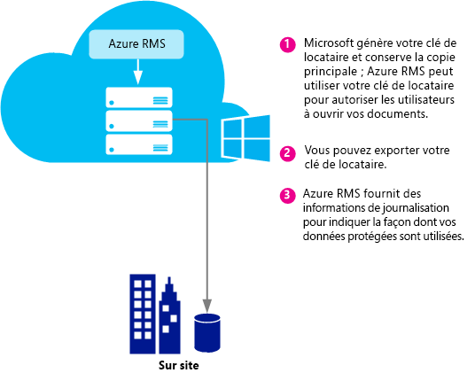
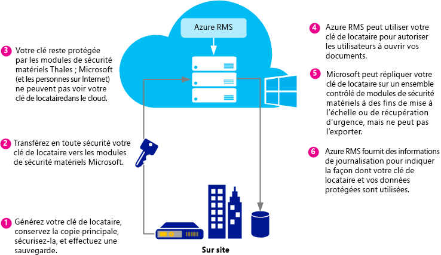
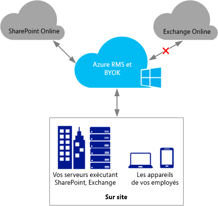
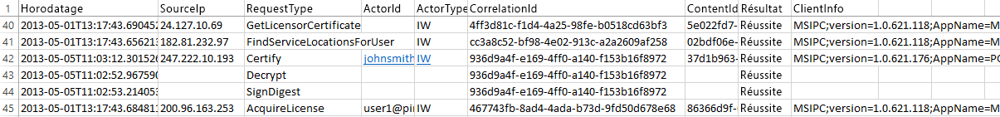

# Planification et impl&#233;mentation de la cl&#233; de locataire Azure Rights Management
Utilisez les informations de cette rubrique pour planifier et gérer votre clé de locataire du service Rights Management (RMS) pour Azure RMS. Par exemple, il se peut qu'au lieu de laisser Microsoft gérer votre clé de locataire (par défaut), vous deviez vous en occuper vous-même afin de respecter les politiques de votre organisation.  Cette pratique est appelée « Bring your own key » (BYOK).

> [!NOTE]
> La clé de locataire RMS est également appelée « clé de certificat de licence serveur » (SLC). Azure RMS gère une ou plusieurs clés pour chaque organisation s'abonnant à Azure RMS. Lorsqu'une clé est utilisée pour RMS au sein d'une organisation (par exemple, clés utilisateur, clés d'ordinateur, clés de chiffrement de document), elle est ajoutée par chiffrement à la clé de locataire RMS.

**Aperçu :** Le tableau suivant offre un aperçu rapide de la topologie de clé de locataire recommandée. Pour plus d'informations, consultez ensuite les sections ci-dessous :

Si vous déployez Azure RMS à l'aide d'une clé de locataire gérée par Microsoft, vous pourrez passer ultérieurement à la solution BYOK. Toutefois, il n’est pas possible actuellement de modifier votre clé de locataire Azure RMS en passant de la solution BYOK à la gestion par Microsoft.

|Besoins de l'entreprise|Topologie de clé de locataire recommandée :|
|---------------------------|-----------------------------------------------|
|Déployer Azure RMS rapidement et sans nécessiter un matériel spécial|Gestion par Microsoft|
|Besoin de l’ensemble des fonctionnalités IRM d'Exchange Online avec Azure RMS|Gestion par Microsoft|
|Vos clés sont créées par vous et protégées dans un module de sécurité matériel (HSM)|BYOK<br /><br />Actuellement, cette configuration entraîne des fonctionnalités IRM limitées dans Exchange Online. Pour plus d'informations, consultez la section [Tarifs et restrictions BYOK](../Topic/Planning_and_Implementing_Your_Azure_Rights_Management_Tenant_Key.md#BKMK_Pricing).|
Reportez-vous aux sections ci-dessous pour choisir la topologie de clé de locataire à utiliser, comprendre le cycle de vie des clés de locataire, implémenter la solution Bring your own key (BYOK) et identifier les étapes ultérieures :

-   [Choix de la topologie de clé de locataire : gestion Microsoft (par défaut) ou gestion BYOK](../Topic/Planning_and_Implementing_Your_Azure_Rights_Management_Tenant_Key.md#BKMK_ChooseTenantKey)

-   [Tarifs et restrictions BYOK](../Topic/Planning_and_Implementing_Your_Azure_Rights_Management_Tenant_Key.md#BKMK_Pricing)

-   [Implémentation de la solution Bring Your Own Key (BYOK)](../Topic/Planning_and_Implementing_Your_Azure_Rights_Management_Tenant_Key.md#BKMK_ImplementBYOK)

-   [Étapes suivantes](../Topic/Planning_and_Implementing_Your_Azure_Rights_Management_Tenant_Key.md#BKMK_NextSteps)

## <a name="BKMK_ChooseTenantKey"></a>Choix de la topologie de clé de locataire : gestion Microsoft (par défaut) ou gestion BYOK
Choisissez la topologie de clé de locataire la plus adaptée à votre organisation. Par défaut, Azure RMS génère la clé de locataire et gère la plupart des aspects de son cycle de vie. Il s'agit de l'option la plus simple, avec la charge administrative la plus faible. Dans la plupart des cas, les utilisateurs n'ont même pas conscience de l'existence de cette clé de locataire. Il leur suffit de s'inscrire à Azure RMS ; le reste du processus de gestion de la clé est traité par Microsoft.

Mais vous pouvez également souhaiter bénéficier d'un contrôle complet sur votre clé de locataire, ce qui implique la création de votre clé et la conservation de la copie principale en local. Il est souvent fait référence à ce scénario sous le terme « Bring your own key » (BYOK). Cette option implique les étapes suivantes :

1.  Vous générez votre clé de locataire en local, en accord avec vos politiques informatiques.

2.  Vous transférez en toute sécurité la clé de locataire à partir d'un module de sécurité matériel en votre possession vers des modules de sécurité matériels possédés et gérés par Microsoft. Notez que tout au long de ce processus, la clé de locataire ne quitte jamais les limites de protection matérielles.

3.  La clé de locataire reste protégée lors de son transfert à Microsoft grâce à des modules de sécurité matériels Thales. Microsoft a collaboré avec Thales pour s'assurer que votre clé de locataire ne puisse pas être extraite de modules de sécurité matériels de Microsoft.

Bien que cette action soit facultative, vous pouvez également utiliser les journaux d'utilisation quasiment en temps réel à partir d'Azure RMS pour voir exactement quand et comment votre clé de locataire est utilisée.

> [!NOTE]
> À des fins de protection supplémentaires, Azure RMS utilise des mondes de sécurité distincts pour ses centres de données en Amérique du Nord, dans la région EMEA (Europe, Moyen-Orient et Afrique) et en Asie. Lorsque vous gérez votre propre clé de locataire, celle-ci est liée au monde de sécurité de la région d'enregistrement de votre locataire RMS. Par exemple, la clé de locataire d'un client européen ne peut pas être utilisée dans des centres de données en Amérique du Nord ou en Asie.

## <a name="BKMK_OverviewLifecycle"></a>Cycle de vie d'une clé de locataire
Si vous choisissez de confier à Microsoft la gestion de votre clé de locataire, Microsoft traite la plupart des aspects de son cycle de vie. Cependant, si vous décidez de gérer vous-même votre clé de locataire, vous êtes responsable d'un grand nombre d'opérations et de certaines procédures supplémentaires.

Les schémas ci-dessous présentent et comparent ces deux options. Le premier schéma permet notamment de juger de la faible charge administrative qui vous incombe dans la configuration par défaut, lorsque Microsoft gère la clé de locataire.



Le deuxième schéma présente quant à lui les étapes supplémentaires requises lorsque vous gérez votre clé de locataire.



Si vous choisissez de confier à Microsoft la gestion de votre clé de locataire, aucune autre action n'est requise de votre part et vous n'avez pas à générer la clé. Vous pouvez ignorer les sections suivantes et accéder directement à la rubrique [Étapes suivantes](../Topic/Planning_and_Implementing_Your_Azure_Rights_Management_Tenant_Key.md#BKMK_NextSteps).

Si vous décidez de gérer vous-même votre clé de locataire, lisez les sections suivantes pour plus d'informations.

### Informations complémentaires sur les modules de sécurité matériels Thales et les compléments Microsoft
Azure RMS utilise des modules de sécurité matériels Thales pour protéger vos clés.

Thales e-Security est l'un des principaux fournisseurs mondiaux de solutions de chiffrement de données et de cybersécurité pour les secteurs des services financiers, de la haute technologie, de la fabrication, du gouvernement et de la technologie. Avec 40 ans d'expérience en matière de protection des informations pour les sociétés et les gouvernements, les solutions Thales sont utilisées par quatre des cinq plus grandes sociétés de l'énergie et de l'aérospatial et 22 pays de l'OTAN, et sécurisent plus de 80 % des transactions de paiement dans le monde.

Microsoft a collaboré avec Thales afin d'obtenir des modules de sécurité matériels à la pointe de la technologie. En d'autres termes, vous bénéficiez des avantages types des services hébergés sans avoir à renoncer au contrôle de vos clés. En particulier, Microsoft gère les modules de sécurité matériels afin que vous n'ayez pas à vous en occuper. En tant que service cloud, Azure RMS évolue rapidement pour respecter les pics d'utilisation de votre organisation et votre clé est protégée dans les modules de sécurité matériels de Microsoft : vous conservez le contrôle du cycle de vie de la clé, car c'est vous qui la générez et la transférez aux modules de sécurité matériels de Microsoft.

Pour plus d'informations, consultez la page relative aux [modules de sécurité matériels Thales et Azure RMS](http://www.thales-esecurity.com/msrms/cloud) sur le site web de Thales.

## <a name="BKMK_Pricing"></a>Tarifs et restrictions BYOK
Toute organisation possédant un abonnement Azure géré par informatique peut utiliser la solution BYOK et consigner son utilisation sans frais supplémentaires. Notez que les organisations utilisant RMS for individuals ne peuvent utiliser ni la solution BYOK, ni la journalisation, car elles ne disposent d'aucun administrateur locataire pour configurer ces fonctions.

> [!NOTE]
> Pour plus d'informations sur RMS for Individuals, consultez la rubrique [RMS for Individuals et Azure Rights Management](../Topic/RMS_for_Individuals_and_Azure_Rights_Management.md).



La solution BYOK et la journalisation fonctionnent de façon transparente, chaque application s'intégrant avec Azure RMS, notamment les services cloud tels que SharePoint Online, les serveurs locaux exécutant Exchange et SharePoint qui fonctionnent avec Azure RMS grâce au connecteur RMS, et les applications clientes telles qu'Office 2013. Vous recevrez des journaux d'utilisation de la clé, quelle que soit l'application réalisant les requêtes Azure RMS.

Il existe une exception : Actuellement, **la solution BYOK Azure RMS n'est pas compatible avec Exchange Online**.  Si vous souhaitez utiliser Exchange Online, nous vous recommandons de déployer Azure RMS dans le mode de gestion de clé par défaut, dans lequel Microsoft génère et gère votre clé. Vous pourrez passer à la solution BYOK ultérieurement, par exemple, lorsqu’Exchange Online prendra effectivement en charge cette solution avec Azure RMS. Toutefois, si vous ne pouvez pas attendre, une autre option consiste à déployer Azure RMS avec l'option BYOK, avec des fonctionnalités RMS réduites pour Exchange Online (les courriers électroniques et pièces jointes non protégés restent entièrement fonctionnels) :

-   Les messages électroniques et pièces jointes protégés dans Outlook Web Access ne peuvent pas être affichés.

-   Les messages électroniques protégés sur les appareils mobiles qui utilisent Exchange ActiveSync IRM ne peuvent pas être affichés.

-   Le déchiffrement du transport (par exemple, pour rechercher les logiciels malveillants) et le déchiffrement du journal ne sont pas possibles. Par conséquent, les courriers électroniques et pièces jointes protégés sont ignorés.

-   Les règles de protection du transport et la protection contre la perte de données (DLP) qui appliquent les stratégies IRM ne sont pas disponibles. La protection RMS ne peut donc pas être appliquée à l'aide de ces méthodes.

-   La recherche basée sur les serveurs de messages électroniques protégés n’est pas disponible. Les messages électroniques protégés sont donc ignorés.

Lorsque vous utilisez la solution BYOK Azure RMS avec des fonctionnalités RMS réduites pour Exchange Online, RMS fonctionne avec les clients de messagerie dans Outlook sur Mac et Windows et sur d'autres clients de messagerie qui n'utilisent pas Exchange ActiveSync IRM.

Si vous effectuez une migration vers Azure RMS à partir des services AD RMS, vous avez peut-être importé votre clé en tant que domaine de publication approuvé (TPD) vers Exchange Online. Cette solution est également appelée BYOK dans la terminologie Exchange, mais elle est distincte de celle portant le même nom dans Azure RMS). Dans ce scénario, vous devez supprimer le domaine de publication approuvé à partir d'Exchange Online afin d'éviter les modèles et stratégies en conflit. Pour plus d'informations, consultez la page [Remove-RMSTrustedPublishingDomain](https://technet.microsoft.com/library/jj200720%28v=exchg.150%29.aspx) dans la bibliothèque d'applets de commande Exchange Online.

En pratique, cette exception ne pose parfois pas problème. Par exemple, les organisations qui souhaitent utiliser la solution BYOK et la journalisation exécutent leurs applications de données (Exchange, SharePoint, Office) en local et utilisent Azure RMS pour les fonctionnalités qui ne sont pas facilement disponibles avec AD RMS en local (par exemple, collaboration avec d'autres sociétés et accès à partir de clients mobiles). La solution BYOK et la journalisation fonctionnent bien dans ce scénario et offrent aux organisations un contrôle total sur leur abonnement Azure RMS.

## <a name="BKMK_ImplementBYOK"></a>Implémentation de la solution Bring Your Own Key (BYOK)
Utilisez les informations et les procédures de cette section si vous souhaitez générer et gérer vous-même votre clé de locataire (solution BYOK) :

-   [Conditions requises pour la solution BYOK](../Topic/Planning_and_Implementing_Your_Azure_Rights_Management_Tenant_Key.md#BKMK_Preqs)

-   [Générer et transférer votre clé de locataire par Internet](../Topic/Planning_and_Implementing_Your_Azure_Rights_Management_Tenant_Key.md#BKMK_BYOK_Internet)

-   [Générer et transférer votre clé de locataire en personne](../Topic/Planning_and_Implementing_Your_Azure_Rights_Management_Tenant_Key.md#BKMK_BYOK_InPerson)

> [!IMPORTANT]
> Si vous avez déjà commencé à utiliser [!INCLUDE[aad_rightsmanagement_1](../Token/aad_rightsmanagement_1_md.md)] (le service est activé) et que certains de vos utilisateurs exécutent Office 2010, contactez le support technique de Microsoft avant d'exécuter ces procédures. Selon votre scénario et vos exigences, vous devrez peut-être appliquer la solution BYOK avec certaines limitations ou étapes supplémentaires.
> 
> Contactez également le support technique si votre organisation applique une politique spécifique en matière de gestion des clés.

### <a name="BKMK_Preqs"></a>Conditions requises pour la solution BYOK
Reportez-vous au tableau suivant pour connaître les conditions requises pour la solution Bring your own key (BYOK).

|Condition requise|Plus d'informations|
|---------------------|-----------------------|
|Abonnement prenant en charge Azure RMS|Pour plus d'informations sur les abonnements disponibles, consultez la section [Abonnements au cloud prenant en charge Azure RMS](../Topic/Requirements_for_Azure_Rights_Management.md#BKMK_SupportedSubscriptions) de la rubrique [Conditions requises pour Azure Rights Management](../Topic/Requirements_for_Azure_Rights_Management.md).|
|Vous n'utilisez pas RMS for Individuals ni Exchange Online. Ou, si vous utilisez Exchange Online, vous comprenez et acceptez les limitations de l'utilisation de la solution BYOK avec cette configuration.|Pour plus d'informations sur les restrictions et les limitations actuelles relatives à la solution BYOK, consultez la section [Tarifs et restrictions BYOK](../Topic/Planning_and_Implementing_Your_Azure_Rights_Management_Tenant_Key.md#BKMK_Pricing) de cette rubrique. **Important:** Actuellement, la solution BYOK n'est pas compatible avec Exchange Online.|
|Module de sécurité matériel Thales, cartes à puce et logiciel de support<br /><br />Si vous migrez d'AD RMS vers Azure RMS en passant d'une clé logicielle à une clé matérielle, vous devez disposer au minimum de la version 11.62 pour les pilotes Thales.|Vous devez avoir accès à un module de sécurité matériel Thales et posséder des connaissances de base concernant le fonctionnement de ce type de module. Reportez-vous à la page relative aux [modules de sécurité matériels Thales](http://www.thales-esecurity.com/msrms/buy) pour obtenir la liste des modèles compatibles ou pour acheter un module de sécurité matériel si vous n'en avez pas.|
|Si vous souhaitez transférer votre clé de locataire par Internet au lieu de vous présenter à Redmond, aux États-Unis :<br /><br />1.  Une station de travail x64 hors connexion dotée au minimum de Windows 7 et du logiciel nShield de Thales version 11.62.<br />    Si cette station de travail exécute Windows 7, vous devez [installer Microsoft .NET Framework 4.5](http://go.microsoft.com/fwlink/?LinkId=225702).<br />2.  Un poste de travail connecté à Internet, doté de Windows 7 au minimum<br />3.  Une clé USB ou tout autre dispositif de stockage portable possédant au moins 16 Mo d'espace libre|Ces éléments ne sont pas obligatoires si vous vous rendez à Redmond pour transférer votre clé de locataire en personne.<br /><br />Pour des questions de sécurité, il est recommandé que le premier poste de travail ne soit connecté à aucun réseau. Cependant, il ne s'agit pas d'une obligation forcée par programmation. **Note:** Dans les instructions ci-après, ce poste de travail est désigné sous le terme « poste de travail déconnecté ».<br />De plus, si votre clé de locataire est destinée à un réseau de production, nous vous recommandons d'utiliser un deuxième poste de travail pour télécharger l'ensemble d'outils et envoyer la clé. Cependant, dans le cadre de tests, vous pouvez utiliser le même poste de travail. **Note:** Dans les instructions ci-après, ce deuxième poste de travail est désigné sous le terme « poste de travail connecté à Internet ».|
|Facultatif : un abonnement Azure|Si vous souhaitez consigner votre utilisation de la clé de locataire (et de Rights Management), vous devez posséder un abonnement Azure et un espace de stockage suffisant sur Azure pour conserver vos journaux.|
Les procédures de génération et d'utilisation de la clé de locataire varient selon que vous préférez les effectuer par Internet ou en personne :

-   **Par Internet :** cette option implique des étapes de configuration supplémentaires, telles que le téléchargement et l'utilisation d'un ensemble d'outils et d'applets de commande Windows PowerShell. Mais elle présente l'avantage de vous éviter de vous déplacer jusqu'au bureau Microsoft pour pouvoir transférer votre clé de locataire. La sécurité est assurée comme suit :

    -   Vous générez la clé de locataire à partir d'une station de travail hors connexion, ce qui réduit la surface d'attaque.

    -   La clé de locataire est chiffrée à l'aide d'une clé d'échange de clés, qui reste chiffrée jusqu'à son transfert aux modules de sécurité matériels Azure RMS. Seule une version chiffrée de votre clé de locataire quitte le poste de travail d'origine.

    -   Un outil définit des propriétés sur votre clé de locataire, qui la lient au monde de sécurité Azure RMS. Ainsi, une fois que les modules de sécurité matériels Azure RMS ont reçu et déchiffré votre clé de locataire, seuls ceux-ci peuvent les utiliser. Votre clé de locataire ne peut pas être exportée. Cette liaison est appliquée par les modules de sécurité matériels Thales.

    -   La clé d'échange de clés utilisée pour chiffrer votre clé de locataire est générée au sein des modules de sécurité matériels Azure RMS et n'est pas exportable. Les modules de sécurité matériels veillent à ce qu'il n'existe pas de version claire de la clé d'échange de clés à l'extérieur. De plus, l'ensemble d'outils inclut une attestation de Thales indiquant que la clé d'échange de clés n'est pas exportable et qu'elle a été générée au sein d'un module de sécurité matériel authentique conçu par Thales.

    -   L'ensemble d'outils inclut également une attestation de Thales indiquant que le monde de sécurité Azure RMS a été généré au sein d'un module de sécurité matériel authentique conçu par Thales, cela afin de garantir que Microsoft utilise du matériel authentique.

    -   Microsoft utilise des clés d'échange de clés et des mondes de sécurité distincts pour chaque zone géographique. Ainsi, votre clé de locataire ne peut être utilisée que dans les centres de données de la zone dans laquelle elle a été chiffrée. Par exemple, la clé de locataire d'un client européen ne peut pas être utilisée dans des centres de données en Amérique du Nord ou en Asie.

    > [!NOTE]
    > Votre clé de locataire peut transiter en toute sécurité via des ordinateurs et des réseaux non sécurisés, car elle est chiffrée et sécurisée à l'aide d'autorisations de niveau de contrôle d'accès. Par conséquent, elle ne peut être utilisée qu'au sein de vos modules de sécurité matériels et dans ceux de Microsoft pour Azure RMS. Vous pouvez utiliser les scripts de l'ensemble d'outils pour vérifier ces mesures de sécurité. Pour plus d'informations, consultez la documentation Thales relative à la [Gestion de clé matérielle dans le cloud RMS](https://www.thales-esecurity.com/knowledge-base/white-papers/hardware-key-management-in-the-rms-cloud).

-   **En personne :** cette option requiert de contacter le support technique de Microsoft afin de fixer un rendez-vous de transfert de clé pour Azure RMS. Vous devez en effet vous rendre au bureau Microsoft de Redmond, Washington (États-Unis) pour transférer votre clé de locataire dans le monde de sécurité Azure RMS.

### <a name="BKMK_BYOK_Internet"></a>Générer et transférer votre clé de locataire par Internet
Exécutez les procédures ci-après si vous souhaitez transférer votre clé de locataire par Internet au lieu de vous rendre au bureau Microsoft pour la transférer en personne :

-   [préparation du poste de travail connecté à Internet](../Topic/Planning_and_Implementing_Your_Azure_Rights_Management_Tenant_Key.md#BKMK_InternetPrepareWorkstation)

-   [préparation du poste de travail déconnecté](../Topic/Planning_and_Implementing_Your_Azure_Rights_Management_Tenant_Key.md#BKMK_DisconnectedPrepareWorkstation)

-   [Génération de la clé de locataire](../Topic/Planning_and_Implementing_Your_Azure_Rights_Management_Tenant_Key.md#BKMK_InternetGenerate)

-   [préparation de la clé de client pour le transfert](../Topic/Planning_and_Implementing_Your_Azure_Rights_Management_Tenant_Key.md#BKMK_InternetPrepareTransfer)

-   [transfert de votre clé de client vers Azure RMS](../Topic/Planning_and_Implementing_Your_Azure_Rights_Management_Tenant_Key.md#BKMK_InternetTransfer)

#### <a name="BKMK_InternetPrepareWorkstation"></a>préparation du poste de travail connecté à Internet
Pour préparer le poste de travail connecté à Internet, suivez ces 3 étapes :

-   [Étape 1 : installation de Windows PowerShell pour Azure Rights Management](../Topic/Planning_and_Implementing_Your_Azure_Rights_Management_Tenant_Key.md#BKMK_PrepareInternetConnectedWorkstation1)

-   [Étape 2 : obtention de l'ID de locataire Azure Active Directory](../Topic/Planning_and_Implementing_Your_Azure_Rights_Management_Tenant_Key.md#BKMK_PrepareInternetConnectedWorkstation2)

-   [Étape 3 : téléchargement de l'ensemble d'outils BYOK](../Topic/Planning_and_Implementing_Your_Azure_Rights_Management_Tenant_Key.md#BKMK_PrepareInternetConnectedWorkstation3)

##### <a name="BKMK_PrepareInternetConnectedWorkstation1"></a>Étape 1 : installation de Windows PowerShell pour Azure Rights Management
Depuis le poste de travail connecté à Internet, téléchargez et installez le module Windows PowerShell pour Azure Rights Management.

> [!NOTE]
> Si vous avez déjà téléchargé ce module Windows PowerShell, exécutez la commande suivante pour vérifier que le numéro de votre version est au minimum 2.1.0.0 : `(Get-Module aadrm -ListAvailable).Version`

Pour obtenir des instructions sur l'installation, consultez [Installation de Windows PowerShell pour Azure Rights Management](../Topic/Installing_Windows_PowerShell_for_Azure_Rights_Management.md).

##### <a name="BKMK_PrepareInternetConnectedWorkstation2"></a>Étape 2 : obtention de l'ID de locataire Azure Active Directory
Lancez Windows PowerShell avec l'option **Exécuter en tant qu'administrateur**, puis exécutez les commandes suivantes :

-   Utilisez l’applet de commande [Connect-AadrmService](http://msdn.microsoft.com/library/windowsazure/dn629415.aspx) pour vous connecter au service Azure RMS :

    ```
    Connect-AadrmService
    ```
    Lorsque vous y êtes invité, entrez vos informations d'identification d'administrateur de client [!INCLUDE[aad_rightsmanagement_1](../Token/aad_rightsmanagement_1_md.md)] (en général, vous allez utiliser un compte d'administrateur global pour Azure Active Directory ou Office 365).

-   Utilisez l’applet de commande [Get-AadrmConfiguration](http://msdn.microsoft.com/library/windowsazure/dn629410.aspx) pour afficher la configuration de votre locataire :

    ```
    Get-AadrmConfiguration
    ```
    Dans le résultat de l'applet de commande, identifiez et enregistrez l'identificateur global unique à partir de la première ligne (BPOSId). Il s'agit de votre ID de locataire Azure Active Directory, dont vous aurez besoin ultérieurement lorsque vous préparerez votre clé de locataire pour le téléchargement.

-   Utilisez l’applet de commande [Disconnect-AadrmService](http://msdn.microsoft.com/library/windowsazure/dn629416.aspx) pour vous déconnecter du service Azure RMS jusqu’à ce que vous soyez prêt à télécharger votre clé :

    ```
    Disconnect-AadrmService
    ```

Ne fermez pas la fenêtre Windows PowerShell.

##### <a name="BKMK_PrepareInternetConnectedWorkstation3"></a>Étape 3 : téléchargement de l'ensemble d'outils BYOK
Accédez au centre de téléchargement Microsoft et [téléchargez l'ensemble d'outils BYOK](http://go.microsoft.com/fwlink/?LinkId=335781) pour votre région :

|Région|Nom du package|
|----------|------------------|
|Amérique du Nord|AzureRMS-BYOK-tools-UnitedStates.zip|
|Europe|AzureRMS-BYOK-tools-Europe.zip|
|Asie|AzureRMS-BYOK-tools-AsiaPacific.zip|
L'ensemble d'outils inclut les éléments suivants :

-   un package Key Exchange Key (KEK) dont le nom commence par **BYOK-KEK-pkg-** ;

-   un package Security World dont le nom commence par **BYOK-SecurityWorld-pkg-** ;

-   un script Python nommé **verifykeypackage.py** ;

-   un fichier exécutable en ligne de commande nommé **KeyTransferRemote.exe**, un fichier de métadonnées nommé **KeyTransferRemote.exe.config** et les fichiers DLL associés ;

-   un package redistribuable Visual C++, nommé **vcredist_x64.exe**.

Copiez le package sur une clé USB ou un autre support de stockage portable.

#### <a name="BKMK_DisconnectedPrepareWorkstation"></a>préparation du poste de travail déconnecté
Pour préparer le poste de travail non connecté à un réseau (ni à Internet, ni à votre réseau interne), suivez ces 2 étapes :

-   [Étape 1 : préparation du poste de travail déconnecté avec le module de sécurité matériel Thales](../Topic/Planning_and_Implementing_Your_Azure_Rights_Management_Tenant_Key.md#BKMK_PrepareDisconnectedWorkstation1)

-   [Étape 2 : installation de l'ensemble d'outils BYOK sur le poste de travail déconnecté](../Topic/Planning_and_Implementing_Your_Azure_Rights_Management_Tenant_Key.md#BKMK_PrepareDisconnectedWorkstation2)

##### <a name="BKMK_PrepareDisconnectedWorkstation1"></a>Étape 1 : préparation du poste de travail déconnecté avec le module de sécurité matériel Thales
Sur le poste de travail déconnecté, installez le logiciel de support nCipher (Thales) sur un ordinateur Windows, puis joignez un module de sécurité matériel Thales à cet ordinateur.

Vérifiez ensuite que les outils Thales apparaissent dans votre chemin **(%nfast_home%\bin** et **%nfast_home%\python\bin**. Par exemple, tapez ce qui suit :

```
set PATH=%PATH%;”%nfast_home%\bin”;”%nfast_home%\python\bin”
```
Pour plus d'informations, reportez-vous au guide d'utilisation inclus avec le module de sécurité matériel Thales, ou visitez le site web de Thales pour Azure RMS à l'adresse [http://www.thales-esecurity.com/msrms/cloud](http://www.thales-esecurity.com/msrms/cloud).

##### <a name="BKMK_PrepareDisconnectedWorkstation2"></a>Étape 2 : installation de l'ensemble d'outils BYOK sur le poste de travail déconnecté
Copiez le package de l'ensemble d'outils BYOK à partir de la clé USB ou du support de stockage portable utilisé, puis procédez comme suit :

1.  Extrayez les fichiers du package téléchargé dans un dossier.

2.  À partir de ce dossier, exécutez le fichier vcredist_x64.exe.

3.  Suivez les instructions pour installer les composants d'exécution Visual C++ pour Visual Studio 2012.

#### <a name="BKMK_InternetGenerate"></a>Génération de la clé de locataire
Sur le poste de travail déconnecté, suivez ces 3 étapes pour générer votre propre clé de locataire :

-   [Étape 1 : création d'un monde de sécurité](../Topic/Planning_and_Implementing_Your_Azure_Rights_Management_Tenant_Key.md#BKMK_InternetGenerate1)

-   [Étape 2 : validation du package téléchargé](../Topic/Planning_and_Implementing_Your_Azure_Rights_Management_Tenant_Key.md#BKMK_InternetGenerate2)

-   [Étape 3 : création d'une nouvelle clé](../Topic/Planning_and_Implementing_Your_Azure_Rights_Management_Tenant_Key.md#BKMK_InternetGenerate3)

##### <a name="BKMK_InternetGenerate1"></a>Étape 1 : création d'un monde de sécurité
Ouvrez une invite de commande et exécutez le programme de nouveau monde Thales.

```
new-world.exe --initialize --cipher-suite=DLf1024s160mRijndael --module=1 --acs-quorum=2/3
```
Ce programme crée un fichier **Security World** à l'emplacement %NFAST_KMDATA%\local\world, qui correspond au dossier C:\ProgramData\nCipher\Key Management Data\local. Vous pouvez utiliser différentes valeurs pour le quorum mais, dans notre exemple, vous êtes invité à entrer trois cartes et codes confidentiels nuls pour chacun. Deux des trois cartes seront ensuite nécessaires pour avoir un accès administratif au monde de sécurité (votre quorum spécifié).  Ces cartes constituent l'**ensemble de cartes administrateur** du nouveau monde de sécurité. À ce stade, vous pouvez spécifier le mot de passe ou code confidentiel pour chaque carte ACS, ou l'ajouter ultérieurement avec une commande.

> [!TIP]
> Vous pouvez vérifier l'état actuel de la configuration de votre module de sécurité matériel à l'aide de la commande `nkminfo`.

Ensuite, procédez comme suit :

1.  Installez le fournisseur Thales CNG tel que décrit dans la documentation Thales et configurez-le pour utiliser le nouveau monde de sécurité.

2.  Sauvegardez le fichier World dans **%nfast_kmdata%\local**. Sécurisez et protégez ensuite le fichier de monde, les cartes administrateur et leurs codes confidentiels. Veillez à ce que personne n'ait accès à plus d'une carte.

##### <a name="BKMK_InternetGenerate2"></a>Étape 2 : validation du package téléchargé
Cette étape est facultative mais recommandée, pour vous permettre de vérifier les points suivants :

-   la clé d'échange de clés incluse dans l'ensemble d'outils a été générée à partir d'un module de sécurité matériel Thales authentique ;

-   le hachage d'Azure RMS Security World inclus dans l'ensemble d'outils a été généré au sein d'un module de sécurité matériel Thales authentique ;

-   la clé d'échange de clés n'est pas exportable.

> [!NOTE]
> Pour valider le package téléchargé, le module de sécurité matériel doit être connecté, sous tension et doté d'un monde de sécurité (tel que celui que vous avez créé).

###### Pour valider le package téléchargé

1.  Exécutez le script verifykeypackage.py en tapant l'une des commandes ci-après, selon votre région :

    -   Pour l'Amérique du Nord :

        ```
        python verifykeypackage.py -k BYOK-KEK-pkg-NA-1 -w BYOK-SecurityWorld-pkg-NA-1
        ```

    -   Pour l'Europe :

        ```
        python verifykeypackage.py -k BYOK-KEK-pkg-EU-1 -w BYOK-SecurityWorld-pkg-EU-1
        ```

    -   Pour l'Asie :

        ```
        python verifykeypackage.py -k BYOK-KEK-pkg-AP-1 -w BYOK-SecurityWorld-pkg-AP-1
        ```

    > [!TIP]
    > Le logiciel Thales inclut un interpréteur Python sous %NFAST_HOME%\python\bin.

2.  Vérifiez que les éléments suivants s'affichent. Ils indiquent une validation réussie : **Résultat :  RÉUSSITE**

Ce script valide la chaîne de signataire jusqu'à la clé racine Thales. Le hachage de cette clé racine est incorporé dans le script. Sa valeur doit être **59178a47 de508c3f 291277ee 184f46c4 f1d9c639**. Vous pouvez également confirmer cette valeur séparément via le [site web de Thales](http://www.thalesesec.com/).

Vous pouvez à présent créer une clé qui sera votre clé de locataire RMS.

##### <a name="BKMK_InternetGenerate3"></a>Étape 3 : création d'une nouvelle clé
Générez une clé CNG à l'aide des programmes Thales **generatekey** et **cngimport**.

Exécutez la commande suivante pour générer la clé :

```
generatekey --generate simple type=RSA size=2048 protect=module ident=contosokey plainname=contosokey nvram=no pubexp=
```
Tenez compte des instructions suivantes pour l'exécution de cette commande :

-   Nous recommandons la taille de clé 2048, mais les clés RSA 1024 bits sont également prises en charge pour les clients AD RMS existants possédant de telles clés et migrant vers Azure RMS.

-   Remplacez la valeur *contosokey* des paramètres **ident** et **plainname** par une valeur de chaîne. Afin de minimiser la charge administrative et de réduire le risque d'erreurs, nous vous recommandons d'utiliser la même valeur pour les deux et d'utiliser des caractères en minuscules.

-   La zone pubexp est vide (par défaut) dans cet exemple, mais vous pouvez indiquer des valeurs spécifiques. Pour plus d'informations, consultez la documentation Thales.

Exécutez ensuite la commande suivante pour importer la clé dans CNG :

```
cngimport --import -M --key=contosokey --appname=simple contosokey
```
Tenez compte des instructions suivantes pour l'exécution de cette commande :

-   Remplacez *contosokey* par la valeur que vous avez spécifiée à l'[Étape 1 : création d'un monde de sécurité](../Topic/Planning_and_Implementing_Your_Azure_Rights_Management_Tenant_Key.md#BKMK_InternetGenerate1) de la section *Génération de la clé de locataire*.

-   Utilisez l'option **-M** afin que la clé convienne pour ce scénario. Dans le cas contraire, la clé résultante sera une clé spécifique à l'utilisateur actuel.

Cette commande crée un fichier de clé tokénisée dans votre dossier %NFAST_KMDATA%\local avec un nom commençant par **key_caping_** suivi d'un SID. Par exemple : **key_caping_machine--801c1a878c925fd9df4d62ba001b94701c039e2fb**. Ce fichier contient une clé chiffrée.

> [!TIP]
> Vous pouvez voir l'état actuel de la configuration de vos clés à l'aide de la commande `nkminfo –k`.

Sauvegardez ce fichier de clé tokénisée à un emplacement sûr.

> [!IMPORTANT]
> Lorsque vous transférerez ultérieurement votre clé à Azure RMS, Microsoft ne pourra pas réexporter cette clé. Il est donc extrêmement important que vous sauvegardiez soigneusement votre clé et votre monde de sécurité. Contactez Thales pour connaître les conseils et meilleures pratiques pour sauvegarder votre clé.

Vous pouvez à présent transférer votre clé de locataire à Azure RMS.

#### <a name="BKMK_InternetPrepareTransfer"></a>préparation de la clé de client pour le transfert
Sur le poste de travail déconnecté, suivez ces 4 étapes pour préparer votre clé de locataire :

-   [Étape 1 : création d'une copie de la clé avec autorisations réduites](../Topic/Planning_and_Implementing_Your_Azure_Rights_Management_Tenant_Key.md#BKMK_InternetPrepareTransfer1)

-   [Étape 2 : inspection de la copie de la clé](../Topic/Planning_and_Implementing_Your_Azure_Rights_Management_Tenant_Key.md#BKMK_InternetPrepareTransfer2)

-   [Étape 3 : Chiffrer votre clé à l'aide de la clé d'échange de clés Microsoft](../Topic/Planning_and_Implementing_Your_Azure_Rights_Management_Tenant_Key.md#BKMK_InternetPrepareTransfer3)

-   [Étape 4 : copie du package de transfert de clé sur le poste de travail connecté à Internet](../Topic/Planning_and_Implementing_Your_Azure_Rights_Management_Tenant_Key.md#BKMK_InternetPrepareTransfer4)

##### <a name="BKMK_InternetPrepareTransfer1"></a>Étape 1 : création d'une copie de la clé avec autorisations réduites
Procédez comme suit pour réduire les autorisations pour la clé de locataire :

-   Dans une invite de commande, exécutez l'une des commandes suivantes, selon votre région :

    -   Pour l'Amérique du Nord :

        ```
        KeyTransferRemote.exe -ModifyAcls -KeyAppName simple -KeyIdentifier contosokey -ExchangeKeyPackage BYOK-KEK-pkg-NA-1 -NewSecurityWorldPackage BYOK-SecurityWorld-pkg-NA-1
        ```

    -   Pour l'Europe :

        ```
        KeyTransferRemote.exe -ModifyAcls -KeyAppName simple -KeyIdentifier contosokey -ExchangeKeyPackage BYOK-KEK-pkg-EU-1 -NewSecurityWorldPackage BYOK-SecurityWorld-pkg-EU-1
        ```

    -   Pour l'Asie :

        ```
        KeyTransferRemote.exe -ModifyAcls -KeyAppName simple -KeyIdentifier contosokey -ExchangeKeyPackage BYOK-KEK-pkg-AP-1 -NewSecurityWorldPackage BYOK-SecurityWorld-pkg-AP-1
        ```

Lorsque vous exécutez cette commande, remplacez *contosokey* par la valeur que vous avez spécifiée à l'[Étape 1 : création d'un monde de sécurité](../Topic/Planning_and_Implementing_Your_Azure_Rights_Management_Tenant_Key.md#BKMK_InternetGenerate1) de la section *Génération de la clé de locataire*.

Vous serez invité à connecter vos cartes ACS de monde de sécurité et, le cas échéant, leur mot de passe ou code confidentiel.

À l'issue de la commande, l'indication **Result: SUCCESS** s'affiche, et la copie de votre clé de locataire avec autorisations réduites est enregistrée dans le fichier nommé key_xferacId_*&lt;contosokey&gt;*.

##### <a name="BKMK_InternetPrepareTransfer2"></a>Étape 2 : inspection de la copie de la clé
Vous pouvez exécuter les utilitaires Thales pour confirmer les autorisations minimales sur la nouvelle clé de locataire :

-   aclprint.py :

    ```
    "%nfast_home%\bin\preload.exe" -m 1 -A xferacld -K contosokey "%nfast_home%\python\bin\python" "%nfast_home%\python\examples\aclprint.py"
    ```

-   kmfile-dump.exe :

    ```
    "%nfast_home%\bin\kmfile-dump.exe" "%NFAST_KMDATA%\local\key_xferacld_contosokey"
    ```

Lorsque vous exécutez cette commande, remplacez *contosokey* par la valeur que vous avez spécifiée à l'[Étape 1 : création d'un monde de sécurité](../Topic/Planning_and_Implementing_Your_Azure_Rights_Management_Tenant_Key.md#BKMK_InternetGenerate1) de la section *Génération de la clé de locataire*.

##### <a name="BKMK_InternetPrepareTransfer3"></a>Étape 3 : Chiffrer votre clé à l'aide de la clé d'échange de clés Microsoft
Exécutez l'une des commandes suivantes, selon votre région :

-   Pour l'Amérique du Nord :

    ```
    KeyTransferRemote.exe -Package -KeyIdentifier contosokey -ExchangeKeyPackage BYOK-KEK-pkg-NA-1 -NewSecurityWorldPackage BYOK-SecurityWorld-pkg-NA-1 -TenantBposId GUID -KeyFriendlyName ContosoFirstkey
    ```

-   Pour l'Europe :

    ```
    KeyTransferRemote.exe -Package -KeyIdentifier contosokey -ExchangeKeyPackage BYOK-KEK-pkg-EU-1 -NewSecurityWorldPackage BYOK-SecurityWorld-pkg-EU-1 -TenantBposId GUID -KeyFriendlyName ContosoFirstkey
    ```

-   Pour l'Asie :

    ```
    KeyTransferRemote.exe -Package -KeyIdentifier contosokey -ExchangeKeyPackage BYOK-KEK-pkg-AP-1 -NewSecurityWorldPackage BYOK-SecurityWorld-pkg-AP-1 -TenantBposId GUID -KeyFriendlyName ContosoFirstkey
    ```

Tenez compte des instructions suivantes pour l'exécution de cette commande :

-   Remplacez *contosokey* par l'identificateur que vous avez utilisé pour générer la clé à l'[Étape 1 : création d'un monde de sécurité](../Topic/Planning_and_Implementing_Your_Azure_Rights_Management_Tenant_Key.md#BKMK_InternetGenerate1) de la section *Génération de la clé de locataire*.

-   Remplacez *GUID* par l'ID de locataire Azure Active Directory récupéré à l'[Étape 2 : obtention de l'ID de locataire Azure Active Directory](../Topic/Planning_and_Implementing_Your_Azure_Rights_Management_Tenant_Key.md#BKMK_PrepareInternetConnectedWorkstation2) de la section *Préparation du poste de travail connecté à Internet*.

-   Remplacez *ContosoFirstKey* par une étiquette qui sera utilisée pour votre nom de fichier de sortie.

À l'issue de la commande, l'indication **Result: SUCCESS** s'affiche, et le dossier actuel contient un nouveau fichier nommé TransferPackage-*ContosoFirstkey*.byok

##### <a name="BKMK_InternetPrepareTransfer4"></a>Étape 4 : copie du package de transfert de clé sur le poste de travail connecté à Internet
À l'aide d'une clé USB ou d'un autre support de stockage portable, copiez le fichier de sortie obtenu à l'étape précédente (KeyTransferPackage-*ContosoFirstkey*.byok) sur le poste de travail connecté à Internet.

> [!NOTE]
> Utilisez des pratiques de sécurité pour protéger le fichier, car il inclut votre clé privée.

#### <a name="BKMK_InternetTransfer"></a>transfert de votre clé de client vers Azure RMS
Sur le poste de travail connecté à Internet, suivez ces 3 étapes pour transférer votre nouvelle clé de locataire à Azure RMS :

-   [Étape 1 : connexion à Azure RMS](../Topic/Planning_and_Implementing_Your_Azure_Rights_Management_Tenant_Key.md#BKMK_InternetTransfer1)

-   [Étape 2 : envoi du package de clé](../Topic/Planning_and_Implementing_Your_Azure_Rights_Management_Tenant_Key.md#BKMK_InternetTransfer2)

-   [Étape 3 : Énumérer vos clés de locataire selon les besoins](../Topic/Planning_and_Implementing_Your_Azure_Rights_Management_Tenant_Key.md#BKMK_InternetTransfer3)

##### <a name="BKMK_InternetTransfer1"></a>Étape 1 : connexion à Azure RMS
Revenez à la fenêtre Windows PowerShell et procédez comme suit :

1.  Pour se connecter au service [!INCLUDE[aad_rightsmanagement_1](../Token/aad_rightsmanagement_1_md.md)] :

    ```
    Connect-AadrmService
    ```

2.  Utilisez l’applet de commande [Get-AadrmKeys](http://msdn.microsoft.com/library/windowsazure/dn629420.aspx) pour voir votre configuration de clé de locataire actuelle :

    ```
    Get-AadrmKeys
    ```

##### <a name="BKMK_InternetTransfer2"></a>Étape 2 : envoi du package de clé
Utilisez l'applet de commande [Add-AadrmKey](http://msdn.microsoft.com/library/windowsazure/dn629418.aspx) pour télécharger le package de transfert de clé copié à partir du poste de travail déconnecté :

```
Add-AadrmKey –KeyFile <PathToPackageFile> -Verbose
```
> [!WARNING]
> Vous êtes invité à confirmer cette action. Il est important de noter que cette action ne peut pas être annulée. Quand vous téléchargez une clé de locataire, elle devient automatiquement la clé de locataire principale de votre organisation et les utilisateurs commencent à l'utiliser dès qu'ils protègent des documents et des fichiers.

Si l'envoi abouti, le message suivant s'affiche : **« The Rights management service successfully added the key. ».**

Notez que le changement prend un certain temps pour se propager à tous les centres de données [!INCLUDE[aad_rightsmanagement_1](../Token/aad_rightsmanagement_1_md.md)].

##### <a name="BKMK_InternetTransfer3"></a>Étape 3 : Énumérer vos clés de locataire selon les besoins
Utilisez à nouveau l'applet de commande Get-AadrmKeys pour afficher la modification de la clé de locataire, ou dès que vous souhaitez consulter la liste de vos clés de locataire. Cette liste comprend la clé de locataire initiale générée par Microsoft ainsi que l'ensemble des clés de locataire que vous avez ajoutées.

```
Get-AadrmKeys
```
La clé de locataire marquée comme **Active** est celle actuellement utilisée par l'organisation pour protéger les documents et les fichiers.

Vous avez à présent suivi toutes les étapes requises pour la solution Bring your own key sur Internet et pouvez passer à la rubrique [Étapes suivantes](../Topic/Planning_and_Implementing_Your_Azure_Rights_Management_Tenant_Key.md#BKMK_NextSteps).

### <a name="BKMK_BYOK_InPerson"></a>Générer et transférer votre clé de locataire en personne
Suivez les procédures de cette section si vous souhaitez transférer votre clé de locataire en personne plutôt que par Internet.

-   [Génération de la clé de locataire](../Topic/Planning_and_Implementing_Your_Azure_Rights_Management_Tenant_Key.md#BKMK_GenerateKey)

-   [transfert de votre clé de client vers Azure RMS](../Topic/Planning_and_Implementing_Your_Azure_Rights_Management_Tenant_Key.md#BKMK_Transfer)

#### <a name="BKMK_GenerateKey"></a>Génération de la clé de locataire
Pour générer votre propre clé de locataire, suivez ces 3 étapes :

-   [Étape 1 : préparation d'un poste de travail avec un module de sécurité matériel Thales](../Topic/Planning_and_Implementing_Your_Azure_Rights_Management_Tenant_Key.md#BKMK_GenerateYourKey1)

-   [Étape 2 : création d'un monde de sécurité](../Topic/Planning_and_Implementing_Your_Azure_Rights_Management_Tenant_Key.md#BKMK_GenerateYourKey2)

-   [Étape 3 : création d'une nouvelle clé](../Topic/Planning_and_Implementing_Your_Azure_Rights_Management_Tenant_Key.md#BKMK_GenerateYourKey3)

##### <a name="BKMK_GenerateYourKey1"></a>Étape 1 : préparation d'un poste de travail avec un module de sécurité matériel Thales
Installez le logiciel de support nCipher (Thales) sur un ordinateur Windows, puis joignez un module de sécurité matériel Thales à cet ordinateur. Vérifiez ensuite que les outils Thales apparaissent dans votre chemin. Pour plus d'informations, reportez-vous au guide d'utilisation inclus avec le module de sécurité matériel Thales, ou visitez le site web de Thales pour Azure RMS à l'adresse [http://www.thales-esecurity.com/msrms/cloud](http://www.thales-esecurity.com/msrms/cloud).

##### <a name="BKMK_GenerateYourKey2"></a>Étape 2 : création d'un monde de sécurité
Ouvrez une invite de commande et exécutez le programme de nouveau monde Thales.

```
new-world.exe --initialize --cipher-suite=DLf1024s160mRijndael --module=1 --acs-quorum=2/3
```
Ce programme crée un fichier **Security World** à l'emplacement %NFAST_KMDATA%\local\world, qui correspond au dossier C:\ProgramData\nCipher\Key Management Data\local. Vous pouvez utiliser différentes valeurs pour le quorum mais, dans notre exemple, vous êtes invité à entrer trois cartes et codes confidentiels nuls pour chacun. Ainsi, toute association de deux cartes offrira un accès intégral au monde de sécurité.  Ces cartes constituent l'**ensemble de cartes administrateur** du nouveau monde de sécurité.

Ensuite, procédez comme suit :

1.  Installez le fournisseur Thales CNG tel que décrit dans la documentation Thales et configurez-le pour utiliser le nouveau monde de sécurité.

2.  Sauvegardez le fichier de monde. Sécurisez et protégez ensuite le fichier de monde, les cartes administrateur et leurs codes confidentiels. Veillez à ce que personne n'ait accès à plus d'une carte.

Vous pouvez à présent créer une clé qui sera votre clé de locataire RMS.

##### <a name="BKMK_GenerateYourKey3"></a>Étape 3 : création d'une nouvelle clé
Générez une clé CNG à l'aide des programmes Thales **generatekey** et **cngimport**.

Exécutez la commande suivante pour générer la clé :

```
generatekey --generate simple type=RSA size=2048 protect=module ident=contosokey plainname=contosokey nvram=no pubexp=
```
Tenez compte des instructions suivantes pour l'exécution de cette commande :

-   Nous recommandons la taille de clé 2048, mais les clés RSA 1024 bits sont également prises en charge pour les clients AD RMS existants possédant de telles clés et migrant vers Azure RMS.

-   Remplacez la valeur *contosokey* des paramètres **ident** et **plainname** par une valeur de chaîne. Afin de minimiser la charge administrative et de réduire le risque d'erreurs, nous vous recommandons d'utiliser la même valeur pour les deux et d'utiliser des caractères en minuscules.

-   La zone pubexp est vide (par défaut) dans cet exemple, mais vous pouvez indiquer des valeurs spécifiques. Pour plus d'informations, consultez la documentation Thales.

Exécutez ensuite la commande suivante pour importer la clé dans CNG :

```
cngimport --import –M --key=contosokey --appname=simple contosokey
```
Tenez compte des instructions suivantes pour l'exécution de cette commande :

-   Remplacez *contosokey* à l'aide de la même valeur que celle indiquée à l'étape 1.

-   Utilisez l'option **-M** afin que la clé convienne pour ce scénario. Dans le cas contraire, la clé résultante sera une clé spécifique à l'utilisateur actuel.

Cette commande crée un fichier de clé tokénisée dans votre dossier %NFAST_KMDATA%\local avec un nom commençant par **key_caping_** suivi d'un SID. Par exemple : **key_caping_machine--801c1a878c925fd9df4d62ba001b94701c039e2fb**. Ce fichier contient une clé chiffrée.

Sauvegardez ce fichier de clé tokénisée à un emplacement sûr.

> [!IMPORTANT]
> Lorsque vous transférerez ultérieurement votre clé à Azure RMS, Microsoft disposera d'une copie non récupérable de votre clé. En d'autres termes, votre clé ne peut être récupérée à partir des modules de sécurité matériels utilisés par Microsoft. Ceci vous permet de garder le contrôle exclusif de votre clé de locataire. Il est donc extrêmement important de sauvegarder votre clé et votre monde de sécurité en lieu sûr. Contactez Thales pour connaître les conseils et meilleures pratiques pour sauvegarder votre clé.

Vous pouvez à présent transférer votre clé de locataire à Azure RMS.

#### <a name="BKMK_Transfer"></a>transfert de votre clé de client vers Azure RMS
Une fois la clé générée, vous devez la transférer à Azure RMS pour pouvoir l'utiliser. Afin de bénéficier d'un niveau de sécurité maximum, ce transfert doit se faire manuellement et nécessite donc que vous vous rendiez au bureau Microsoft de Redmond, Washington (États-Unis). Pour ce faire, suivez ces 3 étapes :

-   [Étape 1 : livraison de la clé à Microsoft](../Topic/Planning_and_Implementing_Your_Azure_Rights_Management_Tenant_Key.md#BKMK_TransferYourKey1)

-   [Étape 2 : transfert de la clé vers le monde de sécurité Azure RMS](../Topic/Planning_and_Implementing_Your_Azure_Rights_Management_Tenant_Key.md#BKMK_TransferYourKey2)

-   [Étape 3 : procédures de clôture](../Topic/Planning_and_Implementing_Your_Azure_Rights_Management_Tenant_Key.md#BKMK_TransferYourKey3)

###### Étape 1 : livraison de la clé à Microsoft

-   Contactez le support technique de Microsoft afin de fixer un rendez-vous de transfert de clé pour Azure RMS. Veillez à apporter les éléments suivants requis par Microsoft :

    -   un quorum de vos cartes administrateur (si vous avez suivi les instructions fournies à l'[Étape 2 : création d'un monde de sécurité](../Topic/Planning_and_Implementing_Your_Azure_Rights_Management_Tenant_Key.md#BKMK_GenerateYourKey2), il s'agit de deux de vos trois cartes) ;

    -   le personnel autorisé à porter vos cartes administrateur et codes confidentiels, généralement deux (un pour chaque carte) ;

    -   votre fichier Security World (%NFAST_KMDATA%\local\world) sur une clé USB ;

    -   votre fichier de clé tokénisée sur une clé USB.

###### Étape 2 : transfert de la clé vers le monde de sécurité Azure RMS

1.  Lors de votre arrivée chez Microsoft, procédez comme suit :

    -   Microsoft vous fournit un poste de travail hors ligne disposant d'un module de sécurité matériel Thales joint, du logiciel Thales installé et d'un fichier Azure RMS Security World préchargé dans le dossier C:\Temp\Destination.

    -   Sur ce poste de travail, chargez votre fichier Security World et votre fichier de clé tokénisée à partir de votre clé USB dans le dossier C:\Temp\Source.

    -   Les opérateurs Azure RMS transfèrent en toute sécurité votre clé vers le monde de sécurité Azure RMS grâce aux utilitaires Thales.

    Ce processus sera semblable à ce qui suit, avec le dernier paramètre de key-xfer-im de cet exemple remplacé par le nom de votre fichier de clé tokénisée :

    **C:\&gt; mk-reprogram.exe --owner c:\Temp\Destination add c:\Temp\Source**

    **C:\&gt; key-xfer-im.exe c:\Temp\Source c:\Temp\Destination --module c:\Temp\Source\key_caping_machine--801c1a878c925fd9df4d62ba001b94701c039e2fb**

2.  Mk-reprogram vous demandera, ainsi qu'aux opérateurs Azure RMS, de connecter vos cartes administrateur et codes confidentiels respectifs. Ces commandes génèrent un fichier de clé tokénisée dans le répertoire C:\Temp\Destination, contenant votre clé protégée par le monde de sécurité Azure RMS.

###### Étape 3 : procédures de clôture

-   En votre présence, les opérateurs Azure RMS doivent procéder comme suit :

    -   Ils exécutent un outil développé par Microsoft en collaboration avec Thales, qui supprime deux autorisations : celle permettant de récupérer la clé et celle permettant de modifier les autorisations. Une fois cette action effectuée, la copie de votre clé est verrouillée dans le monde de sécurité Azure RMS. Les modules de sécurité matériels Thales ne permettront pas aux opérateurs Azure RMS dotés de leurs cartes administrateur de récupérer la copie de texte en clair de votre clé.

    -   Ils copient le fichier de clé résultant sur une clé USB à des fins de transfert ultérieur au service Azure RMS.

    -   Ils rétablissent les paramètres d'usine du module de sécurité matériel et nettoient le poste de travail.

Vous avez à présent accompli toutes les étapes requises pour transférer votre clé en personne et pouvez regagner votre organisation pour les étapes suivantes.

## <a name="BKMK_NextSteps"></a>Étapes suivantes

1.  Commencez à utiliser votre clé de locataire :

    -   Si ce n'est pas déjà fait, vous devez à présent activer Rights Management afin que votre organisation puisse utiliser RMS. Les utilisateurs peuvent exploiter immédiatement la clé de locataire (gérée par Microsoft ou par vous).

        Pour plus d'informations sur l'activation, consultez la rubrique [Activation d'Azure Rights Management](../Topic/Activating_Azure_Rights_Management.md).

    -   Si vous avez déjà activé Rights Management et avez décidé de gérer vous-même vote clé de locataire, les utilisateurs passent graduellement de l'ancienne clé de locataire à la nouvelle. Cette transition progressive s'effectue en quelques semaines. Les documents et fichiers protégés par l'ancienne clé de locataire restent accessibles pour les utilisateurs autorisés.

2.  Envisagez l'activation de la journalisation de l'utilisation, qui consigne chaque transaction effectuée par RMS.

    Si vous avez décidé de gérer vous-même votre clé de locataire, la journalisation inclut des informations utiles sur son utilisation. Consultez l'exemple suivant de fichier journal affiché dans Excel, où les types de requête **Decrypt** et **SignDigest** montrent que la clé de locataire est utilisée.

    

    Pour plus d'informations sur la journalisation de l'utilisation, consultez la rubrique [Journalisation et analyse de l'utilisation d'Azure Rights Management](../Topic/Logging_and_Analyzing_Azure_Rights_Management_Usage.md).

3.  Gérez votre clé de locataire.

    Pour plus d'informations, consultez [Opérations pour votre clé de client Azure Rights Management](../Topic/Operations_for_Your_Azure_Rights_Management_Tenant_Key.md).

## Voir aussi
[Configuration d'Azure Rights Management](../Topic/Configuring_Azure_Rights_Management.md)

