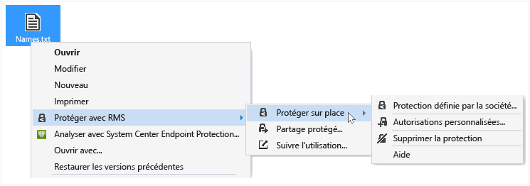

# Protection d&#39;un fichier sur un appareil (Prot&#233;ger sur place) &#224; l&#39;aide de l&#39;application de partage Rights Management
Lorsque vous protégez un fichier sur place, celui-ci remplace le fichier non protégé d'origine. Vous pouvez ensuite laisser le fichier là où il est, le copier vers un autre dossier ou appareil, ou partager le dossier dans lequel il se trouve : le fichier reste protégé. Vous pouvez également joindre le fichier protégé à un message électronique, même si la méthode recommandée pour partager un fichier protégé via courrier électronique consiste à le faire directement à partir de l'Explorateur de fichiers ou d'une application Office (voir [Protégez un fichier partagé par courrier électronique à l’aide de l’application de partage Rights Management](../Topic/Protect_a_file_that_you_share_by_email_by_using_the_Rights_Management_sharing_application.md)).

> [!TIP]
> Si vous rencontrez des erreurs lorsque vous tentez de protéger des fichiers, reportez-vous au [FAQ relatif à l'application de partage Microsoft Rights Management pour Windows](http://go.microsoft.com/fwlink/?LinkId=303971).

## Pour protéger un fichier sur un appareil (Protéger sur place)

1.  Dans l'Explorateur de fichiers, sélectionnez un fichier à protéger. Cliquez avec le bouton droit, sélectionnez **protéger avec RMS**, puis sélectionnez **Protéger sur place**. Par exemple :

    

    > [!NOTE]
    > Si vous ne voyez pas l'option **Protéger avec RMS**, il est probable que l'application de partage RMS ne soit pas installée sur votre ordinateur ou que celui-ci nécessite un redémarrage pour terminer l'installation. Pour plus d'informations sur l'installation de l'application de partage RMS, voir [Télécharger et installer l'application de partage Rights Management](../Topic/Download_and_install_the_Rights_Management_sharing_application.md).

2.  Procédez de l'une des façons suivantes :

    -   Sélectionnez un modèle de stratégie : il s'agit d'une autorisation prédéfinie qui restreint généralement l'accès et l'utilisation à certaines personnes au sein de votre organisation. Par exemple, si le nom de votre organisation est « Contoso, Ltd », voici ce que vous pouvez lire : **Contoso, Ltd - Affichage confidentiel uniquement**. Si vous protégez un fichier sur cet ordinateur pour la première fois, vous devez commencer par sélectionner **Protection définie par la société** pour télécharger les modèles.

        La prochaine fois que vous cliquerez sur l’option **Protéger sur place**, vous aurez jusqu’à 10 modèles affichés, prêts à être sélectionnés. Si le nombre de modèles disponibles est supérieur à 10 et que vous ne voyez pas celui qui vous intéresse, cliquez sur **Protection définie par la société** pour télécharger et afficher tous les modèles.

        Lorsque vous sélectionnez un modèle de stratégie, vous pouvez également protéger plusieurs fichiers et un dossier. Lorsque vous sélectionnez un dossier, tous les fichiers qu'il contient sont automatiquement sélectionnées pour la protection. En revanche, les nouveaux fichiers que vous créez dans ce dossier ne le sont pas.

    -   Sélectionnez **Autorisations personnalisées** : Choisissez cette option si les modèles n'offrent pas le niveau de protection nécessaire, ou si vous souhaitez définir vous-même explicitement les options de protection. Spécifiez les options souhaitées pour ce fichier dans la boîte de dialogue [Ajouter une protection](http://technet.microsoft.com/library/dn574738.aspx), puis cliquez sur **Appliquer**.

3.  Avant que le focus revienne sur l'Explorateur de fichiers, il se peut qu'une boîte de dialogue s'affiche brièvement pour vous informer que le fichier est protégé. Les fichiers sélectionnés sont désormais protégés. Dans certains cas (lorsque l'ajout d'une protection modifie l'extension du nom du fichier), le fichier d'origine dans l'Explorateur de fichiers est remplacé par un nouveau fichier associé à l'icône de verrou de protection de Rights Management. Par exemple :

    

Si vous devez ultérieurement supprimer la protection d'un fichier, voir [Suppression de la protection d'un fichier avec l'application de partage Rights Management](../Topic/Remove_protection_from_a_file_by_using_the_Rights_Management_sharing_application.md).

## Exemples et autres instructions
Pour obtenir des exemples et des instructions concernant l'utilisation de l'application de partage Rights Management, voir les sections suivantes dans le Guide d'utilisation de l'application de partage Rights Management :

-   [Exemples d’utilisation de l’application de partage RMS](../Topic/Rights_Management_sharing_application_user_guide.md#BKMK_SharingExamples)

-   [Que souhaitez-vous faire ?](../Topic/Rights_Management_sharing_application_user_guide.md#BKMK_SharingInstructions)

## Voir aussi
[Guide d’utilisation de l’application de partage Rights Management](../Topic/Rights_Management_sharing_application_user_guide.md)

