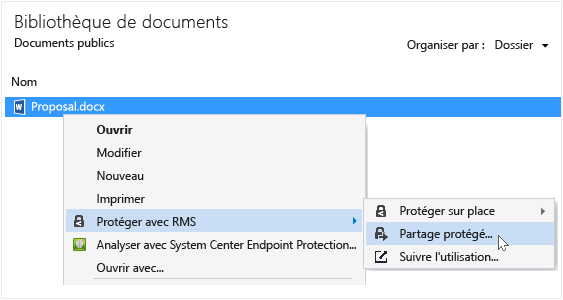
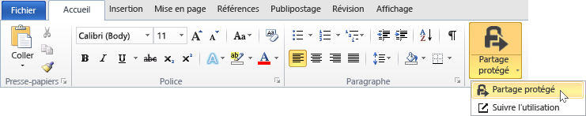
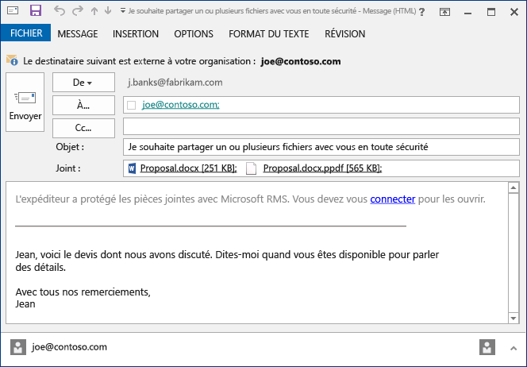

# Prot&#233;gez un fichier partag&#233; par courrier &#233;lectronique &#224; l’aide de l’application de partage Rights Management
Lorsque vous protégez un fichier que vous partagez par courrier électronique, il crée une nouvelle version du fichier d’origine. Le fichier d’origine reste non protégé. La nouvelle version est protégée et automatiquement jointe à un message électronique que vous envoyez ensuite.

Dans certains cas (pour les fichiers créés par Microsoft Word, Excel et PowerPoint), l’application de partage RMS crée deux versions du fichier qu’elle joint au message électronique. La deuxième version du fichier est dotée d’une extension **.ppdf**. Il s’agit d’un cliché instantané PDF du fichier. Cette version du fichier garantit que les destinataires peuvent toujours lire le fichier, même s’ils n’ont pas l’application que vous avez utilisée pour le créer. Cela est souvent le cas lorsque vous lisez vos courriers électroniques sur un appareil mobile et que vous souhaitez afficher les pièces jointes. Pour ouvrir le fichier, vous avez simplement besoin de l’application de partage RMS. Vous pouvez ensuite lire le fichier joint, mais vous ne pouvez pas le modifier sans ouvrir l’autre version du fichier dans l’application prenant en charge RMS.

Si votre organisation utilise Azure RMS, vous pouvez effectuer le suivi de vos fichiers protégés grâce au partage :

-   Sélectionnez une option pour recevoir des courriers électroniques lorsque quelqu’un tente d’ouvrir ces pièces jointes protégées. Chaque fois que quelqu’un accède au fichier, vous recevez une notification vous indiquant qui a tenté d’ouvrir le fichier et à quel moment et si cette personne a réussi (elle a bien été authentifiée) ou non.

-   Utilisez le site de suivi de la documentation. Vous pouvez même cesser de partager le fichier en révoquant l’accès à ce dernier sur le site de suivi de document. Pour plus d'informations, consultez [Suivre et révoquer vos documents lorsque vous utilisez l’application de partage RMS](../Topic/Track_and_revoke_your_documents_when_you_use_the_RMS_sharing_application.md).

## Avec Outlook : pour protéger un fichier partagé par courrier électronique

1.  Créez votre message électronique et joignez le fichier. Puis, dans l’onglet **Message** du groupe **RMS**, cliquez sur **Partage protégé** puis sur**Partage protégé** à nouveau :

    

    Si vous ne voyez pas ce bouton, il est probable que l’application de partage RMS ne soit pas installée sur votre ordinateur, que la version la plus récente ne soit pas installée ou que votre ordinateur doive être redémarré pour terminer l’installation. Pour plus d’informations sur l’installation de l’application de partage, voir [Télécharger et installer l'application de partage Rights Management](../Topic/Download_and_install_the_Rights_Management_sharing_application.md).

2.  Spécifiez les options souhaitées pour ce fichier dans la [boîte de dialogue Partage protégé](http://technet.microsoft.com/library/dn574738.aspx), puis cliquez sur **Envoyer maintenant**.

### Autres méthodes pour protéger un fichier partagé par courrier électronique
En plus d’Outlook, vous pouvez également utiliser ces méthodes pour partager un fichier protégé :

-   Depuis l’Explorateur de fichiers : cette méthode fonctionne pour tous les fichiers.

-   À partir d’une application Office : cette méthode fonctionne pour les applications prises en charge par l’application de partage RMS à l’aide du complément Office, de manière à pouvoir voir le groupe **RMS** sur le ruban.

##### Avec l’Explorateur de fichiers ou une application Office : Pour protéger un fichier partagé par courrier électronique

1.  Utilisez l’une des options suivantes :

    -   Pour l’Explorateur de fichiers : cliquez avec le bouton droit sur le fichier, sélectionnez **Protéger avec RMS**, puis **Partage protégé** :

        

    -   Pour les applications Office, Word, Excel et PowerPoint : assurez-vous d’abord d’avoir enregistré le fichier. Ensuite, sous l’onglet **Accueil**, dans le groupe **RMS**, cliquez sur **Partage protégé**, puis à nouveau sur **Partage protégé** :

        

    Si vous ne voyez pas ces options de protection, il est probable que l’application de partage RMS ne soit pas installée sur votre ordinateur, que la version la plus récente ne soit pas installée ou que votre ordinateur doive être redémarré pour terminer l’installation. Pour plus d’informations concernant l’installation de l’application de partage, consultez [Télécharger et installer l'application de partage Rights Management](../Topic/Download_and_install_the_Rights_Management_sharing_application.md).

2.  Spécifiez les options souhaitées pour ce fichier dans la [boîte de dialogue Partage protégé](http://technet.microsoft.com/library/dn574738.aspx), puis cliquez sur **Envoyer**.

3.  Il se peut qu’une boîte de dialogue s’affiche brièvement pour vous informer que le fichier est protégé. Un message électronique spécialement créé pour vous apparaît ensuite, indiquant aux destinataires que les pièces jointes sont protégées avec Microsoft RMS et qu’ils doivent se connecter. Lorsqu’ils cliquent sur le lien pour se connecter, ils voient des instructions et des liens pour pouvoir ouvrir vos pièces jointes protégées.

    Exemple :

    

    Vous vous demandez : [Qu'est-ce que le fichier .ppdf créé automatiquement ?](../Topic/Dialog_box_options_for_the_Rights_Management_sharing_application.md#BKMK_PPDF)

4.  Facultatif : Vous pouvez modifier n’importe quel élément de ce message électronique. Par exemple, vous pouvez ajouter ou modifier l’objet ou le texte du message.

    > [!WARNING]
    > Bien que vous puissiez ajouter ou supprimer des destinataires dans ce courrier électronique, cela ne modifie pas les autorisations que vous avez spécifiées dans la boîte de dialogue **Partage protégé** concernant la pièce jointe. Par exemple, si vous souhaitez modifier ces autorisations, accordez l’autorisation d’ouvrir le fichier à un nouvel utilisateur, fermez le courrier électronique sans l’enregistrer ni l’envoyer, puis revenez à l’étape 1.

5.  Envoyez le message électronique.

## Exemples et autres instructions
Pour obtenir des exemples et des instructions concernant l'utilisation de l'application de partage Rights Management, voir les sections suivantes dans le Guide d'utilisation de l'application de partage Rights Management :

-   [Exemples d’utilisation de l’application de partage RMS](../Topic/Rights_Management_sharing_application_user_guide.md#BKMK_SharingExamples)

-   [Que souhaitez-vous faire ?](../Topic/Rights_Management_sharing_application_user_guide.md#BKMK_SharingInstructions)

## Voir aussi
[Guide d’utilisation de l’application de partage Rights Management](../Topic/Rights_Management_sharing_application_user_guide.md)

