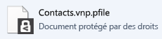
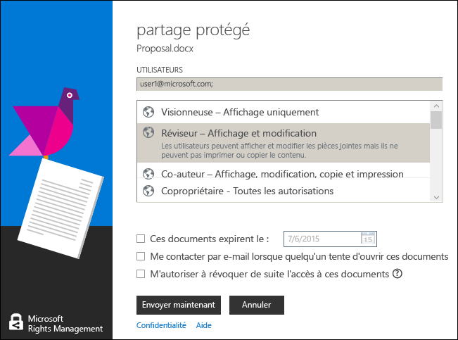

# Guide de l&#39;utilisateur de l&#39;application de partage Rights Management, r&#233;vision pour une seule rubrique
L'application de partage Microsoft Rights Management (RMS) pour Windows vous permet d'empêcher l'accès à des images et documents importants à des personnes non autorisées à les voir, même si vous les envoyez par courrier électronique ou les enregistrez sur un autre appareil. Vous pouvez également utiliser cette application pour ouvrir et utiliser des fichiers protégés par d'autres personnes à l'aide de la même technologie Rights Management.

Tout ce dont vous avez besoin est un ordinateur exécutant au moins Windows 7 et un compte d'administrateur local pour installer l'application de partage RMS. Ensuite, [téléchargez et installez](http://go.microsoft.com/fwlink/?LinkId=303970) cette application gratuite de Microsoft.

Si vous avez des questions qui ne sont pas traitées dans ce guide, voir [Forum aux questions sur l'application de partage Microsoft Rights Management pour Windows](http://go.microsoft.com/fwlink/?LinkId=303971).

Voici quelques exemples d'utilisation de l'application de partage pour protéger vos fichiers.

|Je veux…|Comment procéder|
|------------|--------------------|
|**...partager en toute sécurité des informations financières avec quelqu'un en qui j'ai confiance et qui est en dehors de mon organisation**  Vous travaillez avec une entreprise partenaire et vous voulez envoyer par courrier électronique une feuille de calcul Excel qui contient les chiffres des prévisions de ventes. Vous voulez que ce partenaire puisse afficher les chiffres, mais pas les modifier.|Vous utilisez le bouton Partager un fichier protégé sur le ruban dans Excel, tapez les adresses de messagerie des deux personnes avec lesquelles vous travaillez dans l'entreprise partenaire, sélectionnez Observateur sur le curseur, puis cliquez sur Envoyer.  Quand le courrier électronique arrive à l'entreprise partenaire, seuls les destinataires du courrier électronique peuvent afficher la feuille de calcul, mais ils ne peuvent pas l'enregistrer, la modifier, l'imprimer ni la transférer.  Détails : Voir **Protéger un fichier que vous partagez par courrier électronique** dans la section [Que voulez-vous faire ?](../Topic/Rights_Management_sharing_application_user_guide_-_revision_for_single_topic.md#BKMK_UsingMSRMSApp) de ce guide.|
|**...envoyer en toute sécurité un document par courrier électronique à une personne qui utilise un appareil iOS**  Vous voulez envoyer un document Word hautement confidentiel à un collègue, dont vous savez qu'il consulte régulièrement sa messagerie sur son appareil iOS.|Vous utilisez l'Explorateur de fichiers pour cliquer avec le bouton droit sur le fichier et pour sélectionner Partager un fichier protégé. Dans l'application de partage RMS, vous sélectionnez l'option Autoriser la consommation sur tous les appareils et envoyez le fichier comme pièce jointe à votre collègue.  Le destinataire reçoit le courrier électronique sur son appareil iOS, clique sur le lien dans le courrier électronique qui lui indique comment télécharger l'application de partage, installe la version pour les appareils iOS et affiche ensuite le document.  Détails : Voir **Protéger un fichier que vous partagez par courrier électronique** dans la section [Que voulez-vous faire ?](../Topic/Rights_Management_sharing_application_user_guide_-_revision_for_single_topic.md#BKMK_UsingMSRMSApp) de ce guide.|
|**...lire une pièce jointe que j'ai reçue dans un courrier électronique qui a un fichier en pièce jointe partagé de façon sécurisée, mais je ne parviens pas à le lire, car mon entreprise n'utilise pas Rights Management.**  L'expéditeur du courrier électronique est quelqu'un à qui vous faites confiance, car vous avez traité avec lui par le passé et vous pensez qu'il vous envoie des informations sur une nouvelle opportunité commerciale potentielle.|Vous suivez les instructions du courrier électronique et vous cliquez sur le lien pour vous inscrire auprès de Microsoft Rights Management. Microsoft confirme que votre organisation ne dispose pas d'un abonnement à Office 365, vous envoie un courrier électronique pour effectuer le processus d'abonnement gratuit. Vous vous connectez ensuite avec votre nouveau compte. Vous cliquez sur le deuxième lien dans le courrier électronique pour installer l'application de partage Rights Management. Vous pouvez ensuite ouvrir la pièce jointe du courrier électronique pour lire ce que cette personne vous écrit à propos de cette nouvelle opportunité commerciale.  Détails : Voir **Afficher et utiliser des fichiers qui ont été protégés par Rights Management** dans la section [Que voulez-vous faire ?](../Topic/Rights_Management_sharing_application_user_guide_-_revision_for_single_topic.md#BKMK_UsingMSRMSApp) de ce guide.|
|**...protéger des fichiers confidentiels de l'entreprise sur mon ordinateur portable, de façon à ce qu'ils ne soient pas accessibles par des personnes extérieures à mon entreprise.**  Vous voyagez beaucoup et vous utilisez votre ordinateur portable pour accéder à et mettre à jour des fichiers dans un dossier qui doit être protégé contre les accès non autorisés.|L'application de partage RMS est installée sur votre ordinateur portable. Vous utilisez l'Explorateur de fichiers pour protéger les fichiers à l'aide d'un modèle qui protège rapidement les fichiers. Si votre ordinateur portable est volé, vous savez que personne en dehors de votre entreprise ne peut accéder à ces documents.  Détails : Voir **Protéger un fichier sur un appareil (protéger sur place)** dans la section [Que voulez-vous faire ?](../Topic/Rights_Management_sharing_application_user_guide_-_revision_for_single_topic.md#BKMK_UsingMSRMSApp) de ce guide.|

## Que voulez-vous faire ?
Utilisez les instructions suivantes pour vous aider à utiliser des fichiers protégés.

### Télécharger et installer l'application de partage Rights Management

1.  Accédez à la page [Microsoft Rights Management](http://go.microsoft.com/fwlink/?LinkId=303970) sur le site web Microsoft.

2.  Dans la section **Ordinateurs**, cliquez sur l'icône **Application RMS pour Windows** et enregistrez le package d'installation de l'application de partage Microsoft Rights Management sur votre ordinateur.

3.  Double-cliquez sur le fichier compressé qui a été téléchargé, puis sur **setup.exe**. Si vous êtes invité à continuer, cliquez sur **Oui**.

    > [!TIP]
    > Vous devrez peut-être faire défiler l'écran vers le bas de la liste dans le dossier actif pour voir **setup.exe**.

4.  Dans la page **Installation de Microsoft RMS**, cliquez sur **Suivant** et attendez que l'installation se termine.

5.  Une fois l'installation terminée, cliquez sur **Redémarrer** pour redémarrer votre ordinateur et terminer l'installation. Vous pouvez également cliquer sur **Fermer** et redémarrer votre ordinateur plus tard pour terminer l'installation.

Vous êtes maintenant prêt à protéger vos fichiers ou à lire des fichiers protégés par d'autres utilisateurs.

#### Autres informations
Vous devez disposer d'un compte d'administrateur local pour installer l'application de partage. Si vous ne vous connectez pas en tant qu'administrateur local, vous pouvez utiliser l'option **Exécuter en tant qu'administrateur** quand vous exécutez Setup.exe à l'étape 3.

### Protéger un fichier sur un appareil (protéger sur place)

1.  Dans l'Explorateur de fichiers, sélectionnez un fichier, un dossier ou plusieurs fichiers à protéger. Cliquez avec le bouton droit, puis sélectionnez **Protéger sur place**. Exemple :

    

    > [!NOTE]
    > Si vous ne voyez pas l'option **Protéger sur place**, il est probable que l'application de partage RMS n'est pas installée sur votre ordinateur ou que votre ordinateur doit être redémarré pour terminer l'installation. Pour plus d'informations sur l'installation de l'application de partage, consultez les instructions **Télécharger et installer l'application de partage Rights Management** dans la section [Que voulez-vous faire ?](../Topic/Rights_Management_sharing_application_user_guide_-_revision_for_single_topic.md#BKMK_UsingMSRMSApp) de ce guide.

2.  Effectuez l'une des opérations suivantes :

    -   Sélectionnez un modèle de stratégie : Il s'agit d'autorisations prédéfinies qui limitent l'accès et l'utilisation aux personnes de votre organisation. S'il s'agit de la première fois que vous avez protégé un fichier sur cet ordinateur, vous devez d'abord sélectionner **Protection définie par la société** pour télécharger les modèles. Le nom des modèles commence par le nom de votre entreprise et est suivi d'un nom descriptif de l'autorisation. Exemple : **Contoso - Affichage confidentiel uniquement**

    -   Sélectionnez **Autorisations personnalisées** : Choisissez cette option si les modèles ne fournissent pas le niveau de protection dont vous avez besoin. Par exemple, vous souhaitez accorder l'accès à des personnes extérieures à votre organisation, ou vous souhaitez définir explicitement les options de protection vous-même. Spécifiez les options souhaitées pour ce fichier dans la boîte de dialogue **Ajouter une protection**, puis cliquez sur **Appliquer**.

        > [!NOTE]
        > Pour plus d'informations sur les options de cette boîte de dialogue, consultez les instructions **Spécifier des options dans la boîte de dialogue Rights Management** dans la section [Que voulez-vous faire ?](../Topic/Rights_Management_sharing_application_user_guide_-_revision_for_single_topic.md#BKMK_UsingMSRMSApp) de ce guide.

3.  Vous devez normalement voir rapidement une boîte de dialogue vous informant que le fichier est protégé, puis le focus retourne à l'Explorateur de fichiers. Le ou les fichiers sélectionnés sont maintenant protégés. Dans certains cas (quand l'ajout d'une protection change l'extension de nom de fichier), le fichier d'origine dans l'Explorateur de fichiers est remplacé par un nouveau fichier qui a l'icône du verrou de protection de Rights Management. Exemple :

    

Si vous devez par la suite supprimer la protection d'un fichier, consultez les instructions **Supprimer la protection d'un fichier** dans la section [Que voulez-vous faire ?](../Topic/Rights_Management_sharing_application_user_guide_-_revision_for_single_topic.md#BKMK_UsingMSRMSApp) de ce guide.

#### Autres informations
Quand vous protégez un fichier sur place, il remplace le fichier d'origine non protégé. Vous pouvez alors laisser le fichier là où il est, le copier vers un autre dossier ou appareil, ou partager le dossier où il se trouve, le fichier restant alors protégé. Vous pouvez aussi joindre le fichier protégé à un courrier électronique, même s'il est recommandé de partager par courrier électronique un fichier protégé directement à partir de l'Explorateur de fichiers ou d'une application Office (voir **Protéger un fichier que vous partagez par courrier électronique** dans la section [Que voulez-vous faire ?](../Topic/Rights_Management_sharing_application_user_guide_-_revision_for_single_topic.md#BKMK_UsingMSRMSApp) de ce guide).

Vous pouvez utiliser la même technique pour protéger plusieurs fichiers en même temps, ou un dossier. Quand vous protégez un dossier, tous les fichiers dans ce dossier sont automatiquement sélectionnés pour la protection, mais les fichiers que vous créez dans ce dossier ne sont pas protégés automatiquement.

Si vous constatez des erreurs quand vous essayez de protéger des fichiers, reportez-vous à [Forum Aux Questions pour l'application de partage Microsoft Rights Management pour Windows](http://go.microsoft.com/fwlink/?LinkId=303971).

### Protéger un fichier que vous partagez par courrier électronique

1.  Utilisez une des options suivantes :

    -   Pour l'Explorateur de fichiers : Cliquez avec le bouton droit sur le fichier et sélectionnez **Partager un fichier protégé** :

        

    -   Pour une application Office : Assurez-vous que vous avez tout d'abord enregistré le fichier. Ensuite, dans le groupe **Protection**, cliquez sur **Partager un fichier protégé**.

        

    > [!NOTE]
    > Si vous ne voyez pas ces options pour le partage de protection, il est probable que l'application de partage n'est pas installée sur votre ordinateur ou que celui-ci doit être redémarré pour terminer l'installation. Pour plus d'informations sur l'installation de l'application de partage, consultez les instructions **Télécharger et installer l'application de partage Rights Management** dans la section [Que voulez-vous faire ?](../Topic/Rights_Management_sharing_application_user_guide_-_revision_for_single_topic.md#BKMK_UsingMSRMSApp) de ce guide.

2.  Spécifiez les options souhaitées pour ce fichier dans la boîte de dialogue **Partager un fichier protégé**, puis cliquez sur **Envoyer**.

    

    > [!NOTE]
    > Pour plus d'informations sur les options de cette boîte de dialogue, consultez les instructions **Spécifier des options dans la boîte de dialogue Rights Management** dans la section [Que voulez-vous faire ?](../Topic/Rights_Management_sharing_application_user_guide_-_revision_for_single_topic.md#BKMK_UsingMSRMSApp) de ce guide.

3.  Vous pouvez rapidement voir une boîte de dialogue qui vous informe que le fichier est protégé, puis un message électronique créé à votre intention avec l'objet **J'ai partagé en toute sécurité des fichiers avec vous**. Dans ce message électronique, le fichier que vous avez sélectionné est attaché et protégé, et le texte dans le message électronique contient des liens pour les éléments suivants :

    -   RMS pour les particuliers

    -   L'application de partage RMS

    -   Ce guide de l'utilisateur

    Exemple :

    

4.  Facultatif : Vous pouvez changer tout ce que vous voulez dans ce courrier électronique. Par exemple, vous pouvez ajouter quelque chose à l'objet ou au texte du message, ou les modifier.

    > [!WARNING]
    > Même si vous pouvez ajouter ou supprimer des destinataires pour ce courrier électronique, cela ne change pas les autorisations pour la pièce jointe que vous avez spécifiées dans la boîte de dialogue **Partager un fichier protégé**. Si vous voulez changer les autorisations, par exemple donner à une nouvelle personne l'autorisation d'ouvrir le fichier, fermez le courrier électronique sans l'enregistrer ni l'envoyer, et revenez à l'étape 1.

5.  Envoyez le courrier électronique.

#### Autres informations
Quand vous protégez un fichier que vous partagez par courrier électronique, il crée une nouvelle version du fichier d'origine. Le fichier d'origine reste non protégé, et la nouvelle version est protégée et automatiquement jointe à un courrier électronique que vous envoyez ensuite.

Le message électronique a un objet et un texte par défaut que vous pouvez modifier avant de l'envoyer.

Il existe deux façons de protéger un fichier que vous partagez par courrier électronique :

-   Depuis l'Explorateur de fichiers : Cette méthode fonctionne pour tous les fichiers.

-   Depuis une application Office : Cette méthode fonctionne pour les applications que l'application de partage Rights Management prend en charge à l'aide du complément Office que vous voyez dans le groupe **Protection** sur le ruban.

> [!NOTE]
> Dans cette version de l'application de partage Rights Management, il n'existe pas de complément pour Outlook qui vous permet de protéger les fichiers et messages électroniques directement à partir de l'application Outlook. Au lieu de cela, utilisez la procédure de cette section.

### Afficher et utiliser des fichiers qui ont été protégés par Rights Management

#### Pour afficher un fichier protégé
En utilisant l'Explorateur de fichiers ou le message électronique contenant la pièce jointe, double-cliquez sur le fichier protégé et entrez vos informations d'identification si vous êtes invité à le faire. Le mode d'ouverture du fichier dépend de la façon dont il a été protégé.

-   Si le fichier a été protégé de façon générique (il porte l'extension de fichier .pfile) :

    Vous voyez une boîte de dialogue **Fichier protégé** de l'application de partage qui vous indique qui a protégé le fichier et que vous êtes censé respecter les autorisations du copropriétaire. Vous êtes informé que, quand vous ouvrez le fichier, cette action est auditée.

    

    Cliquez sur **Ouvrir** pour lire le fichier.

-   Si le fichier a été protégé en mode natif (il n'a pas d'extension de fichier .pfile) :

    Le fichier s'ouvre à l'aide de l'application associée à l'extension de nom de fichier d'origine, et une bannière de restriction s'affiche en haut du fichier. La bannière peut afficher les autorisations qui sont appliquées au fichier, ou fournir un lien pour les afficher. Par exemple, le message suivant peut s'afficher, où vous devez cliquer sur **Autorisation actuellement restreinte** pour afficher les autorisations réelles qui sont appliquées au fichier et les personnes qui peuvent y accéder :

    

    Ce fichier est également audité et reste audité tant qu'il est protégé.

##### Autres informations
Avant de pouvoir afficher le fichier protégé, RMS doit d'abord confirmer que vous êtes autorisé à afficher le fichier, ce qu'il fait en vérifiant vos nom d'utilisateur et mot de passe. Dans certains cas, ces informations peuvent être mises en cache et vous ne verrez pas d'invite vous demandant vos informations d'identification. Dans d'autres cas, vous devrez fournir vos informations d'identification.

Si votre organisation n'utilise pas Microsoft Azure Rights Management (Microsoft Azure RMS) ni AD RMS, vous pouvez demander un compte gratuit qui accepte vos informations d'identification afin que vous puissiez ouvrir des fichiers protégés par RMS. Pour demander ce compte, cliquez sur le lien pour faire la demande de [RMS pour les particuliers](http://go.microsoft.com/fwlink/?LinkId=309469).

#### Pour utiliser des fichiers qui ont été protégés (par exemple, modifier et imprimer le fichier)
Si le fichier protégé a une extension de fichier .pfile :

-   Enregistrez le fichier ouvert et donnez-lui une nouvelle extension de nom de fichier associée à l'application que vous souhaitez utiliser.

    Par exemple, si un fichier a été protégé avec le nom de fichier document.vsdx.pfile, affichez le fichier et, dans l'Explorateur de fichiers, enregistrez-le sous le nom document.vsdx.

    Le nouveau fichier n'est plus protégé. Si vous souhaitez le protéger, vous devez le faire manuellement. Pour obtenir des instructions, consultez **Comment protéger un fichier sur un appareil (protéger sur place) à l'aide de l'application de partage Rights Management** dans la section [Que voulez-vous faire ?](../Topic/Rights_Management_sharing_application_user_guide_-_revision_for_single_topic.md#BKMK_UsingMSRMSApp) de ce guide.

Si le fichier protégé à l'origine n'avait pas d'extension .pfile :

-   Vous ne pouvez rien faire d'autre à part afficher le fichier sauf si vous avez une application qui comprend Rights Management. Ces applications sont appelées applications présentant un état d'éveil à la présence d'un environnement virtualisé pour Rights Management. Les applications Office 2013 et Office 2010 (comme Word, Excel, PowerPoint et Outlook) sont des exemples de ces applications. Toutefois, les applications qui ne proviennent pas de Microsoft, telles que celles d'autres éditeurs de logiciels et vos propres applications métier, peuvent également présenter un état d'éveil à la présence d'un environnement virtualisé pour Rights Management.

    Ces applications savent comment ouvrir les fichiers qui ont été protégés par d'autres applications de ce type. Elles conservent également la protection qui leur est appliquée, même si vous modifiez le fichier ou l'enregistrez sous un autre nom de fichier ou à un autre emplacement. Ces applications vous permettent d'utiliser le fichier en fonction des autorisations qui sont actuellement appliquées au fichier ; ainsi, si vous disposez des autorisations pour utiliser le fichier, vous pouvez le faire. Par exemple, si le fichier a été protégé en lecture seule, vous ne pourrez pas apporter des modifications ni imprimer le fichier.

### Supprimer la protection d'un fichier
Dans l'Explorateur de fichiers, cliquez avec le bouton droit sur le fichier (par exemple, Sample.ptxt), cliquez sur **Protéger sur place**, puis sur **Supprimer la protection** :

Des informations d'identification peuvent vous être demandées.

#### Autres informations
Le fichier protégé d'origine est supprimé (par exemple, Sample.ptxt) et remplacé par un fichier portant le même nom, mais avec l'extension de nom de fichier non protégé (par exemple, Sample.txt).

Pour supprimer la protection d'un fichier protégé (autrement dit, pour le déprotéger) à l'aide de l'application de partage RMS, utilisez l'option **Supprimer la protection** de l'Explorateur de fichiers.

> [!IMPORTANT]
> Vous devez être propriétaire du fichier pour supprimer la protection.

### Utiliser des raccourcis clavier dans l'application de partage Rights Management
Appuyez sur la touche **Alt** pour voir les touches d'accès disponibles, puis sur **Alt** + la touche d'accès pour sélectionner une option.

#### Autres informations
Par exemple, dans la boîte de dialogue **Partager un fichier protégé**, appuyez sur la touche **Alt** pour voir les touches d'accès, puis sur **Alt + u** pour cocher la case **Les utilisateurs doivent se connecter chaque fois qu'ils ouvrent ce fichier**.

### Spécifier des options dans la boîte de dialogue Rights Management

|Option|Description|
|----------|---------------|
|**UTILISATEURS**|Tapez les adresses de messagerie des personnes qui doivent pouvoir ouvrir le fichier. Utilisez des points-virgules pour plusieurs adresses. Il peut s'agir d'adresses de messagerie internes ou externes à votre organisation.  Exemple : janetm@contoso.com; pdover@fabricom.com|
|**Autoriser la consommation sur tous les appareils**|Quand vous choisissez cette option qui permet aux utilisateurs d'ouvrir le fichier sur des appareils mobiles tels qu'un iPad, les autorisations ont automatiquement la valeur **COPROPRIÉTAIRE** (toutes les autorisations) afin qu'une protection générique soit utilisée pour protéger le fichier.|
|**AUTORISATIONS**|Déplacez le curseur vers l'autorisation souhaitée pour ce fichier.  Dans certains cas, les autorisations ont automatiquement la valeur COPROPRIÉTAIRE et ne peuvent pas être modifiées. Cela se produit si vous sélectionnez **Autoriser la consommation sur tous les appareils**. Cela se produit également si vous protégez un fichier qui ne peut pas être protégé en mode natif par RMS et qui doit par conséquent être protégé de façon générique. L'application de partage arrive à cette conclusion en fonction de l'extension de nom de fichier. **Tip:** Vous pouvez utiliser la page [Microsoft Rights Management](http://go.microsoft.com/fwlink/?LinkId=303970) sur le site web Microsoft pour vérifier rapidement les applications qui prennent en charge une protection intégrée.|
|**Les utilisateurs doivent se connecter chaque fois qu'ils ouvrent ce fichier**|Sélectionnez cette option quand vous avez besoin d'une sécurité accrue pour un fichier, car elle requiert que les utilisateurs que vous spécifiez soient toujours authentifiés, chaque fois qu'ils accèdent au fichier. Pour ce faire, si leurs informations d'identification ne sont pas mises en cache, ils sont invités à fournir leurs nom d'utilisateur et mot de passe. Toutefois, ce paramètre requiert que ces utilisateurs aient toujours accès à Internet pour ouvrir le fichier et il peut être frustrant d'être invité à déverrouiller un fichier et de devoir attendre la fin du processus d'authentification.|
|**Le contenu expire le**|Sélectionnez cette option uniquement pour les fichiers pour lesquels le temps est important et que les utilisateurs que vous avez sélectionnés ne doivent pas pouvoir ouvrir après une date que vous spécifiez. Vous serez toujours en mesure d'ouvrir le fichier d'origine.|

#### Autres informations
Utilisez le tableau pour vous aider à spécifier les options dans la boîte de dialogue **Ajouter une protection** ou **Partager un fichier protégé** de l'application de partage. Cette boîte de dialogue s'affiche quand vous protégez un fichier sur place et choisissez des autorisations personnalisées, ou protégez un fichier à partager.

Pour plus d'informations sur la protection d'un fichier sur place et la protection d'un fichier à partager, consultez la section [Que voulez-vous faire ?](../Topic/Rights_Management_sharing_application_user_guide_-_revision_for_single_topic.md#BKMK_UsingMSRMSApp) de ce guide.

## Voir aussi
[guide de l'administrateur de l'application de partage Rights Management](../Topic/Rights_Management_sharing_application_administrator_guide.md)
 [Téléchargement de l'application de partage Microsoft Rights Management](http://go.microsoft.com/fwlink/?LinkId=303970)
 [Forum aux questions sur l'application de partage Microsoft Rights Management pour Windows](http://go.microsoft.com/fwlink/?LinkId=303971)

