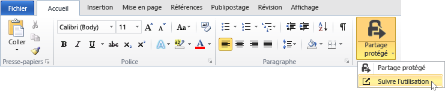
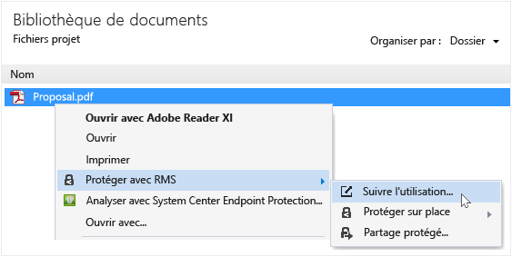
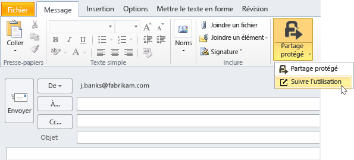

# Suivre et r&#233;voquer vos documents lorsque vous utilisez l’application de partage RMS
Après avoir protégé vos documents à l’aide de l’application de partage RMS, si votre organisation utilise Azure Rights Management plutôt que les services AD RMS (Active Directory Rights Management Services), vous pouvez suivre la façon dont les personnes utilisent vos documents protégés. Si nécessaire, vous pouvez aussi révoquer l’accès à ces documents dès lors que vous ne voulez plus qu’ils soient partagés. Pour cela, utilisez le **site de suivi des documents**, auquel vous pouvez accéder à partir d’un ordinateur Windows ou Mac, d’une tablette ou d’un téléphone.

> [!TIP]
> Vidéo de deux minutes : [Suivi et révocation de documents Azure RMS](http://channel9.msdn.com/Series/Information-Protection/Azure-RMS-Document-Tracking-and-Revocation)

Après avoir accédé à ce site, connectez-vous pour assurer le suivi de vos documents. Sous réserve que votre organisation dispose d’un [abonnement qui prend en charge le suivi et la révocation de documents](https://technet.microsoft.com/dn858608.aspx) et qu’une licence vous a été attribuée dans le cadre de cet abonnement, vous pouvez voir qui a essayé d’ouvrir les fichiers que vous avez protégés, si ces personnes y sont parvenues (ont bien été authentifiées) ou pas, le nombre de fois où elles ont tenté d’accéder au document, ainsi que leur emplacement à ce moment-là. De plus :

-   Si vous souhaitez arrêter le partage d’un document : cliquez sur **Révoquer l’accès**, notez la durée pendant laquelle le document restera disponible et choisissez d’informer ou non les utilisateurs que vous révoquez l’accès au document partagé, puis envoyez un message personnalisé.

-   Si vous souhaitez exporter vers Excel : cliquez sur **Ouvrir dans Excel** pour pouvoir modifier les données et créer vos propres vues et graphiques.

-   Si vous souhaitez configurer des notifications par courrier électronique : cliquez sur **Paramètres** et indiquez si vous souhaitez recevoir des messages électroniques lorsque quelqu’un accède au document et de quelle manière.

-   Si vous avez des questions ou souhaitez fournir des commentaires sur le site de suivi de document : cliquez sur l’icône d’aide pour accéder au [Forum aux questions sur le suivi de documents](http://go.microsoft.com/fwlink/?LinkId=523977).

## Utilisation d’Office pour accéder au site de suivi de document

-   Pour les applications Office, Word, Excel et PowerPoint : Sous l’onglet **Accueil**, dans le groupe **RMS**, cliquez sur **Partage protégé**, puis sur **Suivre l’utilisation**.

    

-   Pour Outlook : Sous l’onglet **Accueil**, dans le groupe **RMS**, cliquez sur **Suivre l’utilisation** :

    

Si vous ne voyez pas ces options pour RMS, il est probable que l’application de partage RMS ne soit pas installée sur votre ordinateur, que la version la plus récente ne soit pas installée ou que votre ordinateur doive être redémarré pour terminer l’installation. Pour plus d’informations sur l’installation de l’application de partage, voir [Télécharger et installer l'application de partage Rights Management](../Topic/Download_and_install_the_Rights_Management_sharing_application.md).

### Autres méthodes de suivi et de révocation de vos documents
Outre le suivi de vos documents sur les ordinateurs Windows à l’aide des applications Office, vous pouvez également utiliser ces méthodes :

-   **Avec un navigateur web** : cette méthode fonctionne pour tous les appareils pris en charge.

-   **Avec l’Explorateur de fichiers** : cette méthode fonctionne sur tous les ordinateurs Windows.

-   **Avec un message électronique Outlook** : Cette méthode fonctionne sur tous les ordinateurs Windows.

##### Utilisation d’un navigateur web pour accéder au site de suivi de document

-   Dans un navigateur pris en charge, accédez au [site de suivi de document](http://go.microsoft.com/fwlink/?LinkId=529562).

    Navigateurs pris en charge : nous vous recommandons d’utiliser Internet Explorer (version 10 ou ultérieure). Toutefois, vous pouvez accéder au site de suivi de document depuis tous les navigateurs répertoriés ci-après :

    -   Internet Explorer : version 10 ou ultérieure

    -   Internet Explorer 9 avec MS12-037 minimum : Mise à jour de sécurité cumulative pour Internet Explorer : 12 juin 2012

    -   Mozilla Firefox : version 12 ou ultérieure

    -   Apple Safari 5 : version 5 ou ultérieure

    -   Google Chrome : version 18 ou ultérieure

##### Utilisation de l’Explorateur de fichiers pour accéder au site de suivi de document

-   Cliquez avec le bouton droit sur le fichier, sélectionnez **Protéger avec RMS**, puis **Suivre l’utilisation** :

    

##### Utilisation d’un message électronique Outlook pour accéder au site de suivi de document

-   Dans un message électronique, sous l’onglet **Message**, dans le groupe **RMS**, cliquez sur **Partage protégé**, puis sur **Suivre l’utilisation** :

    

## Exemples et autres instructions
Pour obtenir des exemples et des instructions concernant l'utilisation de l'application de partage Rights Management, voir les sections suivantes dans le Guide d'utilisation de l'application de partage Rights Management :

-   [Exemples d’utilisation de l’application de partage RMS](../Topic/Rights_Management_sharing_application_user_guide.md#BKMK_SharingExamples)

-   [Que souhaitez-vous faire ?](../Topic/Rights_Management_sharing_application_user_guide.md#BKMK_SharingInstructions)

## Voir aussi
[Guide d’utilisation de l’application de partage Rights Management](../Topic/Rights_Management_sharing_application_user_guide.md)

