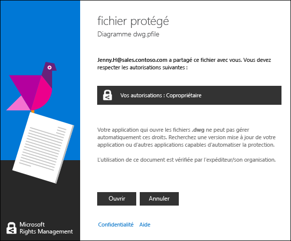

# Afficher et utiliser des fichiers qui ont &#233;t&#233; prot&#233;g&#233;s par Rights Management
Quand l’application de partage [Rights Management (RMS) est installée sur votre ordinateur](https://technet.microsoft.com/library/dn574734%28v=ws.10%29.aspx), vous pouvez afficher un fichier protégé simplement en double-cliquant dessus. Le fichier peut être une pièce jointe à un message électronique, ou un fichier apparaissant dans l'Explorateur de fichiers.

> [!NOTE]
> Pour que vous puissiez afficher le fichier protégé, RMS doit confirmer que vous y êtes autorisé. Pour ce faire, il vérifie vos nom d'utilisateur et mot de passe. Dans certains cas, cette opération peut être mise en cache de sorte que vous ne voyez pas d'invite vous demandant vos informations d'identification. Dans d'autres cas, vous êtes invité à fournir vos informations d'identification.
> 
> Si votre organisation n'utilise pas Gestion des droits Azure (Azure RMS) ou AD RMS, vous pouvez demander un compte gratuit acceptant vos informations d'identification afin de pouvoir ouvrir des fichiers protégés à l'aide de RMS :
> 
> -   Pour demander ce compte, cliquez sur le lien [RMS for Individuals](http://go.microsoft.com/fwlink/?LinkId=309469).
> 
>     Lorsque vous vous inscrivez, utilisez l'adresse de messagerie de votre organisation plutôt qu'une adresse personnelle. Si vous vous inscrivez parce que vous reçu une pièce protégée jointe à un message électronique, utilisez l'adresse de messagerie à laquelle ce message a été envoyé.
> -   Pour plus d'informations, voir [RMS for Individuals et Windows Azure Rights Management](http://technet.microsoft.com/library/dn592127.aspx).

## Pour afficher un fichier protégé
Dans l'Explorateur de fichiers ou dans le message électronique contenant la pièce jointe, double-cliquez sur le fichier protégé, puis entrez vos informations d'identification si vous y êtes invité.

Si vous voyez deux versions du fichier dont les extensions diffèrent, n'ouvrez celle dont l'extension est .ppdf uniquement si l'autre ne s'ouvre pas. Si vous ne pouvez pas non plus ouvrir la version .ppdf, installez l'[application de partage RMS](http://technet.microsoft.com/library/dn574734.aspx) qui sait comment ouvrir des fichiers dont l'extension est .ppdf.

> [!NOTE]
> Pour plus d'informations, voir [Qu'est-ce que le fichier .ppdf créé automatiquement ?](../Topic/Dialog_box_options_for_the_Rights_Management_sharing_application.md#BKMK_PPDF).

La manière dont le fichier s'ouvre dépend de la manière dont il a été protégé, ce que vous pouvez déterminer en examinant l'extension de son nom. Dans chaque cas, l'ouverture du fichier peut être auditée et reste auditée tant qu'il est protégé. En outre, si le fichier a été envoyé en pièce jointe à un message électronique, il se peut que l'expéditeur soit être informé par courrier électronique chaque fois que vous ouvrez le fichier.

|Extension de nom et protection de fichier|Plus d'informations|
|---------------------------------------------|-----------------------|
|L'extension du nom du fichier est **.pfile**.  Le fichier fait l'objet d'une protection générique.|Lorsque vous ouvrez le fichier, vous voyez s'afficher la boîte de dialogue **Fichier protégé** de l'application de partage, qui vous indique qui a protégé le fichier et que vous devez respecter les autorisations de copropriétaire. Pour lire le fichier, cliquez sur **Ouvrir**.  |
|L'extension du nom du fichier est **.ppdf**, ou le fichier ou est un fichier texte ou image protégé (tel que **.ptxt** ou **.pjpg**).  Le fichier fait l'objet d'une protection native en tant que copie en lecture seule.|Le fichier s'ouvre dans la visionneuse installée en même temps que l'application de partage RMS. Ce fichier est en lecture seule, même si vous l'enregistrez dans un autre emplacement ou le renommez.|
|Autres extensions de nom de fichier.  Le fichier fait l'objet d'une protection native.|Le fichier s'ouvre dans l'application associée à l'extension d'origine de son nom, et une bannière de restriction s'affiche en haut du fichier. La bannière peut afficher les autorisations appliquées au fichier, ou un lien permettant de les afficher. Par exemple, il se peut que s'affiche ce qui suit, et que vous deviez cliquer sur **Les autorisations sont actuellement restreintes** pour afficher les autorisations appliquées au fichier et les personnes pouvant accéder à celui-ci :  |
Pour obtenir la liste complète des extensions de nom de fichier prises en charge par Rights Management, consultez les sections [Types de fichier pris en charge et extensions de nom de fichier](../Topic/Rights_Management_sharing_application_administrator_guide.md#BKMK_SupportFileTypes) du [guide de l'administrateur de l'application de partage Rights Management](../Topic/Rights_Management_sharing_application_administrator_guide.md). Si votre extension de nom de fichier n’est pas répertoriée, faites une recherche sur le web pour déterminer si cette extension de nom de fichier est prise en charge par une autre application.

> [!NOTE]
> Si, après avoir confirmé que le fichier est bien protégé par Rights Management et s’il ne s’ouvre pas, téléchargez et utilisez l’[outil Analyseur RMS](https://www.microsoft.com/en-us/download/details.aspx?id=46437). Suivez les instructions contenues dans l’outil pour rechercher la présence de problèmes éventuels sur votre ordinateur qui pourraient empêcher l’ouverture d’un document protégé.

## Pour utiliser un fichier protégé (par exemple, l'éditer et l'imprimer)
Si, après avoir ouvert le fichier protégé, vous voulez faire plus que le lire (par exemple, le modifier, le copier et l’imprimer) :

|Extension de nom de fichier|Instructions|
|-------------------------------|----------------|
|L'extension du nom du fichier est **.pfile**.|Enregistrez le fichier ouvert en lui donnant une nouvelle extension de nom associée à l'application que vous souhaitez utiliser.  Par exemple, si un fichier a été protégé sous le nom document.vsdx.pfile, affichez-le, puis, dans l'Explorateur de fichiers, enregistrez-le sous document.vsdx.  Le nouveau fichier n'est plus protégé. Si vous souhaitez le protéger, vous devez le faire manuellement. Pour obtenir des instructions, consultez [Protection d'un fichier sur un appareil &#40;Protéger sur place&#41; à l'aide de l'application de partage Rights Management](../Topic/Protect_a_file_on_a_device__protect_in-place__by_using_the_Rights_Management_sharing_application.md).|
|L'extension du nom du fichier est **.ppdf**, ou le fichier ou est un fichier texte ou image protégé (tel que **.ptxt** ou **.pjpg**).|Vous pouvez uniquement afficher le fichier et, même si vous le renommez ou le déplacez, sa protection subsiste.|
|Autres extensions de nom de fichier.|Pour utiliser de tels fichiers, votre appareil doit disposer d'une application comprenant Rights Management. Les applications de ce type sont qualifiées de « compatibles RMS ». Les applications Office 2016, Office 2013 et Office 2010 (telles que Word, Excel, PowerPoint et Outlook) sont des exemples d’applications compatibles avec Rights Management. Toutefois, des applications ne provenant pas de Microsoft, telles que celles publiées par d'autres éditeurs de logiciels ou vos propres applications métier, peuvent également être compatibles Rights Management.  Les applications compatibles Rights Management savent comment ouvrir des fichiers protégés par d'autres applications compatibles Rights Management. Elles conservent également la protection appliquée au fichier, même si vous modifiez celui-ci ou l'enregistrez sous un autre nom ou dans un autre emplacement. Ces applications vous permettent d'utiliser le fichier conformément aux autorisations qui lui sont appliquées de sorte que, si vous disposez des autorisations nécessaires, vous l'utiliser. Par exemple, il se peut que vous puissiez modifier le fichier mais pas l'imprimer.|

## Exemples et autres instructions
Pour obtenir des exemples et des instructions concernant l'utilisation de l'application de partage Rights Management, voir les sections suivantes dans le Guide d'utilisation de l'application de partage Rights Management :

-   [Exemples d’utilisation de l’application de partage RMS](../Topic/Rights_Management_sharing_application_user_guide.md#BKMK_SharingExamples)

-   [Que souhaitez-vous faire ?](../Topic/Rights_Management_sharing_application_user_guide.md#BKMK_SharingInstructions)

## Voir aussi
[Guide d’utilisation de l’application de partage Rights Management](../Topic/Rights_Management_sharing_application_user_guide.md)

