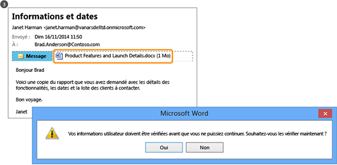

# Qu&#39;est-ce qu&#39;Azure Rights Management&#160;?
Azure Rights Management (Azure RMS) est une solution de protection des informations destinée aux organisations désireuses de protéger leurs données dans l'environnement de travail exigeant d'aujourd'hui.

Ces défis incluent la nécessité d'être connecté à Internet, avec des utilisateurs qui apportent leur appareil personnel au travail, accèdent aux données de l'entreprise tant en déplacement qu'à domicile, et partagent des informations sensibles avec des partenaires commerciaux importants. Dans le cadre de leurs activités professionnelles quotidiennes, les utilisateurs partagent des informations à l'aide de courriers électroniques, de sites de partage de fichiers et de services cloud. Dans ces cas de figure, les contrôles de sécurité traditionnels (comme les listes de contrôle d'accès et les autorisations NTFS) et les pare-feu ont une efficacité limitée sur la protection des données de votre entreprise, mais n'entravent pas l'efficacité de vos utilisateurs.

En comparaison, la solution Azure RMS peut protéger les informations sensibles de votre entreprise dans toutes ces situations. Elle utilise des stratégies de chiffrement, d'identité et d'autorisation pour sécuriser vos fichiers et courriers électroniques, et fonctionne sur plusieurs appareils tels que des téléphones, tablettes et PC. Des informations peuvent être protégées tant au sein qu'en dehors de votre organisation, car cette protection reste associées aux données, même quand celles-ci quittent les limites de votre organisation. Par exemple, un employé peut envoyer un document par courrier électronique à une entreprise partenaire, ou l'enregistrer sur un lecteur cloud. La protection permanente offerte par Azure RMS permet de sécuriser les données de votre entreprise. Elle peut également être nécessaire à des fins de conformité, de communication préalable ou simplement de bonne gestion des informations.

Mais plus important encore, les personnes et services autorisés (recherche et indexation, par exemple) peuvent continuer à lire et examiner les données protégées par Azure RMS, ce qui n'est pas chose facile avec les autres solutions de protection des informations qui utilisent le chiffrement pair à pair. Cette capacité, parfois appelée « reasoning over data », est un élément déterminant pour conserver le contrôle des données de votre entreprise.

L'illustration suivante montre qu'Azure RMS fait office de solution de gestion des droits pour Office 365 ainsi que pour les serveurs et services locaux. Elle montre également que cette solution prend en charge les appareils d'utilisateurs finaux courants qui exécutent Windows, Mac OS, iOS, Android et Windows Phone.

> [!TIP]
> À ce stade, les ressources supplémentaires suivantes peuvent s'avérer utiles :
> 
> -   Vidéo de deux minutes : [Présentation de Microsoft Azure Rights Management](http://technet.microsoft.com/dn833005.aspx)
> -   Didacticiel en cinq étapes : [Didacticiel de démarrage rapide pour la Gestion des droits Azure](../Topic/Quick_Start_Tutorial_for_Azure_Rights_Management.md)
> -   Configuration requise pour Azure RMS, y compris les options d'abonnement pour l'achat ou l'évaluation : [Conditions requises pour Azure Rights Management](../Topic/Requirements_for_Azure_Rights_Management.md)

Pour plus d'informations sur Azure RMS, lisez les sections suivantes :

-   [Quels problèmes Azure RMS résout-il ?](../Topic/What_is_Azure_Rights_Management_.md#BKMK_RMSrequirements)

    -   [Respect des obligations réglementaires, de conformité et de sécurité](../Topic/What_is_Azure_Rights_Management_.md#BKMK_RMScompliance)

-   [Azure RMS en action : ce que voient les utilisateurs et les administrateurs](../Topic/What_is_Azure_Rights_Management_.md#BKMK_RMSpictures)

    -   [Activation et configuration de Rights Management](../Topic/What_is_Azure_Rights_Management_.md#BKMK_Example_ManagementPortal)

    -   [Protection automatique de fichiers sur des serveurs de fichiers exécutant Windows Server et l'infrastructure de classification des fichiers](../Topic/What_is_Azure_Rights_Management_.md#BKMK_Example_FCI)

    -   [Protection automatique des messages électroniques avec Exchange Online et les stratégies de prévention des pertes de données](../Topic/What_is_Azure_Rights_Management_.md#BKMK_Example_DLP)

    -   [Protection automatique de fichiers avec SharePoint Online et des bibliothèques protégées](../Topic/What_is_Azure_Rights_Management_.md#BKMK_Example_SharePoint)

    -   [Partage en toute sécurité de pièces jointes avec des utilisateurs mobiles](../Topic/What_is_Azure_Rights_Management_.md#BKMK_Example_SharingApp)

-   [Fonctionnement d'Azure RMS Sous le capot](../Topic/What_is_Azure_Rights_Management_.md#BKMK_HowRMSworks)

    -   [Contrôles de chiffrement utilisés par Azure RMS : Algorithmes et longueurs de clé](../Topic/What_is_Azure_Rights_Management_.md#BKMK_RMScrytographics)

    -   [Procédure pas à pas décrivant le fonctionnement d'Azure RMS : première utilisation, protection du contenu, consommation du contenu](../Topic/What_is_Azure_Rights_Management_.md#BKMK_Walthrough)

-   [Étapes suivantes](../Topic/What_is_Azure_Rights_Management_.md#BKMK_NextSteps)

## Quels problèmes Azure RMS résout-il ?
Utilisez le tableau suivant pour identifier les besoins ou problèmes métier auxquels votre entreprise peut être confrontée, et savoir de quelle façon Azure RMS peut y remédier.

|Impératif ou problème|Résolu par Azure RMS|
|-------------------------|------------------------|
|Protection de tous les types de fichiers|√ Dans la précédente implémentation de Rights Management, seuls les fichiers Office pouvaient être protégés, à l'aide de la protection native. Désormais, le terme [protection générique](https://technet.microsoft.com/library/dn574738%28v=ws.10%29.aspx) signifie que tous les types de fichier sont pris en charge.|
|Protection des fichiers en tout lieu|√ Quand un fichier est enregistré à un emplacement ([protection locale](https://technet.microsoft.com/library/dn574733%28v=ws.10%29.aspx)), il reste protégé, même s'il est copié vers un emplacement de stockage non contrôlé par le service informatique, tel qu'un service de stockage dans le cloud.|
|Partage sécurisé des fichiers envoyés par courrier électronique|√ Quand un fichier est partagé par courrier électronique ([partage protégé](https://technet.microsoft.com/library/dn574735%28v=ws.10%29.aspx)), il est protégé en tant que pièce jointe à un message électronique contenant des instructions expliquant comment ouvrir la pièce jointe protégée. Dans la mesure où le texte du courrier électronique n'est pas chiffré, son destinataire peut lire ces instructions. En revanche, le document joint est protégé, par conséquent seuls les utilisateurs autorisés peuvent l'ouvrir, même si le courrier électronique ou le document est transféré à d'autres personnes.|
|Audit et surveillance|√ Vous pouvez [auditer et surveiller l'utilisation](https://technet.microsoft.com/library/dn529121.aspx) de vos fichiers protégés, même quand ceux-ci sortent des limites de votre organisation.  Par exemple, vous travaillez pour Contoso, Ltd. Vous travaillez sur un projet conjoint avec 3 personnes de Fabrikam, Inc. Vous envoyez par messagerie électronique à ces 3 personnes un document que vous protégez et dont vous restreignez l'accès à la lecture seule. L'audit Azure RMS peut vous fournir les informations suivantes :  -   Date/heure auxquelles les destinataires de Fabrikam ont ouvert le document, le cas échéant. -   Tentative d'ouverture du document (en vain) par d'autres personnes que vous n'avez pas spécifiées, peut-être parce qu'il a été transféré ou enregistré à un emplacement partagé auxquels des tiers ont accès. -   Tentative d'impression ou de modification du document (en vain) par une ou plusieurs des personnes spécifiées.|
|Prise en charge des appareils les plus courants, outre les ordinateurs Windows|√ Les [appareils pris en charge](https://technet.microsoft.com/library/dn655136.aspx) sont les suivants :  -   Téléphones et ordinateurs Windows -   Ordinateurs Mac -   Tablettes et téléphones iOS -   Tablettes et téléphones Android|
|Prise en charge pour les collaborations interentreprises|√ Dans la mesure où Azure RMS est un service cloud, il n'est pas nécessaire de configurer explicitement des approbations avec d'autres entreprises pour pouvoir partager du contenu protégé avec elles. Si ces entreprises disposent déjà d'un annuaire Azure AD ou Office 365, la collaboration entre entreprises est automatiquement prise en charge. Si ce n'est pas le cas, les utilisateurs peuvent prendre un abonnement gratuit à [RMS for Individuals](https://technet.microsoft.com/library/dn592127.aspx).|
|Prise en charge des services locaux et d'Office 365|√ Azure RMS fonctionne [sans problème avec Office 365](https://technet.microsoft.com/library/jj585004.aspx). Vous pouvez également l'utiliser avec les services locaux suivants lorsque vous déployez le [connecteur RMS](https://technet.microsoft.com/library/dn375964.aspx) :  -   Exchange Server -   SharePoint Server -   Windows Server exécutant l'infrastructure de classification des fichiers|
|Facilité d'activation|√ L’[activation du service Rights Management](https://technet.microsoft.com/library/jj658941.aspx) pour les utilisateurs ne nécessite que quelques clics dans le portail Azure Classic.|
|Capacité à évoluer au sein de votre entreprise, conformément à vos besoins|√ Dans la mesure où Azure RMS s'exécute en tant que service cloud et que l'élasticité Azure permet d'évoluer et de monter en puissance, vous n'êtes pas tenu de configurer ou de déployer d'autres serveurs locaux.|
|Capacité à créer des stratégies simples et flexibles|√ Les [modèles de stratégie de droits personnalisés](https://technet.microsoft.com/library/dn642472.aspx) permettent aux administrateurs d'appliquer des stratégies rapidement et en toute simplicité, et aux utilisateurs d'appliquer le niveau de protection qui convient à chaque document tout en limitant l'accès au personnel interne de votre organisations.  Par exemple, pour partager un document stratégique avec tous les employés de votre entreprise, vous pouvez appliquer une stratégie de lecture seule à tout le personnel interne. Pour un document sensible tel qu'un rapport financier, vous pouvez également limiter l'accès aux cadres de l'entreprise.|
|Prise en charge étendue des applications|√ Azure RMS est étroitement intégré aux applications et services Microsoft Office, mais prend également en charge d'autres applications grâce à l'application de partage RMS.  √ Le [Kit de développement logiciel (SDK) Microsoft Rights Management](https://msdn.microsoft.com/library/hh552972%28v=vs.85%29.aspx) fournit à vos développeurs internes et aux éditeurs de logiciels les API nécessaires à la création d'applications personnalisées prenant en charge Azure RMS.  Pour plus d'informations, consultez [Mode de prise en charge d'Azure Rights Management par les applications](../Topic/How_Applications_Support_Azure_Rights_Management.md).|
|Le service informatique doit conserver le contrôle des données|√ Les entreprises peuvent choisir de gérer leur propre clé de locataire, d'utiliser la solution « [Bring Your Own Key](https://technet.microsoft.com/library/dn440580.aspx) » (BYOK) et de stocker leur clé de locataire dans des modules de sécurité matériels (HSM).  √ Prise en charge de l'audit et de la [journalisation de l'utilisation](https://technet.microsoft.com/library/dn529121.aspx) pour vous permettre d'analyser les perspectives professionnelles, de détecter des abus et (en cas de fuite d'informations) d'effectuer un audit légal.  √ L'accès délégué à l'aide de la [fonctionnalité de super utilisateur](https://technet.microsoft.com/library/mt147272.aspx) garantit que le service informatique a toujours accès au contenu, même si celui-ci a été protégé par un employé ne faisant plus partie de l'organisation. En comparaison, les solutions de chiffrement pair à pair présentent un risque de perte d'accès aux données de l'entreprise.  √ Synchronisez [uniquement les attributs d’annuaire dont Azure RMS a besoin](https://azure.microsoft.com/documentation/articles/active-directory-aadconnectsync-attributes-synchronized/) pour prendre en charge une identité commune pour vos comptes Active Directory locaux, en utilisant un [outil de synchronisation d’annuaire](https://azure.microsoft.com/documentation/articles/active-directory-aadconnect-get-started-tools-comparison/), tel que Azure AD Connect.  √ Activation de l'authentification unique sans réplication des mots de passe dans le cloud, à l'aide d'AD FS.  √ Les organisations ont toujours la possibilité de cesser d'utiliser Azure RMS sans perdre l'accès au contenu précédemment protégé par Azure RMS. Pour plus d'informations sur les options de désactivation des services, voir [Désaffectation et désactivation de Gestion des droits Azure](../Topic/Decommissioning_and_Deactivating_Azure_Rights_Management.md). De plus, les organisations ayant déployé Active Directory Rights Management Services (AD RMS) peuvent [migrer vers Azure RMS](https://technet.microsoft.com/library/dn858447.aspx) sans perdre l'accès aux données précédemment protégées par AD RMS.|
> [!TIP]
> Si vous savez quelle version de Rights Management (services AD RMS - Active Directory Rights Management Services) est utilisée en local, le tableau de comparaison disponible à la page [Comparaison d'Azure Rights Management avec AD RMS](../Topic/Comparing_Azure_Rights_Management_and_AD_RMS.md) vous intéressera peut-être.

### Respect des obligations réglementaires, de conformité et de sécurité
Azure RMS respecte les obligations réglementaires, de conformité et de sécurité suivantes :

√ Utilisation du chiffrement standard et prise en charge de la norme FIPS 140-2. Pour plus d'informations, consultez la section [Contrôles de chiffrement utilisés par Azure RMS : Algorithmes et longueurs de clé](../Topic/What_is_Azure_Rights_Management_.md#BKMK_RMScrytographics) de cette rubrique.

√ Prise en charge des modules de sécurité matériels (HSM) Thales pour stocker votre clé de locataire dans les centres de données Microsoft Azure. Azure RMS utilise des environnements de sécurité distincts pour ses centres de données d'Amérique du Nord, de la zone EMEA (Europe, Moyen-Orient et Afrique) et d'Asie. Par conséquent, vos clés peuvent uniquement être utilisées dans votre région.

√ Certifié pour ce qui suit :

-   ISO/IEC 27001:2013 (inclut [ISO/IEC 27018](http://azure.microsoft.com/blog/2015/02/16/azure-first-cloud-computing-platform-to-conform-to-isoiec-27018-only-international-set-of-privacy-controls-in-the-cloud/))

-   Attestations SOC 2 SSAE 16/ISAE 3402

-   Loi HIPAA BAA

-   Clause type de l'UE

-   L'agence FedRAMP, dans le cadre de la certification d'Azure Active Directory dans Office 365, a émis une autorisation d'utilisation par HHS

-   Niveau 1 PCI DSS

Pour plus d'informations sur ces certifications externes, consultez le [Centre de gestion de la confidentialité Azure](http://azure.microsoft.com/support/trust-center/compliance/).

## Azure RMS en action : ce que voient les utilisateurs et les administrateurs
Les images de cette section présentent quelques exemples classiques de la manière dont les administrateurs et les utilisateurs voient et peuvent utiliser Azure RMS pour protéger des informations sensibles ou confidentielles.

> [!NOTE]
> Dans tous ces exemples où Azure RMS protège des données, le propriétaire du contenu continue à avoir un accès complet aux données (fichiers ou courrier électronique), même si la protection appliquée accorde des autorisations à un groupe dont le propriétaire n'était pas un membre, ou si la protection appliquée inclut une date d'expiration.
> 
> De même, le service informatique peut toujours accéder aux données protégées sans restriction, en utilisant la fonctionnalité de super utilisateur de Rights Management, qui accorde un accès délégué aux utilisateurs autorisés ou aux services que vous spécifiez. En outre, le service informatique peut suivre et analyser l'utilisation des données protégées, par exemple, pour déterminer qui accède aux données et à quel moment.

Pour d'autres captures d'écran et vidéos montrant RMS en action, consultez le [portail des services Microsoft Rights Management](http://www.microsoft.com/rms), le [blog de l’équipe Microsoft Rights Management (RMS)](http://blogs.technet.com/b/rms) et le [contenu organisé pour Azure RMS sur le site Curah!.](http://curah.microsoft.com/Search?query="Azure%20RMS").

### Activation et configuration de Rights Management
Bien que vous puissiez utiliser Windows PowerShell pour activer et configurer Azure RMS, cela est plus facile à partir du portail de gestion. Dès que le service est activé, vous disposez de deux modèles par défaut permettant aux administrateurs et aux utilisateurs d'appliquer rapidement et facilement la protection des informations aux fichiers. Vous pouvez également créer vos propres modèles personnalisés afin d'avoir accès à des paramètres et options supplémentaires.

|||
|-|-|
|  [Image plus grande](http://technet.microsoft.com/98d53a12-3b19-4622-bb1e-75ef56df5438) (par défaut, dans la même fenêtre de navigateur)|Pour activer RMS, vous pouvez utiliser le Centre d’administration Office 365 (première image) ou le portail Azure Classic (deuxième image).  Un simple clic permet d'activer RMS et un autre de confirmer l'activation. Ensuite, la protection des informations est activée pour les administrateurs et les utilisateurs au sein de votre organisation.|
|  [Image plus grande](http://technet.microsoft.com/596e4fec-124c-41b1-8efd-63d5179193fb) (par défaut, dans la même fenêtre de navigateur)|Après l'activation, deux modèles de stratégie des droits sont automatiquement disponibles pour votre organisation. Un modèle est en lecture seule (**Affichage confidentiel uniquement** est inclus dans son nom), tandis que l'autre est accessible en lecture et en modification (**Confidentiel**).  Lorsque ces modèles sont appliqués à des fichiers ou à des messages électroniques, ils restreignent l'accès aux utilisateurs de votre organisation. Il s'agit d'un moyen très simple et rapide d'empêcher une fuite de données de votre organisation vers des personnes extérieures à celle-ci. **Tip:** Ces modèles par défaut sont aisément reconnaissables, car ils ont pour préfixe le nom de votre organisation. Dans notre exemple, **VanArsdel, Ltd**. Si vous ne voulez pas que les utilisateurs puissent voir ces modèles, ou si vous voulez créer vos propres modèles, vous pouvez spécifier cela via le portail Azure Classic. Comme le montre cette illustration, un assistant vous accompagne tout au long du processus de création d'un modèle personnalisé.|
|  [Image plus grande](http://technet.microsoft.com/f5df80e5-efc9-4c0f-91be-060225977356) (par défaut, dans la même fenêtre de navigateur)|L'accès hors connexion, les paramètres d'expiration et la publication (affichage dans les applications qui prennent en charge Rights Management) immédiate ou non du modèle figurent parmi les paramètres de configuration disponibles si vous décidez de créer vos propres modèles.|
|  [Image plus grande](http://technet.microsoft.com/597a3402-fd5a-4bcf-b5e6-5c983dbde697) (par défaut, dans la même fenêtre de navigateur)|Suite à la publication de ces modèles, les utilisateurs peuvent sélectionner ceux-ci dans des applications telles que l'Explorateur de fichiers et Microsoft Word :  -   Un utilisateur peut choisir le modèle par défaut, **VanArsdel, Ltd – Confidentiel**. Ensuite, seuls les employés de l'organisation VanArsdel peuvent ouvrir et utiliser ce document, même s'il est ultérieurement envoyé par courrier électronique à une personne extérieure à l'organisation, ou enregistré dans un emplacement public. -   Un utilisateur peut choisir le modèle personnalisé créé par l'administrateur, **Ventes et Marketing – Lecture et impression uniquement**. Ensuite, non seulement le fichier est protégé contre des personnes extérieures à l'organisation, mais son accès est également limité aux employés du département Ventes et Marketing. Par ailleurs, ces employés ne disposent pas de tous les droits sur le document, mais uniquement de ceux de le lire et de l'imprimer. Ils ne peuvent donc ni le modifier, ni en copier le contenu.|
Pour plus d'informations, consultez les rubriques [Activation d'Azure Rights Management](../Topic/Activating_Azure_Rights_Management.md) et [Configuration de modèles personnalisés pour Azure Rights Management](../Topic/Configuring_Custom_Templates_for_Azure_Rights_Management.md).

Pour aider les utilisateurs à protéger des fichiers d'entreprise importants, consultez [Aide aux utilisateurs sur la protection de fichiers grâce à Azure Rights Management](../Topic/Helping_Users_to_Protect_Files_by_Using_Azure_Rights_Management.md).

Vous pouvez voir ci-dessous quelques exemples de la façon dont les administrateurs peuvent appliquer les modèles afin de configurer automatiquement la protection des informations pour des fichiers et des courriers électroniques.

### Protection automatique de fichiers sur des serveurs de fichiers exécutant Windows Server et l'infrastructure de classification des fichiers
Cet exemple montre comment vous pouvez utiliser Azure RMS pour protéger automatiquement des fichiers sur des serveurs de fichiers qui exécutent au moins Windows Server 2012, et sont configurés pour utiliser l'infrastructure de classification des fichiers.

Il existe de nombreuses façons d'appliquer des valeurs de classification à des fichiers. Par exemple, vous pouvez examiner le contenu des fichiers et appliquer en conséquence des classifications intégrées, telles que Confidentialité et Informations d'identification personnelle. Toutefois, dans cet exemple, un administrateur crée une classification personnalisée **Marketing**, qui est appliquée automatiquement à tous les documents utilisateur enregistrés dans le dossier **Marketing Promotions**. Bien que ce dossier soit protégé par des autorisations NTFS qui limitent l'accès aux membres du groupe Marketing, l'administrateur sait que ces autorisations peuvent être perdues si un membre de ce groupe déplace les fichiers ou les envoie par courrier électronique. Ensuite, des utilisateurs non autorisés pourraient accéder aux informations contenues dans les fichiers.

|||
|-|-|
|  [Image plus grande](http://technet.microsoft.com/cf18c56b-c301-4640-8d9e-9e677e494091) (par défaut, dans la même fenêtre de navigateur)|L'administrateur installe et configure le connecteur RMS (Rights Management), qui joue le rôle de relais entre les serveurs locaux et Azure RMS.|
|  [Image plus grande](http://technet.microsoft.com/ba3e247d-ea5e-4009-8eac-74f70270ece0) (par défaut, dans la même fenêtre de navigateur)|Sur le serveur de fichiers, l'administrateur configure les règles et tâches de classification afin que tous les fichiers utilisateur enregistrés dans le dossier **Marketing Promotions** soient automatiquement classés sous la catégorie **Marketing** et protégés par un chiffrement RMS.  Il sélectionne le modèle RMS personnalisé créé dans notre premier exemple, ce qui restreint l'accès aux membres des départements Ventes et Marketing : **Vente et Marketing - Lecture et impression uniquement**.  Par conséquent, tous les documents de ce dossier sont automatiquement associés à la classification Marketing, et protégés par le modèle RMS Ventes et Marketing.|
|  [Image plus grande](http://technet.microsoft.com/ad666594-68df-4289-835a-235b2af9bf4b) (par défaut, dans la même fenêtre de navigateur)|Voici comment RMS permet d'éviter une fuite de données vers des personnes qui ne doivent pas avoir accès à des informations sensibles ou confidentielles :  -   Janet, du département Marketing, envoie un rapport confidentiel extrait du dossier Marketing Promotions. Ce rapport décrivant de nouvelles fonctionnalités d'un produit et des plans de campagne publicitaire, est demandé par un collègue qui est actuellement en déplacement professionnel. Toutefois, Janet envoie accidentellement le rapport par courrier électronique à la mauvaise personne, n'ayant pas remarqué qu'elle a involontairement sélectionné un destinataire portant un nom similaire, mais travaillant pour une autre société.     Le destinataire ne peut pas lire le rapport confidentiel, car il n'est pas membre du groupe Ventes et Marketing.|
Pour plus d'informations, consultez [Déploiement du connecteur Azure Rights Management](../Topic/Deploying_the_Azure_Rights_Management_Connector.md).

### Protection automatique des messages électroniques avec Exchange Online et les stratégies de prévention des pertes de données
L'exemple précédent a montré comment protéger automatiquement des fichiers contenant des informations sensibles ou confidentielles, mais que se passe-t-il si ces informations ne figurent pas dans un fichier, mais dans un message électronique ? C'est là que les stratégies de prévention des pertes de données d'Exchange Online entrent en jeu, soit en demandant aux utilisateurs d'appliquer la protection des informations (en suivant les Conseils de stratégie), soit en les appliquant automatiquement à leur place (à l'aide de règles de transport).

Dans cet exemple, l'administrateur configure une stratégie permettant à l'organisation de rester en conformité avec les réglementations des États-Unis en matière de protection des informations d'identification personnelle, mais des règles peuvent également être définies en fonction d'autres règlements ou de prescriptions personnalisées que vous définissez.

|||
|-|-|
|  [Image plus grande](http://technet.microsoft.com/58461319-3981-4b7f-a195-956a1778e907) (par défaut, dans la même fenêtre de navigateur)|L'administrateur utilise le modèle Exchange nommé **U.S. Données d'informations d'identification personnelle (PII)** pour créer et configurer une nouvelle stratégie DLP. Ce modèle recherche des informations telles que des numéros de sécurité sociale ou des numéros de permis de conduire dans les messages électroniques.  Les règles sont configurées de telle sorte que les messages électroniques contenant de telles informations, qui sont envoyés à l'extérieur de l'organisation, fassent automatiquement l'objet d'une protection des droits appliquée à l'aide d'un modèle RMS restreignant l'accès aux seuls employés de la société.  Ici, la règle est configurée pour utiliser un des modèles par défaut, **VanArsdel, Ltd – Confidentiel**, de notre premier exemple. Mais vous pouvez également voir comment le choix de modèles inclut tous les modèles personnalisés que vous avez créés, ainsi qu'une option **Ne pas transférer** spécifique d'Exchange.|
|  [Image plus grande](http://technet.microsoft.com/bfb0762d-06fb-42e4-beff-eb391f4bedf0) (par défaut, dans la même fenêtre de navigateur)|Le responsable du recrutement écrit un message électronique qui contient le numéro de sécurité sociale d'un employé embauché récemment. Il envoie ce message électronique à Sherrie du département Ressources humaines.|
|  [Image plus grande](http://technet.microsoft.com/59e3b68e-4bed-4962-bb1e-e82d82f8000a) (par défaut, dans la même fenêtre de navigateur)|Si ce message électronique est envoyé ou transféré à quelqu'un extérieur à l'organisation, la règle DLP applique automatiquement la protection des droits.  Le message électronique est chiffré quand il quitte l'infrastructure de l'organisation, afin que le numéro de sécurité sociale soit illisible pendant le transit ou une fois dans la boîte de réception du destinataire. Le destinataire ne peut pas lire le message, sauf s'il est un employé de VanArsdel.|
Pour plus d'informations, consultez les sections suivantes :

-   [Exchange Online et Exchange Server](../Topic/How_Applications_Support_Azure_Rights_Management.md#BKMK_ExchangeIntro) dans la rubrique [Mode de prise en charge d'Azure Rights Management par les applications](../Topic/How_Applications_Support_Azure_Rights_Management.md).

-   [Exchange Online : configuration de la gestion des droits relatifs à l'information](../Topic/Configuring_Applications_for_Azure_Rights_Management.md#BKMK_ExchangeOnline) dans la rubrique [Configuration d'applications pour Azure Rights Management](../Topic/Configuring_Applications_for_Azure_Rights_Management.md).

### Protection automatique de fichiers avec SharePoint Online et des bibliothèques protégées
Cela montre comment protéger facilement des documents lorsque vous utilisez SharePoint Online et des bibliothèques protégées.

Dans cet exemple, l'administrateur SharePoint de Contoso a créé une bibliothèque pour chaque département, qui permet de stocker et d'extraire de façon centralisée des documents à des fins de modification et de contrôle de version. Par exemple, il existe une bibliothèque pour le département Ventes, une autre pour le département Marketing, une troisième pour le département Ressources humaines, et ainsi de suite. Quand un nouveau document est chargé ou créé dans une de ces bibliothèques protégées, ce document hérite de la protection de la bibliothèque (sans qu'il faille sélectionner un modèle de stratégie de droits). Il est alors automatiquement protégé et le reste, même s'il est déplacé hors de la bibliothèque SharePoint.

|||
|-|-|
|  [Image plus grande](http://technet.microsoft.com/2fc90989-9289-4431-9e6a-07740b7f6e5a) (par défaut, dans la même fenêtre de navigateur)|L'administrateur active Information Rights Management pour le site SharePoint.|
|  [Image plus grande](http://technet.microsoft.com/a18f2e99-5ac4-4103-a88c-527846374091) (par défaut, dans la même fenêtre de navigateur)|Ensuite, il active Rights Management pour une bibliothèque. Bien qu'il existe des options supplémentaires, ce simple paramètre est souvent suffisant.  Désormais, quand des documents sont téléchargés à partir de cette bibliothèque, ils sont automatiquement protégés par Rights Management et héritent de la protection configurée pour la bibliothèque.|
|  [Vue d'ensemble](http://technet.microsoft.com/0ebd6806-0190-441e-84db-72ac4b97e4a2) (par défaut, dans la même fenêtre du navigateur)|Quand une personne du département des ventes extrait ce rapport de la bibliothèque, la bannière d'informations affichée en haut du rapport lui indique clairement qu'il s'agit d'un document protégé dont l'accès est restreint.  Le document reste protégé, même si l'utilisateur le renomme, l'enregistre ailleurs ou le partage par courrier électronique. Quel que soit le nom du fichier, l'emplacement où il est stocké, ou l'adresse à laquelle il a été envoyé par courrier électronique, seuls les membres du département des ventes peuvent le lire.|
Pour plus d'informations, consultez les sections suivantes :

-   [SharePoint Online et SharePoint Server](../Topic/How_Applications_Support_Azure_Rights_Management.md#BKMK_SharePointIntro) dans la rubrique [Mode de prise en charge d'Azure Rights Management par les applications](../Topic/How_Applications_Support_Azure_Rights_Management.md).

-   [SharePoint Online et OneDrive Entreprise : configuration de la gestion des droits relatifs à l'information](../Topic/Configuring_Applications_for_Azure_Rights_Management.md#BKMK_SharePointOnline) dans la rubrique [Configuration d'applications pour Azure Rights Management](../Topic/Configuring_Applications_for_Azure_Rights_Management.md).

### Partage en toute sécurité de pièces jointes avec des utilisateurs mobiles
Les exemples précédents ont montré comment les administrateurs peuvent appliquer automatiquement une protection des informations à des données sensibles et confidentielles. Toutefois, dans certains cas, les utilisateurs doivent appliquer cette protection eux-mêmes. Par exemple, s'ils collaborent avec des partenaires d'une autre organisation, ils ont besoin d'autorisations ou de paramètres personnalisés qui ne sont pas définis dans les modèles, dans des situations spécifiques non couvertes par les exemples précédents. Dans ces situations, les utilisateurs peuvent appliquer les modèles RMS eux-mêmes, ou configurer des autorisations personnalisées.

Cet exemple montre comment un utilisateur peut aisément partager un document avec une personne d'une autre société avec laquelle il collabore, tout en étant en mesure de protéger le document avec la certitude que le destinataire pourra le lire, même sur un appareil mobile. Ce scénario utilise l'application de partage Rights Management, que pouvez déployer automatiquement sur des ordinateurs Windows au sein de votre organisation. Les utilisateurs peuvent également installer l'application eux-mêmes.

Dans cet exemple, Alice, de Contoso, envoie par courrier électronique un document Word confidentiel qu'elle adresse à Bob, de Fabrikam. Celui-ci lit le document sur son iPad, mais il pourrait tout aussi bien le lire sur un iPhone, une tablette ou un téléphone Android, un ordinateur Mac, ainsi qu'un téléphone ou un ordinateur Windows.

|||
|-|-|
|  [Image plus grande](http://technet.microsoft.com/feeef78d-3c2e-432b-817d-d06f784be226) (par défaut, dans la même fenêtre de navigateur)|Sur son PC Windows, Alice crée un message électronique standard auquel elle joint un document.  Quand elle clique sur **Partage protégé** dans le ruban, la boîte de dialogue **Partager le fichier protégé** de l'application de partage RMS s'ouvre.  Souhaitant que Bob puisse afficher et modifier le document, mais pas le copier ou l'imprimer, Alice active l'option **Réviseur – Affichage et modification**. Elle souhaite également recevoir un courrier électronique quand quelqu'un tente d'ouvrir le document, et avoir la possibilité de révoquer celui-ci ultérieurement si nécessaire en sachant que la révocation prendra effet immédiatement.|
|  [Image plus grande](http://technet.microsoft.com/e748fd78-8bba-4168-96cf-f96def078283) (par défaut, dans la même fenêtre de navigateur)|Bob voit le message électronique sur son iPad.  En plus de la pièce jointe, le message d'Alice contient des instructions qu'il suit pour s'inscrire et installer l'application de partage RMS sur son iPad.|
|  [Image plus grande](http://technet.microsoft.com/7dba5ff9-a61d-4a83-8adc-d6ffb0e85df6) (par défaut, dans la même fenêtre de navigateur)|Bob peut à présent ouvrir la pièce jointe. Il est d'abord invité à se connecter pour confirmer qu'il est bien le destinataire souhaité.  Lorsque Bob consulte le document, il voit également les informations d'accès restreint qui lui indiquent qu'il peut afficher et modifier le document, mais pas le copier ou l'imprimer.|
|  [Image plus grande](http://technet.microsoft.com/9f642a2e-58ad-44ab-9f81-f890d15380f9) (par défaut, dans la même fenêtre de navigateur)|Alice reçoit un message électronique lui indiquant que Bob a ouvert avec succès le document qu'elle a envoyé, ainsi que le moment auquel il y a accédé.  Si Bob transfère le message électronique avec la pièce jointe, ou l'enregistre dans un emplacement où d'autres personnes peuvent y accéder, ou si le message est intercepté sur le réseau, personne d'autre que lui n'est en mesure de lire le document.|
Pour plus d'informations, consultez les rubriques [Protection d'un fichier partagé par courrier électronique](https://technet.microsoft.com/library/dn574735.aspx) et [Affichage et utilisation de fichiers protégés](https://technet.microsoft.com/library/dn574741.aspx) du [Guide d’utilisation de l’application de partage Rights Management](https://technet.microsoft.com/library/dn339006.aspx).

En outre, le [Didacticiel de démarrage rapide pour la Gestion des droits Azure](../Topic/Quick_Start_Tutorial_for_Azure_Rights_Management.md) inclut des instructions détaillées pour ce scénario.

Après avoir vu ces quelques exemples de ce qu'Azure RMS peut faire, peut-être souhaitez-vous savoir comment il le fait. Pour obtenir des informations techniques sur le fonctionnement d'Azure RMS, consultez la section suivante.

## Fonctionnement d'Azure RMS Sous le capot
Concernant le fonctionnement d'Azure RMS, il est important de comprendre que le service Rights Management et, plus généralement, Microsoft ne consultent ni ne stockent vos données dans le cadre du processus de protection des informations. Les informations que vous protégez ne sont jamais stockées dans Azure, sauf si vous indiquez expressément votre volonté de les y stocker, ou si vous utilisez un autre service cloud qui les stocke dans Azure. Azure RMS rend simplement les données d'un document illisibles pour toute personne autre que des utilisateurs et services autorisés :

-   Les données sont chiffrées au niveau de l'application, et incluent une stratégie qui définit l'utilisation autorisée du document.

-   Quand un document protégé est utilisé par un utilisateur légitime, ou traité par un service autorisé, ses données sont déchiffrées et les droits définis dans la stratégie appliqués.

À un niveau élevé, vous pouvez voir comment ce processus fonctionne dans l'image suivante. Un document contenant la formule secrète est protégé, puis ouvert correctement par un utilisateur ou un service autorisé. Le document est protégé par une clé de contenu (la clé verte sur cette image). Cette clé unique pour chaque document est placée dans l'en-tête du fichier, où elle est protégée par votre clé racine de locataire RMS (la clé rouge sur l'image). Microsoft peut générer et gérer votre clé de locataire. Vous pouvez également générer et gérer personnellement votre propre clé de locataire.

Durant le processus de protection, quand Azure RMS chiffre, déchiffre, autorise et applique des restrictions, la formule secrète n'est jamais envoyée à Azure.

Pour obtenir une description détaillée de ce qui se passe, consultez la section [Procédure pas à pas décrivant le fonctionnement d'Azure RMS : première utilisation, protection du contenu, consommation du contenu](../Topic/What_is_Azure_Rights_Management_.md#BKMK_Walthrough) de cette rubrique.

Pour obtenir des détails techniques sur les algorithmes et les longueurs de clé qu'Azure RMS utilise, consultez la section suivante.

### Contrôles de chiffrement utilisés par Azure RMS : Algorithmes et longueurs de clé
Même si vous n'avez pas besoin de connaître le détail du fonctionnement de RMS, il se peut que l'on vous interroge sur les contrôles de chiffrement utilisés, pour s'assurer que la protection de sécurité est conforme aux normes.

|||
|-|-|
|Méthode de protection de la documentation :|Algorithm: AES  Longueur de clé : 128 bits et 256 bits 1|
|Méthode de protection de la clé :|Algorithm: RSA  Longueur de clé : 2 048 bits|
|Signature de certificat :|Algorithm: SHA-256|
1 La longueur de 256 bits est utilisée par l'application de partage Rights Management pour la protection en modes générique et natif quand le fichier a une extension de nom de fichier .ppdf, ou est un fichier image ou texte protégé (tel que .ptxt ou .pjpg).

### Procédure pas à pas décrivant le fonctionnement d'Azure RMS : première utilisation, protection du contenu, consommation du contenu
Pour comprendre plus précisément le fonctionnement d'Azure RMS, examinons un flux classique tel qu'il se produit après l'[activation du service Azure RMS](https://technet.microsoft.com/library/jj658941.aspx), quand un utilisateur utilise RMS pour la première fois sur son ordinateur Windows (processus parfois nommé **initialisation de l'environnement utilisateur** ou amorçage), **protège du contenu** (un document ou un message électronique), puis **consomme** (ouvre et utilise) du contenu protégé par quelqu'un d'autre.

Après l'initialisation de l'environnement utilisateur, l'utilisateur peut protéger des documents ou consommer des documents protégés sur cet ordinateur.

> [!NOTE]
> Si l'utilisateur utilise un autre ordinateur Windows, ou si un autre utilisateur utilise ce même ordinateur, le processus d'initialisation est répété.

#### Initialisation de l'environnement utilisateur
Pour qu'un utilisateur puisse protéger du contenu ou utiliser du contenu protégé sur un ordinateur Windows, l'environnement utilisateur doit être préparé sur l'appareil en question. Ce processus se produit une seule fois, sans intervention humaine, quand un utilisateur tente de protéger ou de consommer du contenu protégé :

|||
|-|-|
||Le client RMS sur l'ordinateur se connecte à Azure RMS, puis authentifie l'utilisateur à l'aide de son compte Azure Active Directory.  Lorsque le compte de l'utilisateur est fédéré avec Azure Active Directory, cette authentification est automatique. L'utilisateur n'est donc pas invité à fournir d'informations d'identification.|

|||
|-|-|
||Une fois l'utilisateur authentifié, la connexion est automatiquement redirigée vers locataire RMS de l'organisation, qui émet des certificats permettant à l'utilisateur de s'authentifier auprès d'Azure RMS pour consommer du contenu protégé et protéger du contenu hors connexion.  Une copie du certificat de l'utilisateur est stockée dans Azure RMS afin que, si l'utilisateur utilise un autre appareil, les certificats soient créés à l'aide des mêmes clés.|

#### Protection du contenu
Quand un utilisateur protège un document, le client RMS effectue les actions suivantes sur un document non protégé :

|||
|-|-|
||Le client RMS crée une clé aléatoire (clé de contenu), puis chiffre le document en utilisant cette clé avec l'algorithme de chiffrement symétrique AES.|

|||
|-|-|
||Le client RMS crée ensuite un certificat incluant une stratégie pour le document, soit en se basant sur un modèle, soit en spécifiant des droits spécifiques pour le document. Cette stratégie inclut les droits de différents utilisateurs ou groupes, ainsi que d'autres restrictions telles qu'une date d'expiration.  Le client RMS utilise ensuite la clé de l'organisation obtenue lors de l'initialisation de l'environnement utilisateur, en se servant de cette clé pour chiffrer la stratégie et la clé symétrique de contenu. Le client RMS signe également la stratégie avec le certificat de l'utilisateur obtenu lors de l'initialisation de l'environnement utilisateur.|

|||
|-|-|
||Enfin, le client RMS incorpore la stratégie dans un fichier avec le corps du document chiffré précédemment, pour constituer un document protégé.  Ce document peut être stocké partout, ou partagé à l'aide de n'importe quelle méthode, et la stratégie reste toujours associée au document chiffré.|

#### Consommation du contenu
Quand un utilisateur souhaite consommer un document protégé, le client RMS commence par demander l'accès au service Azure RMS :

|||
|-|-|
||L'utilisateur authentifié envoie la stratégie de document et les certificats de l'utilisateur à Azure RMS. Le service déchiffre et évalue la stratégie, puis génère la liste des droits (éventuels) de l'utilisateur sur le document.|

|||
|-|-|
||Le service extrait ensuite la clé de contenu AES de la stratégie déchiffrée. Cette clé est alors chiffrée avec la clé RSA publique de l'utilisateur obtenue avec la demande.  Après cela, la clé de contenu re-chiffrée est incorporée dans une licence d'utilisation chiffrée avec la liste des droits de l'utilisateur, qui est renvoyée au client RMS.|

|||
|-|-|
||Enfin, le client RMS prend la licence d'utilisation chiffrée et la déchiffre avec sa propre clé privée utilisateur. Cela permet au client RMS de déchiffrer le corps du document si nécessaire, et de l'afficher à l'écran.  Le client déchiffre également la liste des droits, et transmet ceux-ci à l'application qui les applique dans son interface utilisateur.|

#### Variantes
Les procédures pas à pas précédentes couvrent les scénarios standard, mais il existe des variantes :

-   **Appareils mobiles** : Quand des appareils mobiles protègent ou consomment des fichiers avec Azure RMS, les flux de processus sont beaucoup plus simples. Les appareils mobiles ne passent pas par le processus d'initialisation utilisateur, car chaque transaction (pour protéger ou consommer du contenu) est indépendante. Comme les ordinateurs Windows, les appareils mobiles se connectent au service Azure RMS et s'authentifient. Pour protéger du contenu, les appareils mobiles soumettent une stratégie, puis Azure RMS leur envoie une licence de publication et une clé symétrique pour protéger le document. Pour consommer du contenu, quand des appareils mobiles se connectent au service Azure RMS et s'authentifient, ils envoient la stratégie de document à Azure RMS en demandant une licence d'utilisation pour consommer le document. En réponse, Azure RMS leur envoie les clés et restrictions nécessaires. Les deux processus utilisent TLS pour protéger l'échange de clés et d'autres communications.

-   **Connecteur RMS** : Quand Azure RMS est utilisé avec le connecteur RMS, le flux de processus est identique. La seule différence est que le connecteur fait office de relais entre les services locaux (tels qu'Exchange Server et SharePoint Server) et Azure RMS. Le connecteur proprement dit n'effectue aucune opération telle qu'une initialisation de l'environnement utilisateur, un chiffrement ou un déchiffrement. Il relaie simplement la communication qui accède généralement à un serveur AD RMS, en gérant la traduction entre les protocoles utilisés de part et d'autre. Ce scénario vous permet d'utiliser Azure RMS avec des services locaux.

-   **Protection générique (.pfile)** : Quand Azure RMS protège un fichier de façon générique, le flux est fondamentalement le même pour la protection du contenu, sauf que le client RMS crée une stratégie qui accorde tous les droits. Lorsque le fichier est consommé, il est déchiffré avant d'être transmis à l'application cible. Ce scénario vous permet de protéger tous les fichiers, même s'ils ne prennent pas en charge RMS en mode natif.

-   **PDF protégé (.ppdf)** : Quand Azure RMS protège un fichier Office en mode natif, il en crée également une copie qu'il protège de la même façon. La seule différence est que la copie est un fichier au format PPDF, que l'application de partage RMS peut ouvrir en mode affichage. Ce scénario vous permet d'envoyer des pièces jointes protégées par courrier électronique, en sachant que le destinataire sur un appareil mobile sera toujours en mesure de les lire, même si son appareil n'a pas d'application prenant en charge en mode natif des fichiers Office protégés.

## Étapes suivantes
Pour en savoir plus sur Azure RMS, reportez-vous aux autres rubriques de la section [Prise en main d'Azure Rights Management](../Topic/Getting_Started_with_Azure_Rights_Management.md), comme [Mode de prise en charge d'Azure Rights Management par les applications](../Topic/How_Applications_Support_Azure_Rights_Management.md), pour savoir comment intégrer vos applications existantes avec Azure RMS afin de bénéficier d'une solution de protection des informations. Consultez la page [Terminologie relative à Azure Rights Management](../Topic/Terminology_for_Azure_Rights_Management.md) pour vous familiariser avec les termes que vous rencontrerez lors de la configuration et de l'utilisation d'Azure RMS, et n'oubliez pas de lire la page [Conditions requises pour Azure Rights Management](../Topic/Requirements_for_Azure_Rights_Management.md) avant d'entamer votre déploiement. Si vous souhaitez entrer directement dans le vif du sujet et essayer par vous-même, utilisez le [Didacticiel de démarrage rapide pour la Gestion des droits Azure](../Topic/Quick_Start_Tutorial_for_Azure_Rights_Management.md).

Si vous êtes prêt à déployer Azure RMS pour votre organisation, consultez la page [feuille de route pour le déploiement d'Azure Rights Management](../Topic/Azure_Rights_Management_Deployment_Roadmap.md) pour connaître les étapes de déploiement et accéder à des liens pointant vers des instructions.

> [!TIP]
> Pour plus d'informations et pour obtenir de l'aide, utilisez les ressources et liens de la page [Informations et support technique pour Azure Rights Management](../Topic/Information_and_Support_for_Azure_Rights_Management.md).

## Voir aussi
[Prise en main d'Azure Rights Management](../Topic/Getting_Started_with_Azure_Rights_Management.md)

